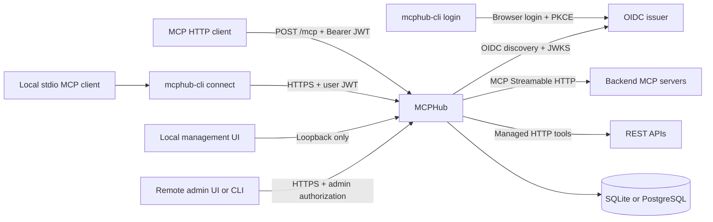

# MCPHub

[](https://github.com/SamuelSupe/mcphub/actions/workflows/ci.yml)
[](https://github.com/SamuelSupe/mcphub/releases/tag/v2.0.0)
[](https://github.com/SamuelSupe/mcphub/blob/main/LICENSE)
[](https://github.com/SamuelSupe/mcphub/blob/main/go.mod)

[English](README.md) | [中文](README.zh-CN.md)

MCPHub is an aggregation gateway for remote MCP Servers. It exposes one Streamable HTTP entry point, connects to multiple backends, builds a per-request backend view from JWT permissions, and routes tools, prompts, resources, and resource templates to the correct backend.

MCPHub v2.0.0 adds explicit tool publication, per-operation write approval, client grants with a local Broker, and enterprise SSO with permissions managed in MCPHub. The redesigned bilingual console organizes service connections, access control and audit workflows. Deploy one gateway with SQLite or PostgreSQL; install the separate `mcphub-cli` on user computers.

**Upgrading from v1.x:** backend tools now default to unpublished, and writes or unclassified tools require approval. Back up the database and matching encryption key before the schema 7 migration, review every published tool and its read/write policy, and follow the [upgrade and rollback guide](RELEASE_NOTES_v2.0.0.md#upgrade-and-rollback--升级与回滚). Go installation paths now include `/v2`.

## Enterprise SSO and user permissions

Bridge a confidential OIDC/OAuth2 identity provider and issue MCPHub credentials to `mcphub-cli`, keeping upstream application secrets off user computers. **Users & organization** manages account enablement, administrative roles, scopes, endpoints, exact tools and business-resource conditions. New users await authorization; write permission still requires per-operation approval.

Department/group membership can synchronize from verified login claims or an authenticated directory snapshot feed. Synchronization never assigns local permissions. SQLite and single-instance PostgreSQL migrate to schema 7. See the [configuration, synchronization contract and security boundaries](docs/sso-and-user-management.md). No Feishu tenant is connected, and no Feishu directory adapter or SCIM implementation is included; generic enterprise OAuth2 response mapping and tenant restrictions are available.

## Architecture



## Project links

- [GitHub repository](https://github.com/SamuelSupe/mcphub)
- [Local management UI guide](#local-management-ui)
- [Contributing guide](CONTRIBUTING.md)
- [Security policy](SECURITY.md)
- [Apache License 2.0](LICENSE) (copyright 2026 SamuelSupe)
- [v2.0.0 release notes](RELEASE_NOTES_v2.0.0.md), [v1.4.0 historical release notes](RELEASE_NOTES_v1.4.0.md), [v2.0.0 GitHub release](https://github.com/SamuelSupe/mcphub/releases/tag/v2.0.0), and [all GitHub Releases](https://github.com/SamuelSupe/mcphub/releases)

MCPHub v2.0.0 is the latest release. v1.4.0 and earlier versions remain available as historical references.

## Capabilities and boundaries

- Connects to multiple backends over MCP Streamable HTTP; backend catalogs are paginated, and the tools, prompts, resources, and resource-template lists are discovered in parallel and refreshed on backend notifications or the configured refresh schedule.
- Aggregates `tools`, `prompts`, `resources`, resource templates, and completion; forwards tool/prompt/resource calls, resource subscribe/unsubscribe, progress notifications, and resource-update notifications.
- Streams backend SSE responses through unchanged while inspecting progress notifications; at most 1 MiB of each event is buffered for inspection, and an oversized event is forwarded unchanged without progress inspection.
- Normalizes missing 2026-07-28 metadata on `notifications/cancelled` from official Go MCP SDK v1.7.0 clients on both Hub ingress and backend egress, so the same logical MCP session remains reusable after cancellation or unsubscribe; this is an interoperability shim, not a custom extension.
- Namespaces capabilities with `backend.id` and rewrites resource URIs to avoid same-name capability and URI collisions between backends.
- Verifies Bearer JWTs with OIDC discovery and JWKS, then filters catalogs and calls by each backend's `required_scopes`.
- Includes the separate `mcphub-cli` program for browser login through an external OIDC service and a local stdio-to-HTTP connector with credential refresh.
- Requires explicit tool publication, resource-argument restrictions and independent approval for write/unclassified tools; supports reviewer quorum, OIDC step-up, configuration review and signed audit delivery.
- Manages SSO user/group/department permissions and per-client scopes through the personal consent portal and local Broker. `setup` emits credential-free MCP configuration; `doctor` diagnoses access without executing tools.
- Applies backend-local `tool_rules` to original tool names with Go `path.Match`; matching rules union and deduplicate required scopes, use all-of authorization, and hide unauthorized tools from `tools/list`.
- Supports static backend request headers or OAuth 2.0 `client_credentials`; neither mode may provide a static `Authorization` header together with OAuth.
- The administration UI groups nine pages under overview, connections, access control, and governance/audit. It supports persistent Chinese/English selection, role-aware navigation and narrow screens. Groups can publish hand-authored HTTP tools and multiple OpenAPI 3.0/3.1 imports through `/mcp`; group Base URL, headers, OAuth, scopes, and timeout are shared, and no raw HTTP proxy is exposed.
- Supports OIDC-authenticated remote browser/CLI administration and encrypted SQLite or PostgreSQL configuration storage for one gateway instance.
- Configures per-endpoint request rates, burst capacity and concurrency through the UI/API; limits are disabled by default and shared by callers.
- Provides health, readiness, and RFC 9728 Protected Resource Metadata endpoints, plus SIGHUP configuration reload.

When a backend connection fails, MCPHub retries and retains its last-known catalog. The catalog may remain listable while calls fail until the connection recovers. Startup does not exit just because a required backend is temporarily unavailable, so `/readyz` remains 503; a runtime created by SIGHUP requires its required backends to connect successfully on the initial attempt. Backend-authored JSON-RPC errors are returned unchanged. Network or transport failures are exposed only as `backend <id> unavailable`, so internal backend URLs, query strings, and credentials do not cross the Hub boundary. On reconnect, every tracked resource subscription must be restored successfully before the backend is marked ready; a restore failure keeps it unavailable and triggers another reconnect attempt.

## Quick start

Go 1.26 is required (`go.mod` declares `go 1.26.0`). To install the v2.0.0 server and optional CLI with Go:

```bash
go install github.com/SamuelSupe/mcphub/v2/cmd/mcphub@v2.0.0
go install github.com/SamuelSupe/mcphub/v2/cmd/mcphub-cli@v2.0.0
```

For a source build, copy the example and set its environment variables:

```bash
cp config.example.yaml config.yaml

# Example only; replace with real HTTPS endpoints and secrets. Do not commit secrets.
export MCPHUB_PUBLIC_URL='https://hub.example.com/mcp'
export MCPHUB_CONSOLE_ORIGIN='https://console.example.com'
export MCPHUB_AUTH_ISSUER='https://idp.example.com'
export MCPHUB_PRIMARY_BACKEND_URL='https://mcp-a.example.com/mcp'
export MCPHUB_PRIMARY_API_KEY='replace-me'
export MCPHUB_CRM_BACKEND_URL='https://mcp-crm.example.com/mcp'
export MCPHUB_CRM_OAUTH_ISSUER='https://idp.example.com'
export MCPHUB_CRM_CLIENT_ID='replace-me'
export MCPHUB_CRM_CLIENT_SECRET='replace-me'

go build -trimpath -o ./mcphub ./cmd/mcphub
./mcphub validate --config ./config.yaml
./mcphub serve --config ./config.yaml
```

`validate` performs read-only validation and prints `configuration valid` on success. In admin mode it reads the selected existing database without changing it, or validates YAML bootstrap backends when the database does not yet exist. `serve` writes structured JSON logs to stderr. Both subcommands require `--config PATH`.

You can also run without producing a binary:

```bash
go run ./cmd/mcphub validate --config ./config.yaml
go run ./cmd/mcphub serve --config ./config.yaml
```

### Browser login and local connector

`mcphub-cli` runs on the user's Windows, macOS, or Linux computer and provides `login`, `connect`, `status`, and `logout`. The server executable `mcphub` provides `serve` and `validate`. Download the CLI archive for your platform below, install it with Go as shown above, or build it from this checkout and place it on your PATH:

```bash
go build -trimpath -o ./mcphub-cli ./cmd/mcphub-cli
```

The release workflow produces separate `mcphub_<version>_<os>_<arch>.tar.gz` server archives and `mcphub-cli_<version>_<os>_<arch>.tar.gz` client archives. Users only need the CLI archive. The server's existing `auth.issuer` and JWT scope policies remain the source of authentication and authorization.

Register a **public native OAuth client** at that issuer with authorization-code and refresh-token grants, PKCE S256, and token-endpoint authentication method `none`. Allow the callback `http://127.0.0.1:<port>/oauth/callback`; use an arbitrary loopback port when the provider supports native clients, or register a fixed port and pass `--callback-port 8765`. Discovery must advertise PKCE S256. The issuer must issue a signed JWT **access token** with an audience containing the exact MCPHub public URL, including `/mcp`, plus `sub`, `exp`, and the required scopes. No client secret is needed on the user's machine.

```bash
mcphub-cli login --server https://hub.example.com/mcp --client-id mcphub-cli --profile work
mcphub-cli status --profile work
```

`login` opens the system browser and waits up to five minutes for the local callback. If browser opening fails, it prints a URL to open on the same computer. It validates state/issuer and completes an authenticated MCP handshake before replacing saved credentials. A failed or canceled login preserves the previous profile. Repeat `--scope` to choose the requested scopes; otherwise the challenge or resource metadata provides the defaults. `offline_access` is added when advertised. A provider that issues no refresh token is supported, with an explicit message that another login will be required after expiry.

Configure a stdio-capable MCP client to launch the connector, substituting the installed binary's absolute path:

```json
{
  "mcpServers": {
    "mcphub": {
      "command": "/absolute/path/to/mcphub-cli",
      "args": ["connect", "--profile", "work"]
    }
  }
}
```

`connect` reads this profile, adds the Bearer token to requests to its saved MCPHub endpoint, and refreshes credentials before expiry. It forwards tools, prompts, resources, pagination, progress, and subscriptions without changing their public names or URIs. Each canceled stdio call closes its corresponding HTTP response stream. stdout contains MCP messages only; diagnostics use stderr. The connector never opens a browser. It refreshes/retries a rejected 401 request at most once, surfaces missing scopes for 403, and does not replay operations after network errors.

```bash
# Reuse the saved endpoint and client ID. List all desired scopes when overriding them.
mcphub-cli login --profile work --scope mcp:primary.read
mcphub-cli logout --profile work
```

Profiles default to `default` and are stored in `~/.mcphub/` on macOS/Linux (directory `0700`, files `0600`), or `%USERPROFILE%\.mcphub\` on Windows with a DACL granting access only to the current user. Windows credential storage requires a local filesystem supporting Windows access controls, such as NTFS. Existing profiles work with `mcphub-cli` without migration. Tokens are stored as local JSON, **not encrypted**; keep this directory outside shared folders and backups accessible to other users. Temporary-file replacement and per-profile process locks protect refresh-token rotation across multiple connectors. For profiles without a Broker, `status` reports local cache state, expiry, and refresh capability, never token values. `logout` clears local tokens while keeping non-secret endpoint settings; subsequent connector requests fail and require login. Already accepted requests may finish. It does not revoke issuer tokens or sign out the browser. Logging in again requires restarting existing connectors for that profile.

Only the **local connector** uses stdio. MCPHub's server and backend connections remain HTTP. This first version does not add SSH/device-code login, dynamic client registration, token export, built-in user accounts, or interactive authorization to third-party backends.

### Client authorization and embedded Broker

Enable `client_authorization.enabled`, configure its portal `client_id`, and enable the managed database. SQLite and a **single MCPHub instance with PostgreSQL** use the same authorization lifecycle. Back up the database and encryption key before upgrading to schema 7.

Register the portal callback `https://hub.example.com/client-auth/auth/callback`. The portal is served on the MCP gateway origin, separately from the administration listener. The CLI and portal must receive JWT access tokens for the full MCP resource URL with the same `issuer + sub`. Pairwise subjects from different OIDC clients require an identity-provider configuration that gives these clients a consistent subject; email matching is not used. An optional portal client secret stays on the server through `client_secret_env`.

```yaml
client_authorization:
  enabled: true
  client_id: mcphub-user-portal
  require_client_grant: false
  max_grant_ttl: 8h
```

Set `require_client_grant: true` on selected backends or HTTP tool groups, or globally to require it everywhere. Global and endpoint requirements are combined with OR. Existing connections without `--client` retain access only to compatible endpoints; authenticated initialization does not expose strict endpoints. Global portal settings are static process configuration and require a restart. Endpoint settings use the existing managed configuration governance.

```bash
mcphub-cli login --server https://hub.example.com/mcp --client-id mcphub-cli --profile work
mcphub-cli client add --profile work --name editor-read --endpoint database-prod \
  --scope mcp:database --scope db:read --tool query --resource /project=project-a
# Review the frozen request and compare its pairing code in the browser.
mcphub-cli connect --profile work --client ci_example
mcphub-cli client list --profile work
mcphub-cli client authorize --profile work --client ci_example --resource /project=project-b
mcphub-cli client revoke --profile work --client ci_example
mcphub-cli broker status
mcphub-cli broker stop
```

`client add` prints a complete MCP configuration containing `connect --profile work --client ci_...`, with no credentials. One entry grants access to one endpoint; use separate entries for multiple endpoints. `connect` starts the shared local Broker as needed. `broker run` runs it in the foreground. `MCPHUB_HOME` selects an alternative private directory; all related processes must use the same directory. Broker diagnostics go to `broker.log`; stdio connections emit only MCP messages.

Authorization defaults to reads and a frozen list of currently eligible tools. Omitted scopes are derived from the selected endpoint and eligible tools within the user's token permissions. Repeated `--scope`, `--tool` and `--resource /json/pointer=value` narrow access. Add `--prompts`, `--resources` and `--subscriptions` explicitly when needed; subscriptions also require resources. Tool argument restrictions cannot scope resource URIs or prompts, so use a separate entry for those capabilities. `--ttl` can shorten the server maximum (1 minute to 8 hours). `client authorize` preserves unspecified settings and asks for consent again; repeated list flags replace the previous list. Existing connections must restart after replacement.

`--allow-write-requests` only permits requesting writes. Each write still follows server approval, quorum, MFA, resource/version checks and business-operation deduplication. Include any required preview/status tools in the client's allowlist. Another client or replacement grant cannot read, cancel, resume or inherit an old approval/result. Reusing its business operation ID cannot cause another execution.

The server requires both the OIDC token and an opaque `MCPHub-Grant` credential. Effective scopes are their intersection. Issuer, user, resource, endpoint UID, expiry, tool publication, resource rules and live policy are checked on every request. Scope/target changes, disabled or recreated endpoints and changed HTTP tool execution semantics require fresh consent. New tools are never automatically added to an existing grant. No grant or user token is forwarded to upstream systems.

`status` and `client list` distinguish cached login state from online grant status and effective scopes. The Broker checks local changes every second and remote status with ETags every 30 seconds; **server revocation applies to new admission immediately**, independently of polling, and cancels active streams. A side effect already accepted upstream cannot be rolled back. `logout` immediately clears local secrets, disconnects the profile and attempts remote session revocation. Offline failures retain only non-secret session references and report revocation as unconfirmed; revoke the old session at `/client-auth/`. `broker stop` stops local transport without revoking grants. Neither command revokes issuer tokens or signs out browser sessions.

The user portal provides bilingual consent, denial, grant and session revocation. Configuration administrators can inspect `GET /api/v1/client-grants?subject=<exact-sub>` and revoke via `POST /api/v1/client-grants/<grant-id>/revoke` with `{"subject":"<exact-sub>"}` on the admin listener. Administrators cannot approve consent as another user. Grant lifecycle and denial events use the existing encrypted store and signed audit-archive outbox when configured.

Private sockets/named pipes, OS peer checks and independent IPC credentials isolate paired entries from other OS users. They do **not** prove application identity or isolate hostile processes running under the same OS account. Release publishing requires the native Windows CLI test suite, including Broker IPC, on x64 and ARM64; macOS/Linux use Unix sockets with OS peer checks. See the [design and validation record](docs/broker-authorization-design.zh-CN.md).

### Tool permissions and diagnostics

Configuration administrators can open **Tool permissions** in the administration UI. Select a backend or HTTP tool group to see published and unpublished tools, effective read/write classification, required scopes, argument resource limits and approval requirements. Search and filters highlight unclassified or unpublished tools. Catalog inspection does not execute tools; HTTP group status indicates whether it is enabled, not upstream connectivity.

**Edit tool policy** edits an exact-name rule and, for MCP backends, publication in the same revision. Other matching rules continue to apply: an exact `read` rule cannot override a wildcard `write` or approval rule. The form supports scopes, JSON Pointer resource allowlists, reviewer subjects, quorum and step-up authentication; advanced approval fields are preserved. HTTP publication remains in the existing tool/group or OpenAPI import editor. All saves use the existing revision checks and configuration-approval workflow when enabled.

**Access check** explains publication, readiness, scope, resource, client Grant and approval gates without calling a tool, running previews, creating approvals or acquiring execution quotas. Supplied scopes are administrator assumptions. To inspect a saved Grant, provide its ID and exact user subject; effective scopes are intersected with that Grant. A successful check is not execution authorization: argument schema, live quotas, resource versions, previews and upstream ACLs are still enforced during execution. The admin-only APIs are `GET /api/v1/tool-policies?endpoint=<id>` and `POST /api/v1/access-check`:

```json
{"endpoint":"projects","tool":"get_project","scopes":["projects:read"],"arguments":{"project":"work"}}
```

On the user's computer, diagnose the same profile and client entry used by the MCP configuration:

```bash
mcphub-cli doctor --profile work
mcphub-cli doctor --profile work --client ci_example
mcphub-cli doctor --profile work --client ci_example --json --timeout 30s
```

`doctor` checks private credential storage, login/refresh, pairing, online Grant state and effective scopes, then performs MCP initialization and reads the first tool-catalog page. It uses a running Broker when available; otherwise it warns and tests the remote connection directly with the same client credentials. It can refresh tokens, but never opens a login window, starts a Broker, creates authorization or executes tools. Reports contain no tokens or IPC credentials, include next steps, and return exit code `1` for blocking failures (`0` for success or warnings). The default deadline is 15 seconds, configurable from 1 second to 2 minutes. No database migration is needed for this workbench or diagnostic command.

### Guided setup and administration

Install the v2.0.0 CLI and run this on the user's computer:

```bash
mcphub-cli setup --server https://hub.example.com/mcp --client-id mcphub-cli --profile work > mcphub-mcp.json
# For an existing login:
mcphub-cli setup --profile work > mcphub-mcp.json
```

The wizard logs in when necessary, lists eligible published tools, and asks for an endpoint, explicit tool selection, optional resource limits, a duration and a client name. Empty selection never grants all tools. Selecting writes/unclassified tools requires a separate confirmation; per-operation approval still applies. Additional resource limits apply to every selected tool. Review the final scope and pairing code in the browser before confirming. The server must enable client authorization; this consent catalog does not grant MCP data-plane access.

Choose portable `mcpServers` JSON or [VS Code `servers` JSON](https://code.visualstudio.com/docs/agent-customization/mcp-servers). Output contains the executable path, `connect --profile … --client …` and `MCPHUB_HOME`, with no credentials. Prompts and diagnostic results go to stderr. Merge the entry into your client's existing configuration and restart its MCP connection; setup does not overwrite application files. Run the configured command on the same computer and OS account as setup. Containers, SSH hosts and remote development environments cannot reuse these local paths or the local Broker. One entry covers one endpoint; run setup again for another.

Setup verifies authorization, initialization and catalog discovery without executing tools. If this final check fails, it keeps the approved grant and prints the configuration with a failing exit status; follow the diagnostics and rerun `doctor`. `Ctrl+C` cancels setup. An expired grant requires `client authorize` or a new setup; refreshable login credentials do not extend the grant's deadline.

The admin UI adds **Client authorizations** and **Request diagnostics**. Configuration administrators can filter grants by exact user subject, client ID, endpoint and status, page through all matching users, inspect granted capabilities/resources/scopes, prefill an access check, and revoke a grant. Granted scopes are an upper bound, not the user's currently verified token permissions. Revocation blocks subsequent admission and cancels active streams; it cannot roll back upstream side effects. The personal portal remains restricted to the signed-in user's grants.

Request diagnostics retain at most 2,000 completed MCP POST requests in process memory, querying the last 30 minutes. Restart clears them. Records contain request IDs, verified subject/client identifiers, known routing names, timing and fixed outcome/reason codes; no tool arguments, results, tokens or raw error bodies are retained. Success, tool errors, protocol errors, approval waiting, authorization denials and rate limits are counted separately. Statistics use the whole filtered window, including P95 duration and mean creation-to-resumption approval wait for resumed operations. In-flight requests, GET streams and historical audit storage are outside this view. Refresh manually to update its snapshot; use the approval/audit views for long-term evidence.

Admin-only APIs (on the **admin listener**, not the personal portal):

```bash
mcphub-cli admin --profile ops get '/client-grants?subject=alice&status=active&limit=25'
mcphub-cli admin --profile ops get '/requests?endpoint=database-prod&outcome=scope_denied&limit=25'
```

Both return `next_cursor`; pass it back as `cursor` with unchanged filters. Grant filters also accept `client` and `endpoint`; request filters also accept `request_id`, `subject`, `client` and original `tool`. Limits are 1–100. Revoke with `POST /api/v1/client-grants/{grant_id}/revoke` and `{"subject":"alice"}`. Setup and diagnostics add no migration themselves; SSO and the user directory use schema 7 in v2.0.0. See [v2.0.0 changes and upgrade procedure](RELEASE_NOTES_v2.0.0.md).

### Prebuilt v2.0.0 downloads

The [v2.0.0 GitHub release](https://github.com/SamuelSupe/mcphub/releases/tag/v2.0.0) provides separate server and client archives. Install `mcphub` on the gateway host and `mcphub-cli` on the user’s computer.

| Platform | Server | Login CLI and local connector |
| --- | --- | --- |
| macOS Intel | [mcphub](https://github.com/SamuelSupe/mcphub/releases/download/v2.0.0/mcphub_v2.0.0_darwin_amd64.tar.gz) | [mcphub-cli](https://github.com/SamuelSupe/mcphub/releases/download/v2.0.0/mcphub-cli_v2.0.0_darwin_amd64.tar.gz) |
| macOS Apple Silicon | [mcphub](https://github.com/SamuelSupe/mcphub/releases/download/v2.0.0/mcphub_v2.0.0_darwin_arm64.tar.gz) | [mcphub-cli](https://github.com/SamuelSupe/mcphub/releases/download/v2.0.0/mcphub-cli_v2.0.0_darwin_arm64.tar.gz) |
| Linux amd64 | [mcphub](https://github.com/SamuelSupe/mcphub/releases/download/v2.0.0/mcphub_v2.0.0_linux_amd64.tar.gz) | [mcphub-cli](https://github.com/SamuelSupe/mcphub/releases/download/v2.0.0/mcphub-cli_v2.0.0_linux_amd64.tar.gz) |
| Linux arm64 | [mcphub](https://github.com/SamuelSupe/mcphub/releases/download/v2.0.0/mcphub_v2.0.0_linux_arm64.tar.gz) | [mcphub-cli](https://github.com/SamuelSupe/mcphub/releases/download/v2.0.0/mcphub-cli_v2.0.0_linux_arm64.tar.gz) |
| Windows x64 | — | [mcphub-cli.exe (ZIP)](https://github.com/SamuelSupe/mcphub/releases/download/v2.0.0/mcphub-cli_v2.0.0_windows_amd64.zip) |
| Windows ARM64 | — | [mcphub-cli.exe (ZIP)](https://github.com/SamuelSupe/mcphub/releases/download/v2.0.0/mcphub-cli_v2.0.0_windows_arm64.zip) |

Before extracting, compare the archive’s SHA-256 with its entry in [SHA256SUMS](https://github.com/SamuelSupe/mcphub/releases/download/v2.0.0/SHA256SUMS), then place the executable on your PATH. All archives contain the license, English/Chinese READMEs, security policy, release notes and `docs/` guides. Server archives also include `config.example.yaml` and the `deploy/` guides, configuration and proxy examples. The Compose example builds from source: use a checkout of the v2.0.0 tag for that workflow.

### Windows CLI quick start

Choose the x64 ZIP for Intel/AMD PCs or the ARM64 ZIP for Windows on Arm. The CLI follows [Go’s Windows requirements](https://go.dev/wiki/MinimumRequirements#windows) (Windows 10 or later); server downloads remain macOS/Linux. After comparing the archive hash with `SHA256SUMS`, extract it and run it from PowerShell:

```powershell
Get-FileHash .\mcphub-cli_v2.0.0_windows_amd64.zip -Algorithm SHA256
Expand-Archive .\mcphub-cli_v2.0.0_windows_amd64.zip -DestinationPath .\mcphub-cli
.\mcphub-cli\mcphub-cli.exe login --server https://hub.example.com/mcp --client-id mcphub-cli --profile work
.\mcphub-cli\mcphub-cli.exe status --profile work
```

Use the issuer registration described above. Login opens the default Windows browser; if it cannot, open the printed URL on the same computer. In your MCP client configuration, use the installed executable’s absolute Windows path (JSON requires escaped backslashes), for example:

```json
{
  "mcpServers": {
    "mcphub": {
      "command": "C:\\Tools\\mcphub-cli\\mcphub-cli.exe",
      "args": ["connect", "--profile", "work"]
    }
  }
}
```

Basic login/connect remain compatible with v1.x gateways; client grants, Broker setup and SSO permission management require a v2.0.0 gateway.

## Local management UI

Enable the embedded UI to manage connections without editing backend YAML. For a new deployment, save the following as `config.yaml`, set `MCPHUB_PUBLIC_URL` and `MCPHUB_AUTH_ISSUER` to your real HTTPS gateway and identity-service URLs, and supply a Base64-encoded 32-byte `MCPHUB_CONFIG_KEY` from your secret store. Generate the key once (for example, with `openssl rand -base64 32`) and retain it securely across restarts and upgrades. Choose a writable database location.

```yaml
server:
  listen: "127.0.0.1:8080"
  public_url: ${MCPHUB_PUBLIC_URL}
auth:
  issuer: ${MCPHUB_AUTH_ISSUER}
admin:
  enabled: true
  listen: "127.0.0.1:8081"
  database_path: ./data/mcphub.db
  encryption_key_env: MCPHUB_CONFIG_KEY
backends: []
```

Run `mcphub validate --config config.yaml`, then `mcphub serve --config config.yaml`. Open [the local console](http://127.0.0.1:8081/) on the gateway host. The admin listener does not require login and must remain loopback-only. The gateway still needs a working OIDC issuer to become ready and authenticate MCP clients.

The console groups daily operations into four areas. Navigation shows only pages available to the current role; reviewers without configuration access land directly in the approval center.

| Area | Page | What to do |
| --- | --- | --- |
| Workspace | Overview | Inspect real backend connectivity, group/HTTP-tool totals and recent changes. Unavailable backends appear first, with direct access to configuration. |
| Connections | MCP backends | Connect Streamable HTTP MCP servers; search, filter, probe, enable/disable and configure publication, upstream credentials and rate limits. |
| Connections | HTTP tool groups | Turn REST APIs into tools, manually or through OpenAPI, with shared connections, credentials and access policies. |
| Access control | Tool permissions | Inspect publication, read/write classification, effective scopes, business resource rules and approvals; edit policies or run a side-effect-free access check. |
| Access control | Users & organization | Manage local SSO user, department and group status, roles, scopes, tools and resource permissions. Expand a record to edit it. |
| Access control | Client authorization | Filter grants by user, client, endpoint and status; inspect full scope, navigate to related requests or revoke a grant. |
| Governance & audit | Approval center | Review permitted write operations and configuration changes, including previews, approval progress, execution outcomes and audit history. |
| Governance & audit | Request diagnostics | Inspect recent outcomes, denial reasons and latency; expand request details and navigate directly to the relevant tool policy. |
| Governance & audit | Activity | Review the latest 50 management changes and their actors, without exposing credentials. |

Recommended workflow: **connect services → publish and classify tools → configure user/organization access → client sign-in and consent → approvals and diagnostics**. Users connect through `mcphub-cli setup` / `connect` and confirm their own grants in the personal authorization portal; administrators maintain policy in this console. Deployment settings such as the identity provider, administrator login, database and audit delivery remain in YAML/environment configuration. See [SSO and user management](docs/sso-and-user-management.md).

Follow the same three steps in either editor: **connection → upstream credentials → client access**. Upstream headers/OAuth authorize MCPHub to call the service. Required scopes authorize clients to use the backend or group: an empty list permits all authenticated clients; a nonempty list requires **every** listed scope. Publish approved original tool names in **Published tools**; discovery never publishes new tools automatically. Tool rules add scopes and resource-argument restrictions for selected operations. Advanced connection settings stay collapsed until needed. When editing an existing secret, leave its value blank to retain it; removing its Header row removes that credential.

Several endpoints may share the same required scopes. Without the SSO bridge, the external issuer grants those scopes. With `auth.sso`, Users & organization manages local user/department/group permissions, while verified login claims or directory snapshots supply memberships. HTTP tool groups share settings within a REST API; they do not group multiple MCP backends. Publication, scopes, business resources, client grants and write approvals jointly constrain calls.

Use the language control to switch between Chinese and English. Narrow screens use a navigation drawer with keyboard and Escape support. Refresh reloads current configuration and shows the last successful update time; failures keep a visible error and retry action. Overview values come from actual configuration and connection state. Request diagnostics cover only the recent in-memory window, not full monitoring or durable audit.

## Remote administrators and PostgreSQL

Remote management adds OIDC administrator login, browser sessions, `mcphub-cli admin` and configuration audit attribution. Admin tokens must include `admin.public_url` in their audience and all `admin.required_scopes` (default `mcphub:admin`). Ordinary MCP login does not grant management access.

```bash
mcphub-cli login --admin --server https://admin.example.com --client-id mcphub-admin-cli --profile ops
mcphub-cli admin --profile ops get /overview
mcphub-cli admin --profile ops get /backends
mcphub-cli admin --profile ops get /tool-groups
mcphub-cli admin --profile ops get /events
```

Choose SQLite (default; existing `database_path` remains compatible) or PostgreSQL (`database_driver: postgres` and `database_dsn_env`). This supports one gateway instance, without multi-instance runtime synchronization. See the [deployment guide](deploy/README.md) for OIDC setup, browser login, API writes, databases and HTTPS proxies.

## Configuration

Configuration is one YAML document decoded with strict field checking. Unknown fields, multiple YAML documents, and missing environment variables are rejected. `${NAME}` placeholders in string configuration fields are expanded from the current process environment; `NAME` must match `[A-Za-z_][A-Za-z0-9_]*`, and there is no default-value syntax. Duration, integer, and boolean fields do not accept placeholders. Loading and SIGHUP reload both expand the environment again. After the admin database has been initialized, YAML backends and their environment placeholders are ignored.

### `server`

| Field | Default | Description |
| --- | --- | --- |
| `listen` | `:8080` | HTTP listen address. It cannot be changed by SIGHUP; restart to change it. |
| `public_url` | none | Required absolute HTTPS URL with an MCP path (for example, `https://hub.example.com/mcp`), with no query or fragment. The path may not contain percent-encoded characters and may not be `/healthz`, `/readyz`, or `/.well-known/oauth-protected-resource`. It is both the MCP URL and the JWT audience. It cannot be changed by SIGHUP. |
| `page_size` | `1000` | Aggregated MCP catalog page size; must be positive. |
| `request_timeout` | `60s` | Default timeout for ordinary MCP requests and backend calls; must be positive. Every MCP-listener HTTP route keeps a request-body read deadline from this value until the body is consumed or closed, including unauthenticated and rejected requests. Once MCP handling proceeds, ordinary MCP POSTs also apply it to response-write deadlines and the request context; the newer `subscriptions/listen` POST keeps long-lived connection semantics after its body is read and is not given those ordinary response-write or context timeouts. Runtime or client context cancellation still expires its underlying write deadline, so a slow subscription write is interrupted when its generation drains or the client disconnects. |
| `drain_timeout` | `15s` | Maximum wait for active requests during SIGTERM/SIGINT shutdown and while replacing the old runtime after SIGHUP; must be positive. |
| `refresh_interval` | `5m` | Maximum backend catalog refresh interval. A shorter backend TTL causes an earlier refresh, with an effective interval no shorter than 5 seconds. Must be positive. |
| `catalog_ttl` | `30s` | Private TTL advertised for MCP catalog/discovery results; may be zero but not negative. |
| `max_request_body_bytes` | `4194304` (4 MiB) | MCP POST body limit; larger requests return 413. Must be positive. |
| `allowed_origins` | `[]` | Additional browser HTTPS Origins. Each entry must be `https://authority` only, with no path, query, fragment, or wildcard. The origin of MCPHub's own `public_url` is allowed automatically. |

Durations use Go `time.ParseDuration` syntax, such as `500ms`, `60s`, and `5m`. The path of `public_url` is the MCP entry path; the example uses `/mcp`. Percent-encoded path characters are rejected, and `/healthz`, `/readyz`, and `/.well-known/oauth-protected-resource` are reserved paths.

### `auth`

| Field | Description |
| --- | --- |
| `issuer` | Required absolute HTTPS OIDC issuer. MCPHub performs discovery (normally `/.well-known/openid-configuration`) and reads JWKS from it. It cannot be changed by SIGHUP. |

JWT requirements are: the issuer and signature must validate against this issuer; `aud` must contain the complete `server.public_url` including its path—when `aud` is a string it must equal `public_url`, and when `aud` is an array it must include `public_url`; `sub` must be non-empty; and `exp` must be present. `nbf`, when present, is checked too. Expiry, activation, and OIDC time comparisons allow 30 seconds of clock skew. The verifier becomes ready only after OIDC discovery succeeds, `jwks_uri` is an absolute HTTPS URL, and a reachable JWKS response contains at least one parseable, valid, asymmetric public verification key; symmetric `oct` keys and invalid or empty keys do not satisfy this condition. Before that first successful refresh, the MCP endpoint returns 503; after it is ready, a temporary discovery or JWKS refresh failure retains the last-known-good verifier. OIDC discovery and JWKS responses are each capped at 1 MiB.

For JWKS readiness, a usable key has no `use` or `use: sig`; if `key_ops` is present it includes `verify`; and an explicit `alg` matches a supported RSA, EC, or Ed25519 JWS algorithm declared by OIDC discovery. If discovery omits `id_token_signing_alg_values_supported`, `RS256` is assumed. Unsupported or malformed keys in the same JWKS do not hide another usable key.

Scopes are read from both JWT `scope` and `scp` claims. `scope` accepts only a space-delimited string (including an empty string or JSON `null`); `scp` accepts a space-delimited string or a string array. The two claims are merged and deduplicated; array entries may not contain whitespace. Backend access uses **all-of** semantics: `required_scopes: [a, b]` requires the token to contain both `a` and `b`. If either is missing, that backend is absent from the token's catalog view and an identified direct call returns 403 `insufficient_scope`. A backend with no `required_scopes` is not scope-gated. Protected Resource Metadata reports the deduplicated union of all backend required scopes in `scopes_supported`.

### `admin`

The administration platform is opt-in. It serves an embedded UI and JSON API from a separate listener. Local mode is loopback-only; remote mode requires OIDC administrator authentication. It manages backend and tool-group configuration; `server`, `auth`, and `admin` remain YAML/restart settings.

| Field | Default | Description |
| --- | --- | --- |
| `enabled` | `false` | Enables management with the selected database as configuration source of truth. |
| `mode` | `local` | `local` has no login and is loopback-only; `remote` enables OIDC administrator authentication. |
| `listen` | `127.0.0.1:8081` | Numeric loopback in local mode; remote mode may bind a private address behind an HTTPS proxy. |
| `public_url` | none | Required HTTPS admin origin in remote mode, with no path or trailing slash; also the admin JWT audience. |
| `client_id` | none | Browser OAuth client ID in remote mode. |
| `client_secret_env` | none | Optional confidential-client secret environment variable; defaults to a public client. |
| `required_scopes` | `[mcphub:admin]` | All required admin scopes; cannot be empty in remote mode. |
| `database_driver` | `sqlite` | `sqlite` or `postgres`. |
| `database_dsn_env` | `MCPHUB_DATABASE_URL` | PostgreSQL DSN environment variable. Do not also set `database_path` for PostgreSQL. |
| `database_path` | none | Required for SQLite. Relative paths resolve from the YAML directory. |
| `encryption_key_env` | `MCPHUB_CONFIG_KEY` | Environment variable containing a Base64-encoded 32-byte AES key. Losing or changing this key makes stored secrets unreadable. |

On the first start with an empty database, expanded YAML backends are imported in one transaction. The selected database becomes the sole backend source after the bootstrap marker is written; later YAML backend edits have no effect. Header values and OAuth client secrets are encrypted with AES-256-GCM and are never returned by the management API.

The UI is available at `http://127.0.0.1:8081/` by default. It can register, probe, edit, enable, disable, and delete backends without restarting the process. Required backend failures reject a change without replacing the current runtime; an unavailable optional backend is saved and continues reconnecting in the background.

The JSON API is rooted at `/api/v1`. Individual backend responses include an `ETag`; update and delete requests must send that revision in `If-Match`, and stale writes fail with `409 revision_conflict`. Secret fields are returned only as configured markers. Omitting a secret value during an edit preserves it, while omitting the Header or OAuth configuration removes it. Audit actors are the remote JWT subject, `local` for local management or `system` for background refreshes; outcomes are redacted.

#### Tool groups and managed HTTP API tools

Tool groups are managed objects in the administration API, not YAML configuration. A group owns the shared HTTPS base URL, static headers or OAuth 2.0 `client_credentials`, JWT required scopes, and request timeout for its tools. Header values and OAuth client secrets are encrypted in the selected database; the API exposes only configured/not-configured markers. Group scope checks retain the same all-of semantics as backend scopes; optional group-local tool rules can add scopes to selected tools.

A group may contain hand-authored HTTP tools and multiple OpenAPI 3.0 or 3.1 imports. OpenAPI imports can be inspected before they are saved. Both kinds are MCP capabilities: they are listed and invoked only through the configured `/mcp` Streamable HTTP endpoint. MCPHub does not expose a raw HTTP proxy or an arbitrary method/path passthrough route.

The stable management paths are:

| Operation | Path |
| --- | --- |
| List/create groups | `GET/POST /api/v1/tool-groups` |
| Read/update/delete a group; probe it | `GET/PUT/DELETE /api/v1/tool-groups/{groupID}`, `POST .../{groupID}/probe` |
| List/create or read/update/delete manual tools | `GET/POST .../{groupID}/tools`, `GET/PUT/DELETE .../{groupID}/tools/{toolName}` |
| Inspect, list/create, or read/update/delete OpenAPI imports | `POST .../{groupID}/imports/inspect`, `GET/POST .../{groupID}/imports`, `GET/PUT/DELETE .../{groupID}/imports/{importID}` |
| Refresh an OpenAPI import | `POST .../{groupID}/imports/{importID}/refresh` |

Group, manual-tool, and import resources return an `ETag`. Updates and deletes require the matching `If-Match`; a stale revision returns `409 revision_conflict`. These resources are persisted and changed only through the admin API and the selected database; there is intentionally no `tool_groups` (or equivalent) YAML schema and SIGHUP does not import one.

Group base URLs and OpenAPI source URLs must use HTTPS; group HTTP requests and source fetches do not follow redirects. A source fetched from another origin never receives the group's static headers or OAuth secret. OpenAPI documents are capped at 5 MiB, requests carrying a document at 6 MiB, and HTTP-tool responses at 1 MiB by default; the response limit is configurable from 64 KiB through 16 MiB. A URL-backed import refreshes automatically every 15 minutes by default (allowed range 1 minute to 24 hours); a failed refresh keeps the last-known-good document/tools and retries with backoff.

#### Upgrade notes for v2.0.0

Review the [complete backup, upgrade and rollback procedure](RELEASE_NOTES_v2.0.0.md#upgrade-and-rollback--升级与回滚) before replacing v1.x. `serve` migrates managed SQLite/PostgreSQL databases to schema 7; `validate` is read-only. Keep the matching `MCPHUB_CONFIG_KEY`. Rolling back requires the old database, key/configuration and binary together.

Explicitly populate `published_tools` for each backend and classify allowed tools as read or write. Empty publication lists expose no tools; writes and unclassified tools require remote browser approval. Local unauthenticated or YAML-only deployments can execute only published, explicitly read-only tools. Existing HTTP tools keep their enabled state; new manual tools default to disabled. Client grants and SSO are opt-in; new SSO users await local authorization.

To enable management for the first time, configure the admin listener, encryption key and writable database. The first start imports YAML backends; after bootstrap, the database is the backend source. Tool groups and OpenAPI imports remain API-managed. Changing the database driver does not migrate data. PostgreSQL remains single-instance. Restart the gateway, refresh the browser, install the separate CLI and restart client connections. See the [deployment guide](deploy/README.md).

### `backends`

At least one backend is required in YAML-only mode. Admin mode may start empty so the first backend can be registered in the UI. Each `id` must match `[A-Za-z0-9_-]{1,32}` and be unique case-insensitively; uppercase letters are allowed.

| Field | Default | Description |
| --- | --- | --- |
| `id` | none | External namespace and configured ID for tool/prompt names; dots are not allowed. Uppercase letters are retained in those names, while resource/template URI authorities use the lowercase ID. |
| `url` | none | Required absolute URL. HTTPS is required by default; HTTP is accepted only when `allow_insecure_http: true` and the host is `localhost` or an IPv4/IPv6 loopback. Fragments are rejected. |
| `required` | `false` | Required backends affect `/readyz`. A runtime disconnect makes readiness 503 while the reconnect loop continues. |
| `required_scopes` | `[]` | JWT scopes required for this backend, checked with all-of semantics; scope entries cannot contain whitespace or duplicates. |
| `published_tools` | `[]` | Exact, case-sensitive original tool names approved for use; no wildcards. Empty publishes no tools. |
| `tool_rules` | `[]` | Optional backend-local tool policies. Each rule has a `match` glob and at least one of `effect`, `approval`, `required_scopes`, or `resource_rules`. `effect: read` permits direct execution; `write` or an omitted classification requires approval. Matching uses Go `path.Match` against the original backend tool name, full-string and case-sensitive. |
| `request_timeout` | inherits `server.request_timeout` | Timeout for this backend's connection, discovery, refresh, and calls; must be positive. |
| `rate_limit` | `{}` | Shared endpoint rate, burst and concurrency limits; unlimited by default. |
| `allow_insecure_http` | `false` | Loopback-only local HTTP switch. It does not relax HTTPS requirements for `server.public_url` or any issuer. |
| `headers` | `{}` | Static headers added to every backend MCP HTTP request. Values support environment expansion, may not contain CR/LF, and names are case-insensitively unique. `Accept`, `Content-Type`, any `Mcp-*` header, and transport-managed headers such as `Host`, `Content-Length`, `Connection`, `Proxy-Authorization`, and `Proxy-Authenticate` are rejected. |
| `oauth` | none | Backend OAuth configuration. The only accepted `type` is `client_credentials`, and it cannot be combined with a static `Authorization` header. |

`oauth` fields:

| Field | Description |
| --- | --- |
| `type` | Must be `client_credentials`. |
| `issuer` | Required absolute HTTPS OAuth issuer; its metadata issuer must match exactly. |
| `client_id` / `client_secret` | Required; preferably supplied only through `${...}` environment variables. |
| `scopes` | Scopes requested from the backend OAuth token endpoint. These are independent of `required_scopes`, which gate the JWT presented to MCPHub. |

Backend OAuth discovery and token requests do not receive the backend's static headers; data-plane requests do and automatically reuse/refresh the client-credentials token. Discovery probes RFC 8414/OIDC metadata for an exact `issuer` and `token_endpoint` only; it does not require interactive authorization or PKCE metadata. OAuth metadata responses are capped at 1 MiB. Backend and OIDC HTTP clients do not follow redirects.

#### Endpoint rate limits

MCP backends and HTTP tool groups accept `rate_limit`; the default is unlimited. Each configured ID has its own allowance shared by all users. Manual and OpenAPI tools in an HTTP group share that group's allowance. Edit **Rate limits** in the admin UI, or include the object in backend/tool-group management API input.

```yaml
# Add to a backends entry; configure HTTP groups through the admin UI/API.
rate_limit:
  requests_per_second: 20
  burst: 40
  max_concurrent: 8
```

- `requests_per_second`: average admission rate, including fractions; `0` or omission means unlimited.
- `burst`: token bucket capacity. With a positive rate, `0` or omission uses capacity `1`. A positive burst requires a positive rate.
- `max_concurrent`: active request cap; `0` or omission means unlimited. Can be used independently of a rate limit.

Limits apply after authentication and scope checks to `tools/call`, `prompts/get`, `resources/read`, `resources/subscribe`, `completion/complete`, and resource-bearing `subscriptions/listen`. Streaming responses hold a concurrency slot until completion or cancellation. A subscription spanning endpoints atomically checks all their budgets and counts once per endpoint. Initialization, catalog reads, health checks, cancellation, unsubscribe, admin probes and background refresh do not consume this allowance.

Rejected requests never reach the backend: HTTP `429`, `Retry-After` seconds and a JSON-RPC error preserve the original request ID. Retry timing for a concurrency cap is only a hint. `mcphub-cli connect` reports the limit and retry hint without replaying calls. Configuration saves, SIGHUP and HTTP tool edits preserve unchanged budgets and active counts; restarting the process resets in-memory counters. Policies persist in SQLite/PostgreSQL; counters do not use the database and are single-instance only. Global ingress, IP and per-user quotas require separate policies; limit unauthenticated traffic at the reverse proxy.

#### Explicit publication and resource limits

**Upgrade change from v1.x:** remote backend tools now default to unpublished. Add every approved original name to `published_tools` in YAML or the backend admin editor/API before rollout. Existing scope globs do not publish tools. Empty or omitted `published_tools` hides all backend tools and denies direct calls. Catalog refreshes cannot publish a new name. Manual HTTP tools default to `enabled: false`; enable each reviewed tool explicitly. Selected OpenAPI operations are explicitly published by the import UI; later discovery of unselected operations does not publish them. Existing HTTP tools keep their stored enabled state.

```yaml
published_tools: [search]
required_scopes: [mcp:read]
tool_rules:
  - match: search
    effect: read
    required_scopes: [projects:read]
    resource_rules:
      - argument: /project
        allowed_values: [work, sandbox]
      - argument: /body/database
        allowed_values: [reports]
```

Every matching resource rule must pass, alongside all required scopes and the current publication/enable state. `argument` is an object-key JSON Pointer into the original `tools/call.arguments`, including the HTTP tool's `body` object where applicable (`~1` escapes `/`, `~0` escapes `~`). The value must be an allowed string or a non-empty array containing only allowed strings. Missing/null/non-string values fail closed. Rules for the same argument intersect; allowed values within one rule are alternatives. With no resource rules, arguments have no additional resource restriction.

Allowed values compare exactly and case-sensitively: no glob, prefix, directory traversal, URL decoding, filesystem or SQL interpretation. Configure the actual resource selector used by the tool. This is a shared per-tool allowlist, not an ownership check against user claims. Backends must enforce authorization for embedded queries, aliases, symlinks and secondary resource selectors. Resource rejection returns an MCP tool error (`isError: true`) without forwarding the call or closing the client connection. Constrained arguments are normalized before forwarding to remove duplicate-key ambiguity while preserving JSON number precision.

Publishing, unpublishing and rules use the existing revisioned admin API and SQLite/PostgreSQL storage; YAML mode supports SIGHUP. A cached tool listing is not authorization: forwarding rechecks the current definition, scopes and resource arguments. Old HTTP handlers are rejected after a manager replacement. Already admitted requests may finish; revocation does not roll back an upstream operation. Probe results include the discovered original tool names without approving them.

#### One-time write approval

Both MCP backends and HTTP groups support `tool_rules[].effect: read` / `write`. Explicit reads execute after publication, scope and resource checks. Writes and unclassified tools require per-operation approval. A matching `approval` policy also makes a tool a write; a broader read rule cannot override it. HTTP methods and upstream `readOnlyHint` never grant permission.

Enable [remote administration](#remote-administrators-and-postgresql). Grant separate scopes to configuration administrators and reviewers. MCP caller tokens retain the MCP audience; reviewer browser sessions use the management audience without needing configuration access:

```yaml
admin:
  # Keep the other remote, public_url, client_id and database settings.
  required_scopes: [mcphub:admin]
  approvals:
    required_scopes: [mcphub:approve]
    pending_ttl: 30m
    execution_ttl: 5m
    retention: 720h
    # Replace with an ACR that your identity provider enforces as Passkey/MFA.
    step_up_acr_values: ["urn:your-idp:mfa"]
```

The review deadline starts at creation (default 30 minutes, range 1 minute–24 hours); the execution deadline starts at approval (default 5 minutes, range 1–30 minutes). Retention defaults to 30 days and permits 1–365 days. Static administration settings require restart. Configuration administrators cannot approve by default; reviewers cannot read or change backend configuration. Explicitly grant both scope sets to accounts needing both roles. The sign-in page offers a separate reviewer login.

Configure policies in YAML or the existing **Tool Rules (JSON)** editor:

```yaml
published_tools: [get_project, preview_update, update_project]
tool_rules:
  - match: get_project
    effect: read
  - match: preview_update
    effect: read
  - match: update_project
    effect: write
    required_scopes: [projects:write]
    resource_rules:
      - argument: /project
        allowed_values: [work]
    approval:
      action: Change project quota
      environment: production
      resource_arguments: [/project]
      require_different_reviewer: true
      require_step_up: true
      approvers:
        - subjects: [reviewer-oidc-sub]
          resources:
            - argument: /project
              allowed_values: [work]
      preview_tool: preview_update
      version_argument: /expected_version
```

Reviewer subjects are exact, verified subjects from the same issuer, never caller-supplied usernames. All resource constraints within a grant must pass; grants are alternatives. Every matching tool policy must allow the reviewer. Selectors can restrict projects, databases, directories or environments. An omitted `approvers` list permits any account with the reviewer scope. `require_different_reviewer` prohibits self-approval. Lists and details enforce the same resource boundaries; requesters can view their own requests without acquiring approval authority.

1. A write returns `structuredContent.code: approval_pending`, `approval_id` and `approval_url`. No write has run; a configured read-only preview runs first.
2. Open the link and sign in as a reviewer. Inspect the action, environment, resource values, complete request and available before/after preview. Enter a reason and approve once or reject.
3. For `require_step_up: true`, select **Verify identity** first. MCPHub requests OIDC `max_age=0`, `prompt=login`, a nonce and configured ACR values. It verifies signature, issuer, client audience, the same subject, nonce, `auth_time`, returned ACR, and `at_hash` when present, allowing at most 30 seconds of clock skew. Verification is tied to this request and browser session, lasts two minutes, and is single-use. The user must still click Approve. Missing OIDC or insufficient authentication strength fails closed. The provider defines and enforces the MFA/Passkey meaning of an ACR; there is no universal MFA string.
4. The original caller invokes `mcphub_resume_approval` with only `{"approval_id":"..."}`. Current scopes, resources, publication and rate limits are checked before forwarding the immutable saved request. Identical active requests are deduplicated; use the dedicated status tool to poll. Existing `mcphub-cli connect` configuration needs no changes.
5. Before execution, the requester can call `mcphub_cancel_approval` with `approval_id` and optional `reason`, or cancel from a reviewer browser session. An authorized reviewer can revoke an approved request. Cancellation/revocation race atomically with execution; an admitted write may finish and cannot be rolled back by revocation.

**Preview contract:** `preview_tool` names an explicitly published read-only original tool in the same backend/group. It receives the same arguments as the write. Its `structuredContent` (the JSON object response body for HTTP tools) must contain `version`, `before` and `after`, for example `{"version":"v7","before":{"limit":10},"after":{"limit":20}}`. `version_argument` selects a specific nonempty version string in the arguments; `*` is rejected. MCPHub checks preview permissions/resources and compares its content, version and tool generation at creation and resume. Any change or failure prevents execution. **The upstream write must also enforce the version atomically**, using HTTP `If-Match` or a database conditional update; a preview cannot close the read/write race. Existing HTTP Header parameter mappings can send `expected_version` as `If-Match`. Without a configured preview, the UI shows administrator-defined action/resource details and the complete request without inventing a change result.

The UI filters by status, exact tool name and exact requester, with cursor pagination (25 records by default). Decisions, cancellation, execution, expiry and restart recovery are audited. An unknown outcome can receive an investigation note and outcome (applied/not applied/uncertain); this never changes execution status or restores execution allowance. APIs: `GET /api/v1/approvals?status=&tool=&subject=&limit=25&cursor=`, `GET /api/v1/approvals/{id}`, and `POST /api/v1/approvals/{id}`. Mutations take `decision` (`approved/rejected/revoked/cancelled/investigated`), a required `reason` of at most 2048 bytes, and investigation `outcome` (`applied/not_applied/uncertain`). `POST /api/v1/approvals/{id}/verify` starts step-up verification. These endpoints require a scoped reviewer browser session; mutations also require CSRF/Origin validation.

SQLite/PostgreSQL atomically consume each approval once; concurrent resumes cannot execute twice, and repeats return the saved result. Cancellation, broken connections and process interruption may leave unknown outcomes that need backend investigation. This is not an upstream exactly-once or rollback guarantee. Changed tool/configuration generations invalidate approval; full runtime reloads/restarts invalidate outstanding requests, and restart marks interrupted execution unknown. Arguments, business metadata and continuation inputs are immutable; only the progress token is rebound. Large integers retain precision. Backend interactions requiring another call require new approval.

Limits: 20 active requests per issuer/subject; 60 KiB execution request; 32 KiB preview; 64 KiB complete intent including policies; 16 MiB saved result. Requests, previews, results, reasons and investigation details are encrypted. A minute-based maintenance loop removes terminal records and detailed history past retention in bounded batches; general activity logs retain argument/reason-free state events. Already admitted writes may finish after policy changes. Approved writes use fresh HTTP/1 connections to prevent transparent retries, so upstreams must support HTTP/1.1. Reads retain connection pooling.

v2.0.0 uses **schema 7** (approval governance first introduced schema 5). Back up the database and encryption key; older binaries cannot open the upgraded writable database. Local unauthenticated management and YAML-only deployments cannot execute writes/unclassified tools. MCP and management API bearer tokens cannot approve. Isolate reviewer browsers, configuration/database access and upstream write credentials from agents. With configuration governance disabled, configuration administrators can change classifications directly; enable independent security review to guard those changes. Strong authentication does not replace reviewing the operation or downstream least privilege.


#### Configuration governance, quorum and operation identity

Enable independent review of configuration changes in remote mode:

```yaml
admin:
  approvals:
    policy_changes:
      enabled: true                     # Default false for existing deployments.
      required_scopes: [mcphub:security]
      subjects: [security-reviewer-sub]  # Optional exact OIDC subjects.
      require_step_up: true             # Requires step_up_acr_values above.
    notifications:
      url: https://notify.example.com/mcphub
      secret: ${MCPHUB_WEBHOOK_SECRET}   # At least 32 bytes.
    audit_archive:
      url: https://audit.example.com/mcphub
      key_id: audit-2026-01
      signing_key: ${MCPHUB_AUDIT_SIGNING_KEY}
```

Configuration administrators propose creates/updates to backends, tool groups, HTTP tools and OpenAPI imports; APIs and `mcphub-cli admin request` return **202** with `pending_approval`, `approval_id` and `approval_url`. The web editor opens the proposal. No configuration is activated yet. Another subject with the security scope must sign in using **Sign in as a security administrator** (`/auth/login?role=security`), review the redacted before/after snapshot, and **Approve and apply**. Credential changes are marked without revealing values. A security role alone cannot directly edit configuration, and a write reviewer alone cannot approve configuration. Review requires a browser session and CSRF checks; API tokens cannot approve. Deletes and a pure enabled→disabled change take effect immediately. Re-enabling and changing other fields require review. YAML/operator access and database access remain trusted; these static governance settings cannot be edited by the management API.

Proposals bind target revisions and, for tools/imports, their group revision. A concurrent modification makes application fail instead of overwriting it. OpenAPI proposals include the resolved document and generated definitions; approval never refetches the specification. Changed automatic refreshes also become proposals and retain the last approved definitions until reviewed. Restart invalidates unstarted proposals; interrupted application is marked unknown and requires inspection. A failed/expired proposal needs a fresh proposal. At most 20 active requests per issuer/subject and 32 MiB per complete configuration proposal are accepted.

For a production write, configure the matching tool rule:

```yaml
approval:
  required_approvals: 2
  require_step_up: true
  operation_id_argument: /operation_id
  status_tool: get_operation_status
  approvers:
    - subjects: [reviewer-a-sub, reviewer-b-sub]
  # Optional conditions can only increase the base quorum/authentication strength.
  # Set the base to 1 if only these resource values require two reviewers.
  risk_rules:
    - resources:
        - argument: /project
          allowed_values: [production]
      required_approvals: 2
      require_step_up: true
```

Quorum defaults to one and permits one or two. Every vote must come from a distinct authorized subject; quorum two always excludes the requester. Required step-up is performed separately by each reviewer. The first vote leaves a two-reviewer request pending; the execution deadline starts only at quorum. Any authorized reviewer can reject while pending or revoke before execution. The UI shows vote count and reviewers. Risk conditions use all-of JSON Pointer conditions with exact string values; an array matches if **any** member has the configured risk value. Missing, empty or mistyped risk arguments fail closed. All matching policies combine with the strongest quorum/step-up requirement. For deletion/bulk tools or a production-only endpoint, set the base quorum on the actual tool: an agent-supplied label such as `risk: low` is not a trustworthy risk boundary.

`operation_id_argument` selects a required 1–128 character string using letters, digits, `.`, `_`, `:` or `-`. Generate it once per business operation and reuse it across client retries. MCPHub binds it to issuer, subject, source and tool. Identical normalized execution parameters return the existing approval/status; different arguments or business metadata conflict. Only transport `progressToken` is excluded from comparison. Completed, rejected, expired and unknown operations cannot reuse the ID for a fresh write. Retention removes detailed results but retains a small hashed identity tombstone, so old IDs remain unavailable; tombstones grow with the number of unique operations. Different caller identities are intentionally isolated. Without an operation ID, identical **active** requests share one approval; after completion, the same arguments may represent a new operation.

The operation ID remains in the saved tool arguments and is sent upstream. An HTTP Header parameter can map it to `Idempotency-Key`; MCP tools must implement their own key handling. Gateway deduplication cannot prevent writes made outside MCPHub, or retries with a new ID. Backend idempotency and atomic version checks are still required for business-level guarantees.

Clients should poll the explicitly read-only tool:

```json
{"name":"mcphub_approval_status","arguments":{"approval_id":"..."}}
```

It returns state, quorum, voters, deadlines and an available cached result, without claiming or executing the operation. Optional `query_upstream: true` invokes `status_tool`, an explicitly published read-only original tool in the same backend/group, using the saved arguments. It must accept those arguments, including the operation ID, and return structured content describing the upstream state/receipt. Scope, resource, configuration and rate-limit checks still apply. The response is an `upstream_observation`; it does not reset an unknown outcome or authorize replay. Status lookup works across restart when the source/tool configuration is unchanged; changed configuration suppresses cached results and upstream lookup. Basic status remains private to the original issuer/subject. Use `mcphub_resume_approval` only when deliberately executing an approved write.

#### Approval notifications and independent audit archive

Both integrations are optional HTTPS endpoints, configured outside the management API. URLs cannot contain credentials, query parameters or fragments. Approval events and delivery records commit in the same SQLite/PostgreSQL transaction. A single worker sends them in order, with a 10-second timeout, no redirects and durable retry backoff from 5 seconds to one hour. Receivers must deduplicate `event_id`: a lost receipt can cause redelivery. A failed archive entry blocks later archive entries to preserve chain order. Events include requests, votes, decisions, cancellation, execution and expiry; pending/approved requests receive one reminder within five minutes of expiry, on the minute-based maintenance tick. Notifications contain only `event_id`, `approval_id`, `action`, `approval_url`, and `expires_at`. Links open the authenticated review page; webhooks cannot approve.

Verify `X-MCPHub-Signature: sha256=<hex>` as HMAC-SHA256 with the webhook secret over `X-MCPHub-Timestamp + "." + raw_body`. Check timestamp freshness and deduplicate the event ID. A 2xx response acknowledges notification delivery. Keep the shared secret out of URLs and logs.

The audit key is a Base64-encoded **64-byte Ed25519 private key** (seed followed by public key); the corresponding 32-byte public key must be distributed independently to the archive verifier. Each envelope contains `entry`, `hash` (SHA-256 of the exact serialized entry), and `signature` (Base64 Ed25519 signature of the 32-byte hash). Entries contain a sequence, previous hash, key ID, event/approval IDs, action, actor, timestamp, decision reason/authentication evidence, and hashes binding the encrypted local intent/result. Tool arguments, configuration secrets and access tokens are not exported; decision reasons should not contain secrets. The external receiver verifies the signature and chain, durably stores the exact JSON envelope, then returns **2xx** with `{"sequence":123,"hash":"matching-envelope-hash"}`. A different/missing receipt is retried. Do not pretty-print or reserialize the signed `entry`.

```bash
mcphub verify-audit --file archive.jsonl --key "audit-2026-01=$AUDIT_PUBLIC_KEY"
# For rotated signing keys, repeat --key ID=BASE64_PUBLIC_KEY.
# For a partial file, pass the externally trusted preceding checkpoint:
mcphub verify-audit --file next.jsonl --key "audit-2026-01=$AUDIT_PUBLIC_KEY"   --after-sequence 123 --after-hash "$TRUSTED_PREVIOUS_HASH"
```

The verifier rejects altered records, missing/reordered internal entries, wrong keys and broken links, and prints the final sequence/hash checkpoint. Preserve and compare checkpoints outside the MCPHub database to detect rollback/deleted tails; a valid prefix alone cannot prove completeness. Use a separately controlled append-only/WORM sink and protect the signing key. This does not defend against an operator controlling both MCPHub's signer and the archive, and it archives approval events rather than every general activity event.

`GET /api/v1/approvals/delivery` exposes enabled flags and pending/failed counts to configuration/security browser roles. The approval page and stderr logs flag delivery failures. Unacknowledged archive entries prevent retention from deleting their approval details; successful external archives outlive local retention. Monitor queue/database growth during outages. No external webhook, production OIDC provider or archive service is provisioned automatically.

#### Backend-local tool rules

`tool_rules` is evaluated per backend before the configured ID is added to a public tool name. A rule's `match` uses Go `path.Match` on the original backend tool name: matching is full-string and case-sensitive, so a pattern such as `admin.*` does not match `Admin.Read` or a substring. Every matching rule contributes its `required_scopes`; MCPHub unions and deduplicates those scopes, then requires all of them together with the backend-level `required_scopes`.

Validation expands existing `${ENV}` placeholders in `match` and rule scope strings; every `match` must be non-empty and a valid Go `path.Match` pattern, every rule must declare at least one of `effect`, `approval`, `required_scopes`, or `resource_rules`, scope entries must be non-empty with no whitespace or duplicates, and duplicate `match` entries within one backend are rejected.

Tools that fail this policy are omitted from `tools/list`. If a client directly calls a known tool without the required scopes, MCPHub returns 403 and a precise `WWW-Authenticate` challenge with `error="insufficient_scope"`, the path-aware `resource_metadata` URL, and a space-delimited `scope` value containing the missing scopes. A rule that matches no tool in the current catalog generation emits one warning, remains valid, and can match after a later catalog refresh. Editing `tool_rules` is supported by SIGHUP and takes effect with the reloaded backend policy.

Backend IDs are compared case-insensitively for uniqueness. Tool and prompt names retain the configured ID, while every exposed resource or resource-template URI uses a lowercase authority and resolves back to the configured ID.

## HTTP endpoints and RFC 9728

Assuming `server.public_url: https://hub.example.com/mcp`:

| Address | Auth | Semantics |
| --- | --- | --- |
| `GET /healthz` | none | Returns `200 {"status":"ok"}` while a runtime exists; use it as a liveness probe. |
| `GET /readyz` | none | Returns 200 when the OIDC verifier and all required backends are ready, otherwise 503. JSON includes `backends_ready`, `backends_total`, `required_ready`, `required_total`, and `auth_verifier_ready`. |
| `GET /.well-known/oauth-protected-resource/mcp` | none | Path-aware RFC 9728 Protected Resource Metadata address; expose this address to clients. |
| `GET /.well-known/oauth-protected-resource` | none | Root-path compatibility alias for the same metadata. Route both addresses to MCPHub through a reverse proxy. |
| `/mcp` | Bearer JWT | Stateless MCP Streamable HTTP entry; accepts POST only, and compatibility clients use the same `/mcp` POST semantics. Modern clients may use request-scoped SSE in the POST response; MCPHub does not provide a standalone GET SSE or DELETE session endpoint. Catalogs and calls are filtered by token scopes. |

Metadata has `resource` equal to the complete `public_url`, `authorization_servers` containing `auth.issuer`, `scopes_supported` equal to the union of backend required scopes, and `bearer_methods_supported` equal to `header`. An MCP request without a token receives a 401 challenge whose `resource_metadata` points to `https://hub.example.com/.well-known/oauth-protected-resource/mcp`; missing scopes return 403 `insufficient_scope`.

Cross-origin requests accept only the `public_url` origin or an exact origin in `allowed_origins`. Preflight responses allow only `POST` (with `OPTIONS` as the preflight response) and the implemented MCP/trace headers (including supported `Mcp-Param-*` parameter headers); `*` is not supported. Other paths return 404.

## Name and URI mapping

- Tools and prompts are exposed as `<backend-id>.<original-name>`. Original names must match `[A-Za-z0-9_.-]{1,128}`. If the namespaced name exceeds 128 characters, MCPHub truncates it while retaining the backend prefix and appends a short SHA-256 suffix of the original name. Invalid metadata and mapped collisions are omitted and logged.
- Static resources and `ResourceLink`/embedded resources in results are encoded as `mcphub://<backend-id>/r/<base64url-no-padding(original-uri)>`. MCPHub decodes that URI to read from the corresponding backend and recursively rewrites resource URIs in results.
- Resource templates are encoded as `mcphub://<backend-id>/t/<sha256(original-template)>`, retaining URI-template variables as a query expression (for example, `{?id}`). Reads and completions restore the backend's original template.
- `ResourceLink`, `EmbeddedResource`, and `ResourceContents` URIs in backend tool, prompt, or resource results are rewritten and recorded as issued resources for that backend. They remain readable and subscribable while their URI digest is retained, but are not added individually to the public `resources` catalog. Each backend retains at most 16,384 distinct issued-URI SHA-256 digests; once the oldest digest is evicted, a new read or subscription for that URI may fail, while existing subscription cancellation and session cleanup still use the session map. `resource updated` notifications never create catalog entries.
- Resource subscriptions are tracked and deduplicated per upstream MCP session, while backend references are shared and reference-counted by original URI; an unpaired unsubscribe is ignored, session close cleans up, and reconnect restores all tracked subscriptions, waiting for `notifications/subscriptions/acknowledged` when the backend protocol supports that acknowledgement, before the backend is marked ready. An acknowledgement's subscription ID maps back to the original subscription URI(s), so a 2026 resource update fans out to those URIs even when the event URI differs; timeout, cancellation, and session/reconnect cleanup remove the mapping. When a modern `subscriptions/listen` stream is canceled or disconnects, cleanup detaches from the canceled upstream context but remains bounded by backend `request_timeout` and session lifecycle, so legacy backends still receive `resources/unsubscribe`. If any restore fails, the backend remains unavailable and the reconnect loop tries again.

Each token's scope set selects an independent backend view, so one MCP connection sees only the capabilities allowed for that token.

## SIGHUP reload and shutdown

On Unix, send signals to a running `serve` process:

```bash
kill -HUP <mcphub-pid>   # reload the same --config file
kill -TERM <mcphub-pid>  # graceful shutdown
```

SIGHUP fully loads, expands, and validates the configuration before building a candidate runtime; failures leave the old runtime in place. Required backends in the new runtime must connect successfully on the initial attempt. The old runtime waits for active requests for `drain_timeout` before closing; when a runtime generation closes, it cancels request contexts bound to that generation before closing its Hub/backend state, preventing late session registration. That cancellation immediately expires the underlying write deadline, interrupting slow or unread subscription writes after the drain; ordinary requests retain their `request_timeout` deadline. Allowed origins, catalog/request/drain parameters, the backend list, backend authentication, scopes, and backend-local `tool_rules` can be reloaded. Changes to these fields are rejected and require a restart:

- `server.listen`
- `server.public_url`
- `auth.issuer`
- every `admin` field

These values determine bound listeners, storage/encryption identity, RFC 9728/JWT audience, and the OIDC verifier, so they cannot be changed by replacing only the in-memory runtime. In admin mode SIGHUP reloads static YAML fields and composes backends from the selected database; YAML backend changes are ignored after first import.

SIGHUP candidate startup uses a cancelable context; shutdown cancels a candidate that is still connecting. Candidate required backends must connect successfully before the swap, and each candidate or retired runtime closes its own backend sessions and connections.

SIGINT and SIGTERM first stop MCPHub from accepting new requests, then keep the current runtime and backend context alive while HTTP requests drain for `drain_timeout`. If the HTTP drain reaches that timeout, MCPHub force-closes the remaining HTTP connections; generation close then cancels request contexts bound to the generation before backend state is closed.

When SIGHUP creates an unavailable optional backend, it inherits the previous in-memory catalog only when its catalog-source identity is unchanged: backend ID and URL, `allow_insecure_http`, every fixed header, and OAuth configuration presence plus `type`, `issuer`, `client_id`, `client_secret`, and `scopes` must match. Any credential, OAuth, or tenant-selection-header change blocks reuse. Fields that do not identify the catalog source, such as `required`, `required_scopes`, `tool_rules`, and timeouts, do not block reuse; inherited data never marks the new backend ready.

## Docker

The Dockerfile builds a static binary with `golang:1.26-bookworm`, then copies it into `gcr.io/distroless/static-debian12:nonroot`. The final image has no shell and runs as the nonroot user.

```bash
docker build -t mcphub:local .
docker run --rm \
  --name mcphub \
  -p 8080:8080 \
  --env-file .env \
  -v "$PWD/config.yaml:/etc/mcphub/config.yaml:ro" \
  mcphub:local serve --config /etc/mcphub/config.yaml
```

The container listen address must match the published port (the example uses `:8080`). `--env-file` injects environment variables only; the configuration is mounted read-only. Restrict permissions on the host `config.yaml` and `.env`. The image entrypoint is already `/usr/local/bin/mcphub`, so pass `serve` or `validate` as arguments.

SQLite administration needs a writable database volume; both stores need `MCPHUB_CONFIG_KEY`. Local mode binds container loopback and is not reachable through ordinary port publishing. For remote container management use `mode: remote`, OIDC administrator authorization and an HTTPS proxy; see the [PostgreSQL Compose guide](deploy/README.md).

## Security notes

- Use HTTPS for production `public_url`, `auth.issuer`, and remote backend URLs. `allow_insecure_http` permits only loopback backends; it cannot make a remote plaintext URL valid.
- `public_url` must appear in the token `aud`: a string `aud` equals `public_url`, while an audience array contains `public_url`; after TLS termination, a reverse proxy must preserve the public host and path and route both RFC 9728 metadata addresses.
- Use exact `allowed_origins` entries and do not add untrusted consoles. Origin and preflight headers are strictly allowlisted; preflight permits only `POST` (with `OPTIONS` as the response method).
- Put client secrets, API keys, and static Authorization values in environment variables or an external secret store, not in Git. Static headers are sent to backend data planes; do not put sensitive values in logs or capability names.
- Validation rejects line breaks, duplicate headers, and transport-managed headers, including `Proxy-Authorization` and `Proxy-Authenticate`. OAuth rejects a static `Authorization` header to prevent competing authentication sources.
- Overlong or invalid request IDs are regenerated, logged request/trace values are bounded or hashed, capability and resource-URI fields are validated and sanitized, and request failures record only external error types rather than raw external error text.
- `/healthz`, `/readyz`, and metadata do not require Bearer authentication; restrict their network visibility as appropriate. The MCP entry accepts Bearer JWTs in the Authorization header.
- Every MCP-listener HTTP route keeps the `request_timeout` request-body read deadline until the body is consumed or closed, so unauthenticated and rejected requests with slow bodies are bounded. A `subscriptions/listen` POST is exempt from ordinary response-write and request-context timeouts only after its body has been read.
- Backend SSE responses are streaming passthrough. Progress inspection buffers at most 1 MiB per event; an oversized event is forwarded unchanged without progress inspection.
- Acknowledged 2026 resource subscription IDs map updates back to their original subscription URI(s), including when an update event URI differs; timeout, cancellation, and session/reconnect cleanup remove the mapping.
- Local management has no login and permits only numeric loopback. Remote management requires a separate audience and admin scopes, HTTPS, exact Host/Origin checks, cookie CSRF protection and a restrictive CSP.
- Keep `MCPHUB_CONFIG_KEY` outside YAML and backups. The SQLite file uses `0600`, but its availability and recoverability depend on retaining the exact 32-byte key.

## Known limits and troubleshooting

- Administration persists backend/tool-group configuration and write approvals with their audit history. There is still no metrics endpoint, persistent MCP catalog, cross-instance subscription state, or high-availability coordination; each process owns its backend connections, catalogs, and token views.
- This release does not provide built-in accounts, stdio backends, a standalone legacy GET SSE endpoint, native TLS, dynamic tenants or per-user backend credentials, opaque-token introspection, Tasks, MCP Apps, or custom MCP extensions. The local `connect` command provides stdio access to the HTTP gateway. TLS and external rate limiting belong at the reverse proxy.
- The aggregator advertises and implements only tools, prompts, resources (including subscriptions), and completions. Other backend capabilities do not automatically become gateway capabilities. Invalid names, URI templates, and SDK-rejected metadata are omitted.
- A disconnected backend keeps its last-known-good catalog, but calls require a live connection. A required backend makes `/readyz` return 503; an optional backend does not block overall readiness.
- `server.refresh_interval` is the maximum refresh period; a shorter backend TTL refreshes sooner. There is no forced-refresh API.
- SIGHUP does not reread the orchestration layer's Docker `--env-file`; placeholders use the current process environment. Restart for secret changes or fields that cannot be reloaded.

Common symptoms:

1. `validate` reports `environment variable ... is not set`: export every `${...}` variable in the example.
2. `/readyz` returns 503: inspect `auth_verifier_ready` and `required_ready` in the JSON, then check OIDC discovery/JWKS and required backend URLs.
3. MCP returns 401 with a `resource_metadata` challenge: check the Bearer token, signature, issuer, and audience.
4. MCP returns 403 `insufficient_scope`: add every scope named in the challenge for that backend.
5. `/mcp` returns 404: ensure the request path exactly matches the path in `public_url`; `public_url` cannot be the domain root.
