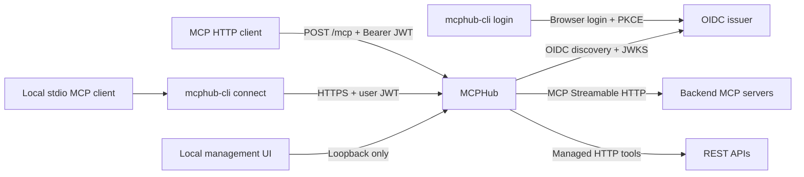

# MCPHub

[](https://github.com/SamuelSupe/mcphub/actions/workflows/ci.yml)
[](https://github.com/SamuelSupe/mcphub/releases/tag/v1.3.0)
[](https://github.com/SamuelSupe/mcphub/blob/main/LICENSE)
[](https://github.com/SamuelSupe/mcphub/blob/main/go.mod)

[English](README.md) | [中文](README.zh-CN.md)

MCPHub is an aggregation gateway for remote MCP Servers. It exposes one Streamable HTTP entry point, connects to multiple backends, builds a per-request backend view from JWT permissions, and routes tools, prompts, resources, and resource templates to the correct backend.

MCPHub v1.3.0 adds a redesigned local management UI and a separate browser-login CLI with a stdio-to-HTTP connector. The optional admin console manages encrypted SQLite configuration, HTTP tools, and OpenAPI imports. The gateway remains a single process, with no metrics endpoint, persistent remote MCP catalog, or cluster coordination.

## Architecture



## Project links

- [GitHub repository](https://github.com/SamuelSupe/mcphub)
- [Local management UI guide](#local-management-ui)
- [Contributing guide](CONTRIBUTING.md)
- [Security policy](SECURITY.md)
- [Apache License 2.0](LICENSE) (copyright 2026 SamuelSupe)
- [v1.3.0 release notes](RELEASE_NOTES_v1.3.0.md), [v1.2.0 historical release notes](RELEASE_NOTES_v1.2.0.md), [v1.3.0 GitHub release](https://github.com/SamuelSupe/mcphub/releases/tag/v1.3.0), and [all GitHub Releases](https://github.com/SamuelSupe/mcphub/releases)

MCPHub v1.3.0 is the latest release. v1.2.0 and earlier versions remain available as historical references.

## Capabilities and boundaries

- Connects to multiple backends over MCP Streamable HTTP; backend catalogs are paginated, and the tools, prompts, resources, and resource-template lists are discovered in parallel and refreshed on backend notifications or the configured refresh schedule.
- Aggregates `tools`, `prompts`, `resources`, resource templates, and completion; forwards tool/prompt/resource calls, resource subscribe/unsubscribe, progress notifications, and resource-update notifications.
- Streams backend SSE responses through unchanged while inspecting progress notifications; at most 1 MiB of each event is buffered for inspection, and an oversized event is forwarded unchanged without progress inspection.
- Normalizes missing 2026-07-28 metadata on `notifications/cancelled` from official Go MCP SDK v1.7.0 clients on both Hub ingress and backend egress, so the same logical MCP session remains reusable after cancellation or unsubscribe; this is an interoperability shim, not a custom extension.
- Namespaces capabilities with `backend.id` and rewrites resource URIs to avoid same-name capability and URI collisions between backends.
- Verifies Bearer JWTs with OIDC discovery and JWKS, then filters catalogs and calls by each backend's `required_scopes`.
- Includes the separate `mcphub-cli` program for browser login through an external OIDC service and a local stdio-to-HTTP connector with credential refresh.
- Applies backend-local `tool_rules` to original tool names with Go `path.Match`; matching rules union and deduplicate required scopes, use all-of authorization, and hide unauthorized tools from `tools/list`.
- Supports static backend request headers or OAuth 2.0 `client_credentials`; neither mode may provide a static `Authorization` header together with OAuth.
- The local admin UI separates overview, MCP backends, HTTP tool groups, and change history. It defaults to Chinese and can persistently switch to English. Groups can publish hand-authored HTTP tools and multiple OpenAPI 3.0/3.1 imports through `/mcp`; group Base URL, headers, OAuth, scopes, and timeout are shared, and no raw HTTP proxy is exposed.
- Provides health, readiness, and RFC 9728 Protected Resource Metadata endpoints, plus SIGHUP configuration reload.

When a backend connection fails, MCPHub retries and retains its last-known catalog. The catalog may remain listable while calls fail until the connection recovers. Startup does not exit just because a required backend is temporarily unavailable, so `/readyz` remains 503; a runtime created by SIGHUP requires its required backends to connect successfully on the initial attempt. Backend-authored JSON-RPC errors are returned unchanged. Network or transport failures are exposed only as `backend <id> unavailable`, so internal backend URLs, query strings, and credentials do not cross the Hub boundary. On reconnect, every tracked resource subscription must be restored successfully before the backend is marked ready; a restore failure keeps it unavailable and triggers another reconnect attempt.

## Quick start

Go 1.26 is required (`go.mod` declares `go 1.26.0`). To install the v1.3.0 server and optional CLI with Go:

```bash
go install github.com/SamuelSupe/mcphub/cmd/mcphub@v1.3.0
go install github.com/SamuelSupe/mcphub/cmd/mcphub-cli@v1.3.0
```

For a source build, copy the example and set its environment variables:

```bash
cp config.example.yaml config.yaml

# Example only; replace with real HTTPS endpoints and secrets. Do not commit secrets.
export MCPHUB_PUBLIC_URL='https://hub.example.com/mcp'
export MCPHUB_CONSOLE_ORIGIN='https://console.example.com'
export MCPHUB_AUTH_ISSUER='https://idp.example.com'
export MCPHUB_PRIMARY_BACKEND_URL='https://mcp-a.example.com/mcp'
export MCPHUB_PRIMARY_API_KEY='replace-me'
export MCPHUB_CRM_BACKEND_URL='https://mcp-crm.example.com/mcp'
export MCPHUB_CRM_OAUTH_ISSUER='https://idp.example.com'
export MCPHUB_CRM_CLIENT_ID='replace-me'
export MCPHUB_CRM_CLIENT_SECRET='replace-me'

go build -trimpath -o ./mcphub ./cmd/mcphub
./mcphub validate --config ./config.yaml
./mcphub serve --config ./config.yaml
```

`validate` performs read-only validation and prints `configuration valid` on success. In admin mode it reads an existing SQLite database without changing it, or validates YAML bootstrap backends when the database does not yet exist. `serve` writes structured JSON logs to stderr. Both subcommands require `--config PATH`.

You can also run without producing a binary:

```bash
go run ./cmd/mcphub validate --config ./config.yaml
go run ./cmd/mcphub serve --config ./config.yaml
```

### Browser login and local connector

`mcphub-cli` runs on the user's macOS or Linux computer and provides `login`, `connect`, `status`, and `logout`. The server executable `mcphub` provides `serve` and `validate`. Download the CLI archive for your platform below, install it with Go as shown above, or build it from this checkout and place it on your PATH:

```bash
go build -trimpath -o ./mcphub-cli ./cmd/mcphub-cli
```

The release workflow produces separate `mcphub_<version>_<os>_<arch>.tar.gz` server archives and `mcphub-cli_<version>_<os>_<arch>.tar.gz` client archives. Users only need the CLI archive. The server's existing `auth.issuer` and JWT scope policies remain the source of authentication and authorization.

Register a **public native OAuth client** at that issuer with authorization-code and refresh-token grants, PKCE S256, and token-endpoint authentication method `none`. Allow the callback `http://127.0.0.1:<port>/oauth/callback`; use an arbitrary loopback port when the provider supports native clients, or register a fixed port and pass `--callback-port 8765`. Discovery must advertise PKCE S256. The issuer must issue a signed JWT **access token** with an audience containing the exact MCPHub public URL, including `/mcp`, plus `sub`, `exp`, and the required scopes. No client secret is needed on the user's machine.

```bash
mcphub-cli login --server https://hub.example.com/mcp --client-id mcphub-cli --profile work
mcphub-cli status --profile work
```

`login` opens the system browser and waits up to five minutes for the local callback. If browser opening fails, it prints a URL to open on the same computer. It validates state/issuer and completes an authenticated MCP handshake before replacing saved credentials. A failed or canceled login preserves the previous profile. Repeat `--scope` to choose the requested scopes; otherwise the challenge or resource metadata provides the defaults. `offline_access` is added when advertised. A provider that issues no refresh token is supported, with an explicit message that another login will be required after expiry.

Configure a stdio-capable MCP client to launch the connector, substituting the installed binary's absolute path:

```json
{
  "mcpServers": {
    "mcphub": {
      "command": "/absolute/path/to/mcphub-cli",
      "args": ["connect", "--profile", "work"]
    }
  }
}
```

`connect` reads this profile, adds the Bearer token to requests to its saved MCPHub endpoint, and refreshes credentials before expiry. It forwards tools, prompts, resources, pagination, progress, and subscriptions without changing their public names or URIs. Each canceled stdio call closes its corresponding HTTP response stream. stdout contains MCP messages only; diagnostics use stderr. The connector never opens a browser. It refreshes/retries a rejected 401 request at most once, surfaces missing scopes for 403, and does not replay operations after network errors.

```bash
# Reuse the saved endpoint and client ID. List all desired scopes when overriding them.
mcphub-cli login --profile work --scope mcp:primary.read
mcphub-cli logout --profile work
```

Profiles default to `default` and are stored in `~/.mcphub/` (directory `0700`, files `0600`). Existing profiles work with `mcphub-cli` without migration. Tokens are stored as local JSON, **not encrypted**; keep this directory outside shared folders and backups accessible to other users. Atomic writes and per-profile process locks protect refresh-token rotation across multiple connectors. `status` reports only local cache state, expiry, and refresh capability, never token values. `logout` clears local tokens while keeping non-secret endpoint settings; subsequent connector requests fail and require login. Already accepted requests may finish. It does not revoke issuer tokens or sign out the browser. Logging in again requires restarting existing connectors for that profile.

Only the **local connector** uses stdio. MCPHub's server and backend connections remain HTTP. This first version does not add SSH/device-code login, dynamic client registration, token export, built-in user accounts, admin login, or interactive authorization to third-party backends.

### Prebuilt v1.3.0 downloads

The [v1.3.0 GitHub release](https://github.com/SamuelSupe/mcphub/releases/tag/v1.3.0) provides separate server and client archives. Install `mcphub` on the gateway host and `mcphub-cli` on the user’s computer.

| Platform | Server | Login CLI and local connector |
| --- | --- | --- |
| macOS Intel | [mcphub](https://github.com/SamuelSupe/mcphub/releases/download/v1.3.0/mcphub_v1.3.0_darwin_amd64.tar.gz) | [mcphub-cli](https://github.com/SamuelSupe/mcphub/releases/download/v1.3.0/mcphub-cli_v1.3.0_darwin_amd64.tar.gz) |
| macOS Apple Silicon | [mcphub](https://github.com/SamuelSupe/mcphub/releases/download/v1.3.0/mcphub_v1.3.0_darwin_arm64.tar.gz) | [mcphub-cli](https://github.com/SamuelSupe/mcphub/releases/download/v1.3.0/mcphub-cli_v1.3.0_darwin_arm64.tar.gz) |
| Linux amd64 | [mcphub](https://github.com/SamuelSupe/mcphub/releases/download/v1.3.0/mcphub_v1.3.0_linux_amd64.tar.gz) | [mcphub-cli](https://github.com/SamuelSupe/mcphub/releases/download/v1.3.0/mcphub-cli_v1.3.0_linux_amd64.tar.gz) |
| Linux arm64 | [mcphub](https://github.com/SamuelSupe/mcphub/releases/download/v1.3.0/mcphub_v1.3.0_linux_arm64.tar.gz) | [mcphub-cli](https://github.com/SamuelSupe/mcphub/releases/download/v1.3.0/mcphub-cli_v1.3.0_linux_arm64.tar.gz) |

Before extracting, compare the archive’s SHA-256 with its entry in [SHA256SUMS](https://github.com/SamuelSupe/mcphub/releases/download/v1.3.0/SHA256SUMS), then place the executable on your PATH. Both packages contain the license and English/Chinese READMEs; the server package also includes `config.example.yaml`.

## Local management UI

Enable the embedded UI to manage connections without editing backend YAML. For a new deployment, save the following as `config.yaml`, set `MCPHUB_PUBLIC_URL` and `MCPHUB_AUTH_ISSUER` to your real HTTPS gateway and identity-service URLs, and supply a Base64-encoded 32-byte `MCPHUB_CONFIG_KEY` from your secret store. Generate the key once (for example, with `openssl rand -base64 32`) and retain it securely across restarts and upgrades. Choose a writable database location.

```yaml
server:
  listen: "127.0.0.1:8080"
  public_url: ${MCPHUB_PUBLIC_URL}
auth:
  issuer: ${MCPHUB_AUTH_ISSUER}
admin:
  enabled: true
  listen: "127.0.0.1:8081"
  database_path: ./data/mcphub.db
  encryption_key_env: MCPHUB_CONFIG_KEY
backends: []
```

Run `mcphub validate --config config.yaml`, then `mcphub serve --config config.yaml`. Open [the local console](http://127.0.0.1:8081/) on the gateway host. The admin listener does not require login and must remain loopback-only. The gateway still needs a working OIDC issuer to become ready and authenticate MCP clients.

| Page | What to do |
| --- | --- |
| Overview | Check backend readiness, group/tool totals and recent changes; choose how to connect a service. |
| MCP backends | Connect an existing Streamable HTTP MCP server; search by ID or URL, filter status, test its connection, and manage its configuration. |
| HTTP tool groups | Turn a REST API into MCP tools. Create a group, then add HTTP interfaces or inspect and select operations from an OpenAPI document. |
| Change history | Review the latest 50 configuration events; secret values are redacted. |

Follow the same three steps in either editor: **connection → upstream credentials → client access**. Upstream headers/OAuth authorize MCPHub to call the service. Required scopes authorize clients to use the backend or group: an empty list permits all authenticated clients; a nonempty list requires **every** listed scope. Tool rules may add scopes for selected operations. Advanced connection settings stay collapsed until needed. When editing an existing secret, leave its value blank to retain it; removing its Header row removes that credential.

For several MCP endpoints to share an access policy, assign them the same required scope and have your issuer grant that scope to the appropriate users. HTTP tool groups share connection settings and policy within a REST API; they do not group multiple MCP backends. MCPHub does not provide an endpoint-group/role/user directory or interpret JWT `roles`/`groups` claims.

Use the language control to switch between Chinese and English. Refresh reloads the current configuration and shows the last successful update time; a failed refresh keeps a visible error and retry action.

## Configuration

Configuration is one YAML document decoded with strict field checking. Unknown fields, multiple YAML documents, and missing environment variables are rejected. `${NAME}` placeholders in string configuration fields are expanded from the current process environment; `NAME` must match `[A-Za-z_][A-Za-z0-9_]*`, and there is no default-value syntax. Duration, integer, and boolean fields do not accept placeholders. Loading and SIGHUP reload both expand the environment again. After the admin database has been initialized, YAML backends and their environment placeholders are ignored.

### `server`

| Field | Default | Description |
| --- | --- | --- |
| `listen` | `:8080` | HTTP listen address. It cannot be changed by SIGHUP; restart to change it. |
| `public_url` | none | Required absolute HTTPS URL with an MCP path (for example, `https://hub.example.com/mcp`), with no query or fragment. The path may not contain percent-encoded characters and may not be `/healthz`, `/readyz`, or `/.well-known/oauth-protected-resource`. It is both the MCP URL and the JWT audience. It cannot be changed by SIGHUP. |
| `page_size` | `1000` | Aggregated MCP catalog page size; must be positive. |
| `request_timeout` | `60s` | Default timeout for ordinary MCP requests and backend calls; must be positive. Every HTTP route keeps a request-body read deadline from this value until the body is consumed or closed, including unauthenticated and rejected requests. Once MCP handling proceeds, ordinary MCP POSTs also apply it to response-write deadlines and the request context; the newer `subscriptions/listen` POST keeps long-lived connection semantics after its body is read and is not given those ordinary response-write or context timeouts. Runtime or client context cancellation still expires its underlying write deadline, so a slow subscription write is interrupted when its generation drains or the client disconnects. |
| `drain_timeout` | `15s` | Maximum wait for active requests during SIGTERM/SIGINT shutdown and while replacing the old runtime after SIGHUP; must be positive. |
| `refresh_interval` | `5m` | Maximum backend catalog refresh interval. A shorter backend TTL causes an earlier refresh, with an effective interval no shorter than 5 seconds. Must be positive. |
| `catalog_ttl` | `30s` | Private TTL advertised for MCP catalog/discovery results; may be zero but not negative. |
| `max_request_body_bytes` | `4194304` (4 MiB) | MCP POST body limit; larger requests return 413. Must be positive. |
| `allowed_origins` | `[]` | Additional browser HTTPS Origins. Each entry must be `https://authority` only, with no path, query, fragment, or wildcard. The origin of MCPHub's own `public_url` is allowed automatically. |

Durations use Go `time.ParseDuration` syntax, such as `500ms`, `60s`, and `5m`. The path of `public_url` is the MCP entry path; the example uses `/mcp`. Percent-encoded path characters are rejected, and `/healthz`, `/readyz`, and `/.well-known/oauth-protected-resource` are reserved paths.

### `auth`

| Field | Description |
| --- | --- |
| `issuer` | Required absolute HTTPS OIDC issuer. MCPHub performs discovery (normally `/.well-known/openid-configuration`) and reads JWKS from it. It cannot be changed by SIGHUP. |

JWT requirements are: the issuer and signature must validate against this issuer; `aud` must contain the complete `server.public_url` including its path—when `aud` is a string it must equal `public_url`, and when `aud` is an array it must include `public_url`; `sub` must be non-empty; and `exp` must be present. `nbf`, when present, is checked too. Expiry, activation, and OIDC time comparisons allow 30 seconds of clock skew. The verifier becomes ready only after OIDC discovery succeeds, `jwks_uri` is an absolute HTTPS URL, and a reachable JWKS response contains at least one parseable, valid, asymmetric public verification key; symmetric `oct` keys and invalid or empty keys do not satisfy this condition. Before that first successful refresh, the MCP endpoint returns 503; after it is ready, a temporary discovery or JWKS refresh failure retains the last-known-good verifier. OIDC discovery and JWKS responses are each capped at 1 MiB.

For JWKS readiness, a usable key has no `use` or `use: sig`; if `key_ops` is present it includes `verify`; and an explicit `alg` matches a supported RSA, EC, or Ed25519 JWS algorithm declared by OIDC discovery. If discovery omits `id_token_signing_alg_values_supported`, `RS256` is assumed. Unsupported or malformed keys in the same JWKS do not hide another usable key.

Scopes are read from both JWT `scope` and `scp` claims. `scope` accepts only a space-delimited string (including an empty string or JSON `null`); `scp` accepts a space-delimited string or a string array. The two claims are merged and deduplicated; array entries may not contain whitespace. Backend access uses **all-of** semantics: `required_scopes: [a, b]` requires the token to contain both `a` and `b`. If either is missing, that backend is absent from the token's catalog view and an identified direct call returns 403 `insufficient_scope`. A backend with no `required_scopes` is not scope-gated. Protected Resource Metadata reports the deduplicated union of all backend required scopes in `scopes_supported`.

### `admin`

The local administration platform is opt-in. When enabled it serves an embedded UI and JSON API from a separate, unauthenticated loopback listener. It manages backend and tool-group configuration; `server`, `auth`, and `admin` remain YAML/restart settings.

| Field | Default | Description |
| --- | --- | --- |
| `enabled` | `false` | Enables the local administration platform and SQLite backend source of truth. |
| `listen` | `127.0.0.1:8081` | Must use numeric IPv4 or IPv6 loopback. It cannot be changed with SIGHUP. |
| `database_path` | none | Required when enabled. Relative paths resolve from the YAML file's directory. |
| `encryption_key_env` | `MCPHUB_CONFIG_KEY` | Environment variable containing a Base64-encoded 32-byte AES key. Losing or changing this key makes stored secrets unreadable. |

On the first start with an empty database, expanded YAML backends are imported in one transaction. SQLite becomes the sole backend source after the bootstrap marker is written; later YAML backend edits have no effect. Header values and OAuth client secrets are encrypted with AES-256-GCM and are never returned by the management API.

The UI is available at `http://127.0.0.1:8081/` by default. It can register, probe, edit, enable, disable, and delete backends without restarting the process. Required backend failures reject a change without replacing the current runtime; an unavailable optional backend is saved and continues reconnecting in the background.

The JSON API is rooted at `/api/v1`. Individual backend responses include an `ETag`; update and delete requests must send that revision in `If-Match`, and stale writes fail with `409 revision_conflict`. Secret fields are returned only as configured markers. Omitting a secret value during an edit preserves it, while omitting the Header or OAuth configuration removes it. Audit events identify the actor as `local` and contain only redacted outcomes.

#### Tool groups and managed HTTP API tools

Tool groups are managed objects in the administration API, not YAML configuration. A group owns the shared HTTPS base URL, static headers or OAuth 2.0 `client_credentials`, JWT required scopes, and request timeout for its tools. Header values and OAuth client secrets are encrypted in SQLite; the API exposes only configured/not-configured markers. Group scope checks retain the same all-of semantics as backend scopes; optional group-local tool rules can add scopes to selected tools.

A group may contain hand-authored HTTP tools and multiple OpenAPI 3.0 or 3.1 imports. OpenAPI imports can be inspected before they are saved. Both kinds are MCP capabilities: they are listed and invoked only through the configured `/mcp` Streamable HTTP endpoint. MCPHub does not expose a raw HTTP proxy or an arbitrary method/path passthrough route.

The stable management paths are:

| Operation | Path |
| --- | --- |
| List/create groups | `GET/POST /api/v1/tool-groups` |
| Read/update/delete a group; probe it | `GET/PUT/DELETE /api/v1/tool-groups/{groupID}`, `POST .../{groupID}/probe` |
| List/create or read/update/delete manual tools | `GET/POST .../{groupID}/tools`, `GET/PUT/DELETE .../{groupID}/tools/{toolName}` |
| Inspect, list/create, or read/update/delete OpenAPI imports | `POST .../{groupID}/imports/inspect`, `GET/POST .../{groupID}/imports`, `GET/PUT/DELETE .../{groupID}/imports/{importID}` |
| Refresh an OpenAPI import | `POST .../{groupID}/imports/{importID}/refresh` |

Group, manual-tool, and import resources return an `ETag`. Updates and deletes require the matching `If-Match`; a stale revision returns `409 revision_conflict`. These resources are persisted and changed only through the admin API and SQLite; there is intentionally no `tool_groups` (or equivalent) YAML schema and SIGHUP does not import one.

Group base URLs and OpenAPI source URLs must use HTTPS; group HTTP requests and source fetches do not follow redirects. A source fetched from another origin never receives the group's static headers or OAuth secret. OpenAPI documents are capped at 5 MiB, requests carrying a document at 6 MiB, and HTTP-tool responses at 1 MiB by default; the response limit is configurable from 64 KiB through 16 MiB. A URL-backed import refreshes automatically every 15 minutes by default (allowed range 1 minute to 24 hours); a failed refresh keeps the last-known-good document/tools and retries with backoff.

#### Upgrade notes for v1.3.0

Upgrading from v1.2.0 requires no configuration or database schema migration. Keep the existing SQLite database and the same `MCPHUB_CONFIG_KEY`; back up the database and retain the key separately before replacing the binary. Restart the process and reload the browser to load the new UI. Install `mcphub-cli` separately on client machines and register its public OAuth client with your issuer.

Existing YAML-only deployments remain unchanged while `admin.enabled` is `false`. To enable local administration for the first time, set the loopback `admin` listener, provide the Base64-encoded 32-byte `MCPHUB_CONFIG_KEY`, and provision a writable SQLite path. The first start imports the existing YAML backends in one transaction; after the bootstrap marker is written, SQLite is the sole backend source and later YAML backend edits are ignored. Create tool groups, manual HTTP tools, and OpenAPI imports through `/api/v1/tool-groups`; no YAML migration is expected because these objects have no YAML representation.

### `backends`

At least one backend is required in YAML-only mode. Admin mode may start empty so the first backend can be registered in the UI. Each `id` must match `[A-Za-z0-9_-]{1,32}` and be unique case-insensitively; uppercase letters are allowed.

| Field | Default | Description |
| --- | --- | --- |
| `id` | none | External namespace and configured ID for tool/prompt names; dots are not allowed. Uppercase letters are retained in those names, while resource/template URI authorities use the lowercase ID. |
| `url` | none | Required absolute URL. HTTPS is required by default; HTTP is accepted only when `allow_insecure_http: true` and the host is `localhost` or an IPv4/IPv6 loopback. Fragments are rejected. |
| `required` | `false` | Required backends affect `/readyz`. A runtime disconnect makes readiness 503 while the reconnect loop continues. |
| `required_scopes` | `[]` | JWT scopes required for this backend, checked with all-of semantics; scope entries cannot contain whitespace or duplicates. |
| `tool_rules` | `[]` | Optional backend-local tool policies. Each rule has a `match` glob and `required_scopes`; matching uses Go `path.Match` against the original backend tool name, full-string and case-sensitive. |
| `request_timeout` | inherits `server.request_timeout` | Timeout for this backend's connection, discovery, refresh, and calls; must be positive. |
| `allow_insecure_http` | `false` | Loopback-only local HTTP switch. It does not relax HTTPS requirements for `server.public_url` or any issuer. |
| `headers` | `{}` | Static headers added to every backend MCP HTTP request. Values support environment expansion, may not contain CR/LF, and names are case-insensitively unique. `Accept`, `Content-Type`, any `Mcp-*` header, and transport-managed headers such as `Host`, `Content-Length`, `Connection`, `Proxy-Authorization`, and `Proxy-Authenticate` are rejected. |
| `oauth` | none | Backend OAuth configuration. The only accepted `type` is `client_credentials`, and it cannot be combined with a static `Authorization` header. |

`oauth` fields:

| Field | Description |
| --- | --- |
| `type` | Must be `client_credentials`. |
| `issuer` | Required absolute HTTPS OAuth issuer; its metadata issuer must match exactly. |
| `client_id` / `client_secret` | Required; preferably supplied only through `${...}` environment variables. |
| `scopes` | Scopes requested from the backend OAuth token endpoint. These are independent of `required_scopes`, which gate the JWT presented to MCPHub. |

Backend OAuth discovery and token requests do not receive the backend's static headers; data-plane requests do and automatically reuse/refresh the client-credentials token. Discovery probes RFC 8414/OIDC metadata for an exact `issuer` and `token_endpoint` only; it does not require interactive authorization or PKCE metadata. OAuth metadata responses are capped at 1 MiB. Backend and OIDC HTTP clients do not follow redirects.

#### Backend-local tool rules

`tool_rules` is evaluated per backend before the configured ID is added to a public tool name. A rule's `match` uses Go `path.Match` on the original backend tool name: matching is full-string and case-sensitive, so a pattern such as `admin.*` does not match `Admin.Read` or a substring. Every matching rule contributes its `required_scopes`; MCPHub unions and deduplicates those scopes, then requires all of them together with the backend-level `required_scopes`.

Validation expands existing `${ENV}` placeholders in `match` and rule scope strings; every `match` must be non-empty and a valid Go `path.Match` pattern, every rule must declare non-empty `required_scopes` entries with no whitespace or duplicates, and duplicate `match` entries within one backend are rejected.

Tools that fail this policy are omitted from `tools/list`. If a client directly calls a known tool without the required scopes, MCPHub returns 403 and a precise `WWW-Authenticate` challenge with `error="insufficient_scope"`, the path-aware `resource_metadata` URL, and a space-delimited `scope` value containing the missing scopes. A rule that matches no tool in the current catalog generation emits one warning, remains valid, and can match after a later catalog refresh. Editing `tool_rules` is supported by SIGHUP and takes effect with the reloaded backend policy.

Backend IDs are compared case-insensitively for uniqueness. Tool and prompt names retain the configured ID, while every exposed resource or resource-template URI uses a lowercase authority and resolves back to the configured ID.

## HTTP endpoints and RFC 9728

Assuming `server.public_url: https://hub.example.com/mcp`:

| Address | Auth | Semantics |
| --- | --- | --- |
| `GET /healthz` | none | Returns `200 {"status":"ok"}` while a runtime exists; use it as a liveness probe. |
| `GET /readyz` | none | Returns 200 when the OIDC verifier and all required backends are ready, otherwise 503. JSON includes `backends_ready`, `backends_total`, `required_ready`, `required_total`, and `auth_verifier_ready`. |
| `GET /.well-known/oauth-protected-resource/mcp` | none | Path-aware RFC 9728 Protected Resource Metadata address; expose this address to clients. |
| `GET /.well-known/oauth-protected-resource` | none | Root-path compatibility alias for the same metadata. Route both addresses to MCPHub through a reverse proxy. |
| `/mcp` | Bearer JWT | Stateless MCP Streamable HTTP entry; accepts POST only, and compatibility clients use the same `/mcp` POST semantics. Modern clients may use request-scoped SSE in the POST response; MCPHub does not provide a standalone GET SSE or DELETE session endpoint. Catalogs and calls are filtered by token scopes. |

Metadata has `resource` equal to the complete `public_url`, `authorization_servers` containing `auth.issuer`, `scopes_supported` equal to the union of backend required scopes, and `bearer_methods_supported` equal to `header`. An MCP request without a token receives a 401 challenge whose `resource_metadata` points to `https://hub.example.com/.well-known/oauth-protected-resource/mcp`; missing scopes return 403 `insufficient_scope`.

Cross-origin requests accept only the `public_url` origin or an exact origin in `allowed_origins`. Preflight responses allow only `POST` (with `OPTIONS` as the preflight response) and the implemented MCP/trace headers (including supported `Mcp-Param-*` parameter headers); `*` is not supported. Other paths return 404.

## Name and URI mapping

- Tools and prompts are exposed as `<backend-id>.<original-name>`. Original names must match `[A-Za-z0-9_.-]{1,128}`. If the namespaced name exceeds 128 characters, MCPHub truncates it while retaining the backend prefix and appends a short SHA-256 suffix of the original name. Invalid metadata and mapped collisions are omitted and logged.
- Static resources and `ResourceLink`/embedded resources in results are encoded as `mcphub://<backend-id>/r/<base64url-no-padding(original-uri)>`. MCPHub decodes that URI to read from the corresponding backend and recursively rewrites resource URIs in results.
- Resource templates are encoded as `mcphub://<backend-id>/t/<sha256(original-template)>`, retaining URI-template variables as a query expression (for example, `{?id}`). Reads and completions restore the backend's original template.
- `ResourceLink`, `EmbeddedResource`, and `ResourceContents` URIs in backend tool, prompt, or resource results are rewritten and recorded as issued resources for that backend. They remain readable and subscribable while their URI digest is retained, but are not added individually to the public `resources` catalog. Each backend retains at most 16,384 distinct issued-URI SHA-256 digests; once the oldest digest is evicted, a new read or subscription for that URI may fail, while existing subscription cancellation and session cleanup still use the session map. `resource updated` notifications never create catalog entries.
- Resource subscriptions are tracked and deduplicated per upstream MCP session, while backend references are shared and reference-counted by original URI; an unpaired unsubscribe is ignored, session close cleans up, and reconnect restores all tracked subscriptions, waiting for `notifications/subscriptions/acknowledged` when the backend protocol supports that acknowledgement, before the backend is marked ready. An acknowledgement's subscription ID maps back to the original subscription URI(s), so a 2026 resource update fans out to those URIs even when the event URI differs; timeout, cancellation, and session/reconnect cleanup remove the mapping. When a modern `subscriptions/listen` stream is canceled or disconnects, cleanup detaches from the canceled upstream context but remains bounded by backend `request_timeout` and session lifecycle, so legacy backends still receive `resources/unsubscribe`. If any restore fails, the backend remains unavailable and the reconnect loop tries again.

Each token's scope set selects an independent backend view, so one MCP connection sees only the capabilities allowed for that token.

## SIGHUP reload and shutdown

On Unix, send signals to a running `serve` process:

```bash
kill -HUP <mcphub-pid>   # reload the same --config file
kill -TERM <mcphub-pid>  # graceful shutdown
```

SIGHUP fully loads, expands, and validates the configuration before building a candidate runtime; failures leave the old runtime in place. Required backends in the new runtime must connect successfully on the initial attempt. The old runtime waits for active requests for `drain_timeout` before closing; when a runtime generation closes, it cancels request contexts bound to that generation before closing its Hub/backend state, preventing late session registration. That cancellation immediately expires the underlying write deadline, interrupting slow or unread subscription writes after the drain; ordinary requests retain their `request_timeout` deadline. Allowed origins, catalog/request/drain parameters, the backend list, backend authentication, scopes, and backend-local `tool_rules` can be reloaded. Changes to these fields are rejected and require a restart:

- `server.listen`
- `server.public_url`
- `auth.issuer`
- every `admin` field

These values determine bound listeners, storage/encryption identity, RFC 9728/JWT audience, and the OIDC verifier, so they cannot be changed by replacing only the in-memory runtime. In admin mode SIGHUP reloads static YAML fields and composes backends from SQLite; YAML backend changes are ignored after first import.

SIGHUP candidate startup uses a cancelable context; shutdown cancels a candidate that is still connecting. Candidate required backends must connect successfully before the swap, and each candidate or retired runtime closes its own backend sessions and connections.

SIGINT and SIGTERM first stop MCPHub from accepting new requests, then keep the current runtime and backend context alive while HTTP requests drain for `drain_timeout`. If the HTTP drain reaches that timeout, MCPHub force-closes the remaining HTTP connections; generation close then cancels request contexts bound to the generation before backend state is closed.

When SIGHUP creates an unavailable optional backend, it inherits the previous in-memory catalog only when its catalog-source identity is unchanged: backend ID and URL, `allow_insecure_http`, every fixed header, and OAuth configuration presence plus `type`, `issuer`, `client_id`, `client_secret`, and `scopes` must match. Any credential, OAuth, or tenant-selection-header change blocks reuse. Fields that do not identify the catalog source, such as `required`, `required_scopes`, `tool_rules`, and timeouts, do not block reuse; inherited data never marks the new backend ready.

## Docker

The Dockerfile builds a static binary with `golang:1.26-bookworm`, then copies it into `gcr.io/distroless/static-debian12:nonroot`. The final image has no shell and runs as the nonroot user.

```bash
docker build -t mcphub:local .
docker run --rm \
  --name mcphub \
  -p 8080:8080 \
  --env-file .env \
  -v "$PWD/config.yaml:/etc/mcphub/config.yaml:ro" \
  mcphub:local serve --config /etc/mcphub/config.yaml
```

The container listen address must match the published port (the example uses `:8080`). `--env-file` injects environment variables only; the configuration is mounted read-only. Restrict permissions on the host `config.yaml` and `.env`. The image entrypoint is already `/usr/local/bin/mcphub`, so pass `serve` or `validate` as arguments.

Admin mode additionally requires a writable volume for `database_path` and `MCPHUB_CONFIG_KEY` in the container environment. Because the unauthenticated admin server is deliberately bound to container loopback, ordinary `-p 8081:8081` publishing cannot reach it. Use a host installation or Linux host networking for local administration; do not broaden the listener address to expose it remotely.

## Security notes

- Use HTTPS for production `public_url`, `auth.issuer`, and remote backend URLs. `allow_insecure_http` permits only loopback backends; it cannot make a remote plaintext URL valid.
- `public_url` must appear in the token `aud`: a string `aud` equals `public_url`, while an audience array contains `public_url`; after TLS termination, a reverse proxy must preserve the public host and path and route both RFC 9728 metadata addresses.
- Use exact `allowed_origins` entries and do not add untrusted consoles. Origin and preflight headers are strictly allowlisted; preflight permits only `POST` (with `OPTIONS` as the response method).
- Put client secrets, API keys, and static Authorization values in environment variables or an external secret store, not in Git. Static headers are sent to backend data planes; do not put sensitive values in logs or capability names.
- Validation rejects line breaks, duplicate headers, and transport-managed headers, including `Proxy-Authorization` and `Proxy-Authenticate`. OAuth rejects a static `Authorization` header to prevent competing authentication sources.
- Overlong or invalid request IDs are regenerated, logged request/trace values are bounded or hashed, capability and resource-URI fields are validated and sanitized, and request failures record only external error types rather than raw external error text.
- `/healthz`, `/readyz`, and metadata do not require Bearer authentication; restrict their network visibility as appropriate. The MCP entry accepts Bearer JWTs in the Authorization header.
- Every HTTP route keeps the `request_timeout` request-body read deadline until the body is consumed or closed, so unauthenticated and rejected requests with slow bodies are bounded. A `subscriptions/listen` POST is exempt from ordinary response-write and request-context timeouts only after its body has been read.
- Backend SSE responses are streaming passthrough. Progress inspection buffers at most 1 MiB per event; an oversized event is forwarded unchanged without progress inspection.
- Acknowledged 2026 resource subscription IDs map updates back to their original subscription URI(s), including when an update event URI differs; timeout, cancellation, and session/reconnect cleanup remove the mapping.
- The administration API has no login. Configuration validation forces it onto numeric loopback, rejects cross-origin and unexpected Host requests, and applies a restrictive CSP. Never expose it through a public reverse proxy.
- Keep `MCPHUB_CONFIG_KEY` outside YAML and backups. The SQLite file uses `0600`, but its availability and recoverability depend on retaining the exact 32-byte key.

## Known limits and troubleshooting

- The local admin platform persists backend and tool-group configuration only. There is still no metrics endpoint, persistent MCP catalog, cross-instance subscription state, or high-availability coordination; each process owns its backend connections, catalogs, and token views.
- This release does not provide admin users/remote admin authentication, stdio backends, a standalone legacy GET SSE endpoint, native TLS, dynamic tenants or per-user backend credentials, opaque-token introspection, Tasks, MCP Apps, or custom MCP extensions. The local `connect` command provides stdio access to the HTTP gateway. TLS and external rate limiting belong at the reverse proxy.
- The aggregator advertises and implements only tools, prompts, resources (including subscriptions), and completions. Other backend capabilities do not automatically become gateway capabilities. Invalid names, URI templates, and SDK-rejected metadata are omitted.
- A disconnected backend keeps its last-known-good catalog, but calls require a live connection. A required backend makes `/readyz` return 503; an optional backend does not block overall readiness.
- `server.refresh_interval` is the maximum refresh period; a shorter backend TTL refreshes sooner. There is no forced-refresh API.
- SIGHUP does not reread the orchestration layer's Docker `--env-file`; placeholders use the current process environment. Restart for secret changes or fields that cannot be reloaded.

Common symptoms:

1. `validate` reports `environment variable ... is not set`: export every `${...}` variable in the example.
2. `/readyz` returns 503: inspect `auth_verifier_ready` and `required_ready` in the JSON, then check OIDC discovery/JWKS and required backend URLs.
3. MCP returns 401 with a `resource_metadata` challenge: check the Bearer token, signature, issuer, and audience.
4. MCP returns 403 `insufficient_scope`: add every scope named in the challenge for that backend.
5. `/mcp` returns 404: ensure the request path exactly matches the path in `public_url`; `public_url` cannot be the domain root.
