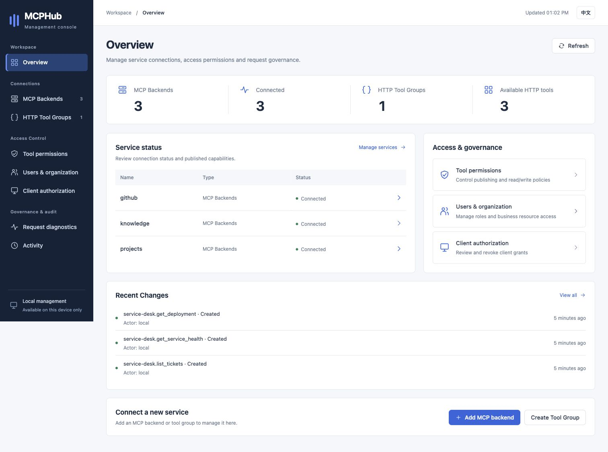
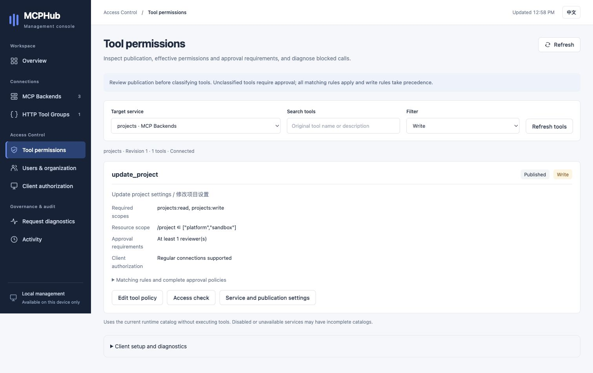
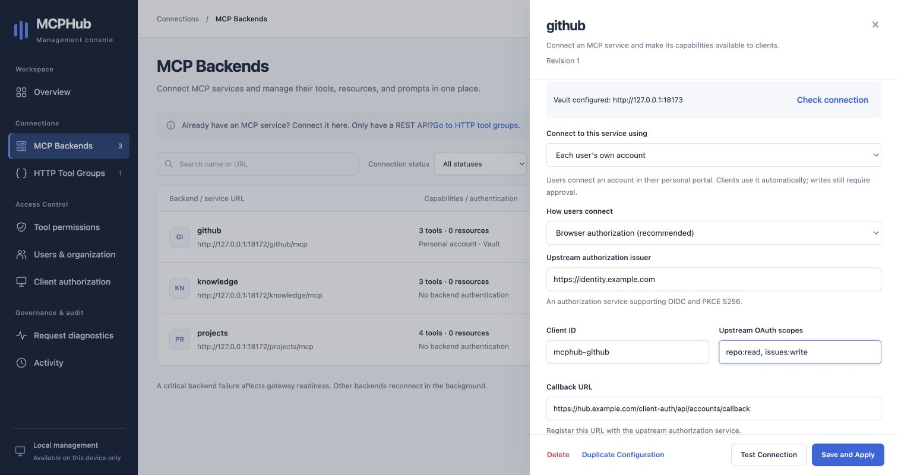
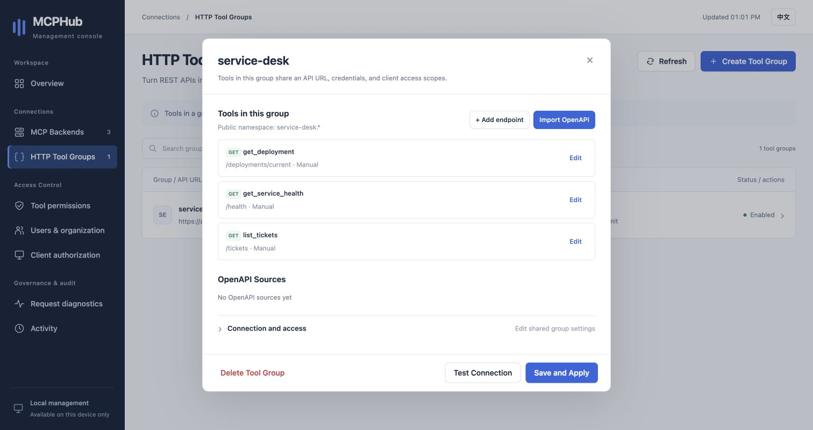
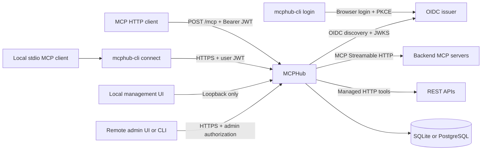

# MCPHub

[English](README.md) | [中文](README.zh-CN.md)

MCPHub exposes existing remote MCP servers and ordinary HTTP APIs as MCP tools. A single Streamable HTTP endpoint centralizes service connections, tool publication, user permissions, client authorization and write approval.

Users install `mcphub-cli` on their computers, sign in through a browser and confirm access for each Agent. Administrators deploy `mcphub` and manage services, credentials and policies. The gateway runs as one instance with SQLite or PostgreSQL.

## Start here

**[Online help center](https://samuelsupe.github.io/mcphub/en/)**: 19 end-user guides in English and Chinese, with grouped navigation, full-text search and client configuration examples.

**[Online administrator manual](https://samuelsupe.github.io/mcphub/en/admin/)**: 20 chapters in English and Chinese covering deployment, services, identity, governance and operations. Switch languages from any chapter.

| Your task | Start with | Covers |
| --- | --- | --- |
| Use company tools from an Agent | **[User manual](docs/user-guide.md)** | CLI installation, client setup, personal accounts, approvals and troubleshooting |
| Deploy and manage MCPHub | **[Administrator manual](docs/admin-guide.md)** | Deployment, services, publication, user permissions, governance and operations |
| Look up fields, APIs or protocol behavior | [Configuration and protocol reference](docs/configuration.md) | YAML, tool policies, limits, HTTP endpoints and reloads |
| Find a specific topic | [Documentation index](docs/README.md) | SSO, Vault, deployment examples, architecture and releases |

First-time user: get the MCP URL and CLI client ID from your administrator, run the [setup wizard](docs/user-guide.md#connect-an-mcp-client), then add its output to your MCP client.

First deployment: follow the [administrator manual](docs/admin-guide.md#preparation-and-installation) to prepare identity, HTTPS, storage and an encryption key. Validate one read-only service first.

## Version and upgrades

These documents cover **v2.2.0**, adding persistent request history and improving administrator recovery, SSO login and personal-account diagnostics. [Release notes](RELEASE_NOTES_v2.2.0.md) · [Downloads](https://github.com/SamuelSupe/mcphub/releases/tag/v2.2.0)

v2.2.0 migrates managed databases to **schema 9**. Back up the database and matching encryption key before starting; rollback requires the pre-upgrade backup. Upgrades from v1.x also require reviewing tool publication and read/write policies, and the Go module path adds `/v2`. See the [upgrade and rollback procedure](RELEASE_NOTES_v2.2.0.md#upgrade-and-rollback--升级与回滚).

## Capabilities and boundaries

- Aggregate remote MCP tools, prompts, resources, templates and completion with permission-aware discovery and routing.
- Connect stdio MCP clients through a separate CLI and local Broker, with browser login, credential refresh and revocable client grants.
- Publish tools explicitly and enforce user/group policies, scopes, business resources, client grants and approval per write.
- Bridge enterprise OIDC / OAuth2 identity and use Vault for shared service or personal upstream accounts.
- Manage MCP backends, HTTP tool groups and OpenAPI imports in the console; inspect request history and configuration changes.
- Store encrypted configuration in single-instance SQLite / PostgreSQL, with health probes, reloads and endpoint rate limits.

See the [capability reference](docs/configuration.md#capabilities-and-boundaries) for detailed protocol behavior.

## Screenshots

Captured from MCPHub v2.1.0 running in OrbStack, using local Chrome and demonstration data. The console supports English and Chinese; these captures show local administration. See [capture details](docs/screenshots/README.md).

**Service overview** — connection health, available tools, access controls and recent configuration changes.

<strong>Tool permissions</strong> — scopes, business resources and write approval

Inspect a published write tool's effective scopes, allowed project values and required reviewer count before an Agent can execute it.

<strong>Vault accounts</strong> — connect upstream services with each user's own account

Choose personal credentials and configure browser authorization, upstream scopes and the callback URL. This capture shows the configuration interface, without connecting a real external account.

<strong>HTTP tool groups</strong> — manage REST endpoints and OpenAPI sources

Group HTTP endpoints under one MCP namespace, with shared connections and access policies.

## Architecture

MCP clients connect to the gateway; administrators manage policies through a separate listener. Upstream services retain their own business authorization checks.

```mermaid
flowchart LR
    C[MCP HTTP client] -->|POST /mcp + Bearer JWT| H[MCPHub]
    S[Local stdio MCP client] --> CLI[mcphub-cli connect]
    CLI -->|HTTPS + user JWT| H
    L[mcphub-cli login] -->|Browser login + PKCE| I[OIDC issuer]
    H -->|OIDC discovery + JWKS| I
    H -->|MCP Streamable HTTP| B[Backend MCP servers]
    H -->|Managed HTTP tools| A[REST APIs]
    U[Local management UI] -->|Loopback only| H
    R[Remote admin UI or CLI] -->|HTTPS + admin authorization| H
    H --> D[(SQLite or PostgreSQL)]
```

For enterprise integration, see the [Feishu SSO, Vault and Agent architecture](docs/feishu-vault-agent-architecture.zh-CN.md). It identifies real-tenant, directory-adapter and MFA acceptance work still required; the PDF is a historical review snapshot.

## Known limits

Run one active Hub instance. PostgreSQL or Vault HA does not provide multi-instance Hub consistency. The server does not connect to stdio backends or provide native TLS, built-in accounts or a standalone legacy GET SSE endpoint. Terminate TLS at a reverse proxy. Personal Vault accounts currently cover remote MCP endpoints.

See [administrator troubleshooting](docs/admin-guide.md#known-limits-and-troubleshooting) or [user connection diagnostics](docs/user-guide.md#diagnostics-and-troubleshooting).

## Project resources

[Contributing](CONTRIBUTING.md) · [Security policy](SECURITY.md) · [All releases](https://github.com/SamuelSupe/mcphub/releases) · [Apache License 2.0](LICENSE) (Copyright 2026 SamuelSupe)
