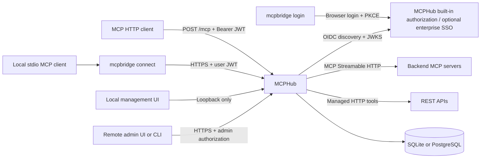

# MCPHub

> This guide covers v2.3.0 fresh deployments. Built-in accounts and Agent device authorization require v2.3.0; v2.2.2 does not include these features.

[](https://github.com/SamuelSupe/mcphub/actions/workflows/ci.yml)
[](https://github.com/SamuelSupe/mcphub/releases/tag/v2.2.2)
[](https://github.com/SamuelSupe/mcphub/blob/main/LICENSE)
[](https://github.com/SamuelSupe/mcphub/blob/main/go.mod)

[English](README.md) | [中文](README.zh-CN.md)

MCPHub exposes existing remote MCP servers and ordinary HTTP APIs as MCP tools. A single Streamable HTTP endpoint centralizes service connections, tool publication, user permissions, client authorization and write approval.

Users install `mcpbridge` on their computers, sign in through a browser and confirm access for each Agent. Administrators deploy `mcphub` and manage services, credentials and policies. The gateway runs as one instance with SQLite or PostgreSQL.

| Program | Install on | Main commands |
| --- | --- | --- |
| **mcphub — server** | Gateway host | `serve`, `validate`, `init-admin` |
| **mcpbridge — client** | Agent/user computer | `setup`, `login`, `connect`, `doctor` |

From v2.2.2, `mcpbridge` replaces the executable name `mcphub-cli`. The client package is named `mcpbridge_v2.3.0_*`; use the `mcphub_v2.3.0_*` package to deploy the server. Run either executable with `--version` to confirm its name, version and role.

## Agent link authorization

With the built-in issuer, user sign-in and client consent happen on one web page. Local, SSH and container Agents can use this flow without a browser callback to the Agent's machine. Run both commands under the same operating-system user and private `MCPHUB_HOME` directory:

```bash
mcpbridge pair start --server https://hub.example.com/mcp --profile work --name "Project Agent" --json
mcpbridge pair finish --request pr_example --wait --json
mcpbridge connect --profile work --client ci_example
```

Replace the request and client IDs with the actual results. Show the user `verification_uri_complete` and `user_code`. After comparing the code, the user signs in with local accounts, LDAP or OIDC, selects a service, tools, resource restrictions and duration, then approves. No tools are selected by default; write access is off. Without `--wait`, finish checks once. `pending_user` requires approval; `ready` means private credentials were saved and MCP connectivity was checked. The default requested maximum is 1 hour, capped by the gateway. Requests expire after 5 minutes and polling starts at 5 seconds. `--ttl` takes seconds (at least 60); narrow requests with `--endpoint` and repeated `--tool` / `--scope`.

For Agents without command execution, use these stdio arguments:

```json
["connect", "--server", "https://hub.example.com/mcp", "--profile", "work", "--name", "Project Agent", "--interactive-auth"]
```

The session initializes immediately with only `mcpbridge_auth_start` and `mcpbridge_auth_status`. Start reuses the same unexpired request; status may collect and save credentials and check connectivity. Respect the returned `interval`. Refresh tools after ready. If the Agent does not support `notifications/tools/list_changed`, reconnect using the returned `connect --profile … --client …` command. Failed business calls are never queued or retried automatically. Reauthorization after expiry or revocation is explicit.

Each pairing grants one service and tool capability; use existing setup for prompts, resource URIs or subscriptions. Current groups and the confirmed grant both restrict access, and new tools never expand old grants. Private credentials remain inside MCPBridge. Never copy tokens to an Agent. Failure preserves an existing working profile; choose a new profile for another user or server. Pure external issuers retain PKCE login and setup.

## Start here

**[Online help center](https://samuelsupe.github.io/mcphub/en/)**: 19 end-user guides in English and Chinese, with grouped navigation, full-text search and client configuration examples.

**[Online administrator manual](https://samuelsupe.github.io/mcphub/en/admin/)**. The manual has 22 chapters in English and Chinese covering deployment, services, identity, governance and operations. Switch languages from any chapter.

| Your task | Start with | Covers |
| --- | --- | --- |
| Use company tools from an Agent | **[User manual](docs/user-guide.md)** | CLI installation, client setup, personal accounts, approvals and troubleshooting |
| Configure LDAP and OIDC | [Identity services guide](docs/enterprise-login.md) | Console setup, connection tests and group permissions |
| Deploy and manage MCPHub | **[Administrator manual](docs/admin-guide.md)** | Deployment, services, publication, user permissions, governance and operations |
| Look up fields, APIs or protocol behavior | [Configuration and protocol reference](docs/configuration.md) | YAML, tool policies, limits, HTTP endpoints and reloads |
| Find a specific topic | [Documentation index](docs/README.md) | SSO, Vault, deployment examples, architecture and releases |

First-time user: get the MCP URL and CLI client ID from your administrator, run the [setup wizard](docs/user-guide.md#connect-an-mcp-client), then add its output to your MCP client.

First deployment: follow the [administrator manual](docs/admin-guide.md#preparation-and-installation) to prepare HTTPS, storage and an encryption key, then initialize the administrator locally. Validate one read-only service first.

## Version and fresh deployments

These documents cover **fresh v2.3.0 deployments**. The default enables the management console and SQLite with no preconfigured backends. Install `mcphub` on the gateway and `mcpbridge` on user computers. [Release notes](RELEASE_NOTES_v2.3.0.md) · [Download v2.3.0](https://github.com/SamuelSupe/mcphub/releases/tag/v2.3.0).

The default requires only `MCPHUB_PUBLIC_URL` and `MCPHUB_CONFIG_KEY`. Follow **start MCPHub → initialize the administrator locally → sign in → create groups, assign group permissions, add users and connect backends → test connections → publish tools**. See [built-in accounts](docs/builtin-accounts.md) for passwords and MFA; enterprise LDAP and OIDC are optional and can be configured together in the console. Configure each backend separately. Remote administration uses `deploy/config.remote-*`.

## Capabilities and boundaries

- Aggregate remote MCP tools, prompts, resources, templates and completion with permission-aware discovery and routing.
- Connect stdio MCP clients through a separate CLI and local Broker, with browser login, credential refresh and revocable client grants.
- Publish tools explicitly and enforce user/group policies, scopes, business resources, client grants and approval per write.
- Bridge enterprise OIDC / OAuth2 identity and use Vault for shared service or personal upstream accounts.
- Manage MCP backends, HTTP tool groups and OpenAPI imports in the console; inspect request history and configuration changes.
- Store encrypted configuration in single-instance SQLite / PostgreSQL, with health probes, reloads and endpoint rate limits.

See the [capability reference](docs/configuration.md#capabilities-and-boundaries) for detailed protocol behavior.

## Screenshots

Captured from MCPHub v2.1.0 running in OrbStack, using local Chrome and demonstration data. The console supports English and Chinese; these captures show local administration. See [capture details](docs/screenshots/README.md).

**Service overview** — connection health, available tools, access controls and recent configuration changes.


<details>
<summary><strong>Tool permissions</strong> — scopes, business resources and write approval</summary>

Inspect a published write tool's effective scopes, allowed project values and required reviewer count before an Agent can execute it.


</details>

<details>
<summary><strong>Vault accounts</strong> — connect upstream services with each user's own account</summary>

Choose personal credentials and configure browser authorization, upstream scopes and the callback URL. This capture shows the configuration interface, without connecting a real external account.


</details>

<details>
<summary><strong>HTTP tool groups</strong> — manage REST endpoints and OpenAPI sources</summary>

Group HTTP endpoints under one MCP namespace, with shared connections and access policies.


</details>

## Architecture

MCP clients connect to the gateway; administrators manage policies through a separate listener. Upstream services retain their own business authorization checks.


```mermaid
flowchart LR
    C[MCP HTTP client] -->|POST /mcp + Bearer JWT| H[MCPHub]
    S[Local stdio MCP client] --> CLI[mcpbridge connect]
    CLI -->|HTTPS + user JWT| H
    L[mcpbridge login] -->|Browser login + PKCE| I[MCPHub built-in authorization / optional enterprise SSO]
    H -->|OIDC discovery + JWKS| I
    H -->|MCP Streamable HTTP| B[Backend MCP servers]
    H -->|Managed HTTP tools| A[REST APIs]
    U[Local management UI] -->|Loopback only| H
    R[Remote admin UI or CLI] -->|HTTPS + admin authorization| H
    H --> D[(SQLite or PostgreSQL)]
```

For enterprise integration, see the [Feishu SSO, Vault and Agent architecture](docs/feishu-vault-agent-architecture.zh-CN.md). It identifies real-tenant, directory-adapter and MFA acceptance work still required; the PDF is a historical review snapshot.

## Known limits

Run one active Hub instance. PostgreSQL or Vault HA does not provide multi-instance Hub consistency. The server does not connect to stdio backends or provide native TLS or a standalone legacy GET SSE endpoint. Terminate TLS at a reverse proxy. Personal Vault accounts currently cover remote MCP endpoints.

See [administrator troubleshooting](docs/admin-guide.md#known-limits-and-troubleshooting) or [user connection diagnostics](docs/user-guide.md#diagnostics-and-troubleshooting).

## Project resources

[Contributing](CONTRIBUTING.md) · [Security policy](SECURITY.md) · [All releases](https://github.com/SamuelSupe/mcphub/releases) · [Apache License 2.0](LICENSE) (Copyright 2026 SamuelSupe)
