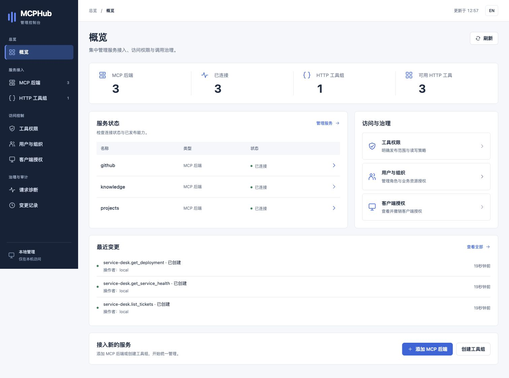
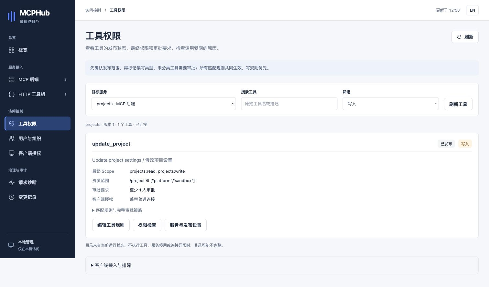
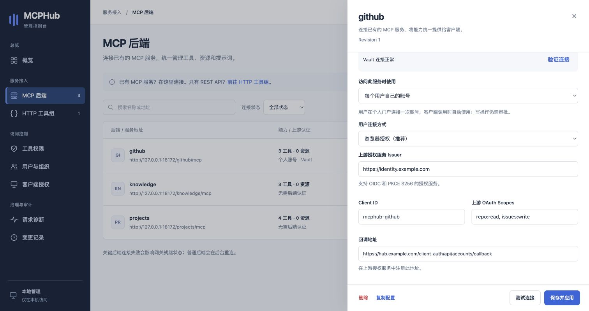
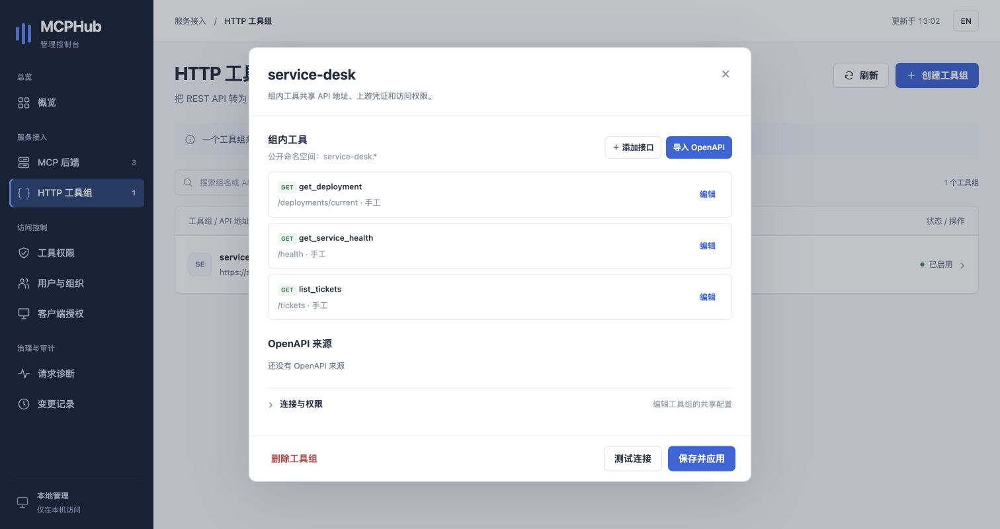
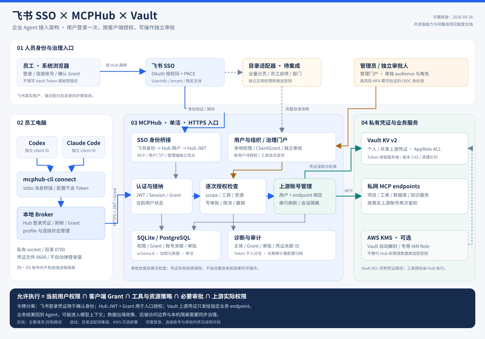
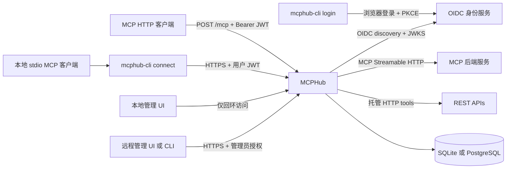

# MCPHub

[](https://github.com/SamuelSupe/mcphub/actions/workflows/ci.yml)
[](https://github.com/SamuelSupe/mcphub/releases/tag/v2.1.0)
[](https://github.com/SamuelSupe/mcphub/blob/main/LICENSE)
[](https://github.com/SamuelSupe/mcphub/blob/main/go.mod)

[English](README.md) | [中文](README.zh-CN.md)

MCPHub 是一个面向远端 MCP Server 的聚合网关。它用一个 Streamable HTTP 入口连接多个后端，按 JWT 权限为每个请求生成可见的后端视图，并把工具、提示、资源和资源模板路由回正确的后端。

MCPHub v2.1.0 新增 Vault 共享/个人上游账号、OIDC 凭证刷新，以及账号更换和断开时的授权撤销联动。工具显式发布、单次写审批、客户端授权、本地 Broker 与企业 SSO 继续由 MCPHub 集中控制。新版中英文控制台按服务接入、访问控制和治理审计组织功能。网关保持单实例部署，支持 SQLite 或 PostgreSQL；用户电脑单独安装 `mcphub-cli`。

**从 v1.x 升级：** 后端工具现在默认不发布，写工具和未分类工具需经审批。数据库迁移前，请备份数据库与匹配的加密密钥，逐项审核发布范围及读写策略，并遵循[升级与回滚流程](RELEASE_NOTES_v2.1.0.md#upgrade-and-rollback--升级与回滚)。Go 安装路径新增 `/v2`。

## 界面预览

以下为 MCPHub v2.1.0 在 OrbStack 运行、使用本机 Chrome 截取的真实界面，内容均为演示数据。控制台支持中英文切换，截图展示本地管理模式。详见[截图说明](docs/screenshots/README.md)。

**服务概览**：集中查看连接状态、可用工具、权限管理入口和最近配置变更。



<details>
<summary><strong>工具权限</strong>：Scope、业务资源范围与写审批</summary>

在 Agent 执行前，检查已发布写工具的最终 Scope、允许访问的项目以及审批人数要求。



</details>

<details>
<summary><strong>Vault 账号</strong>：按用户身份连接上游服务</summary>

选择个人账号，配置浏览器授权、上游 Scope 和回调地址。截图展示配置界面，未连接真实外部账号。



</details>

<details>
<summary><strong>HTTP 工具组</strong>：管理 REST 接口与 OpenAPI 来源</summary>

将 HTTP 接口组织为同一 MCP 命名空间内的工具，共享连接配置和访问策略。



</details>

## 企业 SSO 与用户权限

支持通用 OIDC / OAuth2 机密客户端身份桥接，向 `mcphub-cli` 签发 MCPHub 自己的凭证；无需把企业应用密钥放到用户电脑。管理员在「用户与组织」管理用户启停、管理员/审批员角色、Scope、endpoint、精确工具和业务资源范围。首次登录默认待授权，写权限仍受逐次审批保护。

部门和用户组支持登录声明同步或独立鉴权的目录快照推送；同步只影响身份和成员关系，不能授予本地权限。SQLite / 单实例 PostgreSQL 在 v2.1.0 中自动迁移到 schema 8。详见[配置、同步契约和安全边界](docs/sso-and-user-management.zh-CN.md)。本次不连接飞书租户，也不包含飞书通讯录适配器或 SCIM；接口已支持企业 OAuth2 响应字段映射和租户限制。

## Vault 与个人账号

管理员在 MCP 后端选择「Vault → 共享服务账号 / 每个用户自己的账号」；用户在个人门户点击「连接账号」，原有 MCP 客户端配置无需更改。上游 Token 保存在 Vault，支持 OIDC 自动刷新、账号隔离，以及更换/断开账号时使旧客户端授权失效；写操作仍需审批。

此能力从 v2.1.0 起提供。SQLite / 单实例 PostgreSQL 迁移至 **schema 8**（v2.0.0 为 schema 7）。详见[配置、使用流程和安全边界](docs/vault-accounts.zh-CN.md)。

## 架构

企业部署参考：[飞书 SSO、Vault 与 Codex / Claude Code 完整架构、接入步骤和最佳实践](docs/feishu-vault-agent-architecture.zh-CN.md)。也可查看[文档导航](docs/README.zh-CN.md)、下载 [27 页完整 PDF](docs/feishu-vault-agent-architecture.zh-CN.pdf)及[配置示例](deploy/config.feishu-vault.example.yaml)。



飞书确认人员身份，MCPHub 管理用户、客户端、工具、资源与写审批，Vault 保管上游凭证。指南明确标注真实飞书租户、目录适配器和 MFA 的集成验收要求。PDF 保留 2026-09-26 的架构评审快照；当前版本状态以在线指南为准。



## 项目链接

- [GitHub 仓库](https://github.com/SamuelSupe/mcphub)
- [本地管理 UI 指南](#本地管理-ui)
- [贡献指南](CONTRIBUTING.md)
- [安全策略](SECURITY.md)
- [Apache License 2.0](LICENSE)（Copyright 2026 SamuelSupe）
- [v2.1.0 发行说明](RELEASE_NOTES_v2.1.0.md)、[v2.0.0 历史发行说明](RELEASE_NOTES_v2.0.0.md)、[v1.4.0 历史发行说明](RELEASE_NOTES_v1.4.0.md)、[v2.1.0 GitHub release](https://github.com/SamuelSupe/mcphub/releases/tag/v2.1.0)和 [全部 GitHub Releases](https://github.com/SamuelSupe/mcphub/releases)

MCPHub v2.1.0 是当前最新版本；v2.0.0 及更早版本仍作为历史版本保留。

## 能力与边界

- 通过 MCP Streamable HTTP 连接多个后端；后端目录按分页读取，tools、prompts、resources 和资源模板列表会并行发现，并按后端通知或刷新周期更新。
- 聚合 `tools`、`prompts`、`resources`、资源模板和 completion；转发 tool/prompt/resource 调用、资源订阅/取消订阅、进度通知和资源更新通知。
- 后端 SSE 响应保持 streaming passthrough；检查 progress notification 时每个 event 最多缓存 1 MiB，超大 event 原样转发但跳过 progress 检查。
- 针对官方 Go MCP SDK v1.7.0 客户端的 `notifications/cancelled` 消息缺少 2026-07-28 metadata，Hub 入站和后端出站都会做兼容规范化，使取消或取消订阅后的同一逻辑 MCP session 仍可复用；这是互操作性 shim，不是自定义扩展。
- 以 `backend.id` 为命名空间，改写资源 URI，避免不同后端的同名能力和 URI 冲突。
- 使用 OIDC discovery 和 JWKS 验证 Bearer JWT；按后端 `required_scopes` 过滤目录和调用。
- 提供独立的 `mcphub-cli` 程序，提供外部 OIDC 浏览器登录及本地 stdio 到 HTTP 的连接器，并自动刷新凭证。
- 工具须显式发布，并受业务资源参数规则约束；写工具和未分类工具需要独立审批，支持多人复核、OIDC 加强认证、配置审批与签名审计投递。
- 在 MCPHub 管理 SSO 用户、部门和用户组权限，通过个人授权门户与本地 Broker 控制客户端 Scope；`setup` 输出不含凭证的 MCP 配置，`doctor` 不执行工具即可检查访问问题。
- 对原始后端 tool name 应用后端本地 `tool_rules` 和 Go `path.Match`；匹配规则的 scope 会合并去重，按 all-of 授权，并从 `tools/list` 隐藏未授权 tool。
- 支持后端静态请求头，或 OAuth 2.0 `client_credentials`；两者不能同时提供 `Authorization`。
- 管理 UI 按总览、服务接入、访问控制、治理与审计组织九个页面，支持持久化中英文选择、按角色显示入口和窄屏布局。工具组可以把手工 HTTP tool 和多个 OpenAPI 3.0/3.1 import 通过 `/mcp` 发布；组内共享 Base URL、Header、OAuth、scope 和 timeout，且不会暴露 raw HTTP proxy。
- 支持通过 OIDC 认证的远程浏览器/CLI 管理，以及单实例网关的加密 SQLite 或 PostgreSQL 配置存储。
- 可在 UI/API 中配置 endpoint 每秒请求数、突发容量和最大并发；默认不限流，调用者共享额度。
- 提供健康、就绪和 RFC 9728 Protected Resource Metadata 端点；配置支持 SIGHUP 热重载。

后端连接失败时，MCPHub 会重试并保留已知的后端目录；目录可能仍可列出，但具体调用会在连接恢复前失败。启动时不会因为 required 后端暂时不可用而退出，`/readyz` 会保持 503；SIGHUP 创建新运行时则要求 candidate 中的 required 后端首次连接成功。后端产生的 JSON-RPC error 原样返回。网络或 transport 失败对外只返回 `backend <id> unavailable`，不会泄露内部 backend URL、query 或 credential。后端重连时，所有 tracked resource subscription 必须全部恢复成功后才会标记 ready；任一恢复失败都会保持 unavailable 并触发后续重连。

## 快速开始

要求 Go 1.26（`go.mod` 声明 `go 1.26.0`）。使用 Go 安装 v2.1.0 服务端和可选 CLI：

```bash
go install github.com/SamuelSupe/mcphub/v2/cmd/mcphub@v2.1.0
go install github.com/SamuelSupe/mcphub/v2/cmd/mcphub-cli@v2.1.0
```

如果从源码构建，请先复制示例并设置其中的环境变量：

```bash
cp config.example.yaml config.yaml

# 示例；请替换为真实的 HTTPS 地址和 secret。不要把 secret 写进 Git。
export MCPHUB_PUBLIC_URL='https://hub.example.com/mcp'
export MCPHUB_CONSOLE_ORIGIN='https://console.example.com'
export MCPHUB_AUTH_ISSUER='https://idp.example.com'
export MCPHUB_PRIMARY_BACKEND_URL='https://mcp-a.example.com/mcp'
export MCPHUB_PRIMARY_API_KEY='replace-me'
export MCPHUB_CRM_BACKEND_URL='https://mcp-crm.example.com/mcp'
export MCPHUB_CRM_OAUTH_ISSUER='https://idp.example.com'
export MCPHUB_CRM_CLIENT_ID='replace-me'
export MCPHUB_CRM_CLIENT_SECRET='replace-me'

go build -trimpath -o ./mcphub ./cmd/mcphub
./mcphub validate --config ./config.yaml
./mcphub serve --config ./config.yaml
```

`validate` 只读校验配置，成功时在 stdout 输出 `configuration valid`。管理模式下，数据库存在时会只读检查所选存储；数据库尚不存在时校验 YAML bootstrap backends，不创建文件。`serve` 把结构化 JSON 日志写到 stderr。两个子命令都要求 `--config PATH`。

也可以直接运行而不生成二进制：

```bash
go run ./cmd/mcphub validate --config ./config.yaml
go run ./cmd/mcphub serve --config ./config.yaml
```

### 浏览器登录与本地连接器

`mcphub-cli` 在用户的 Windows、macOS 或 Linux 电脑上运行，提供 `login`、`connect`、`status`、`logout`。服务端程序 `mcphub` 提供 `serve`、`validate`。可下载下方对应平台的 CLI 包、使用上文 Go 命令安装，或从当前源码构建后将它放入 PATH：

```bash
go build -trimpath -o ./mcphub-cli ./cmd/mcphub-cli
```

发布工作流分别生成服务端的 `mcphub_<version>_<os>_<arch>.tar.gz` 和客户端的 `mcphub-cli_<version>_<os>_<arch>.tar.gz`，用户电脑只需安装 CLI 包。服务端继续使用现有 `auth.issuer` 和 JWT scope 策略完成认证与授权。

先在该身份服务注册一个 **公开原生 OAuth 客户端**，启用授权码、refresh token、PKCE S256，以及 token endpoint 的 `none` 认证方式。允许回调 `http://127.0.0.1:<port>/oauth/callback`；支持原生客户端的服务可允许随机回环端口，否则注册固定端口并传入 `--callback-port 8765`。Discovery 必须声明支持 S256。身份服务签发的 JWT **access token** 必须包含完整 MCPHub 公开 URL（含 `/mcp`）作为 audience，并携带 `sub`、`exp` 和所需 scope。本机无需保存 client secret。

```bash
mcphub-cli login --server https://hub.example.com/mcp --client-id mcphub-cli --profile work
mcphub-cli status --profile work
```

`login` 打开系统浏览器，最多等待 5 分钟接收本机回调。打开失败时，会打印可在同一台电脑浏览器中访问的授权链接。它校验 state/issuer，并完成一次已认证的 MCP 握手，成功后才替换原有凭证；失败或取消会保留原有登录。重复传入 `--scope` 可指定申请的权限，未指定时使用认证 challenge 或资源 metadata 的默认值；身份服务声明支持时会追加 `offline_access`。若未签发 refresh token，仍可登录，但会明确提示到期后需要重新登录。

在支持 stdio 的 MCP 客户端中配置以下启动命令，将路径替换为已安装二进制的绝对路径：

```json
{
  "mcpServers": {
    "mcphub": {
      "command": "/absolute/path/to/mcphub-cli",
      "args": ["connect", "--profile", "work"]
    }
  }
}
```

`connect` 读取 profile，仅向保存的 MCPHub 地址附加 Bearer token，在到期前自动刷新凭证。工具、提示词、资源、分页、进度与订阅均通过连接器转发，公开名称和 URI 保持一致；取消 stdio 调用会关闭对应 HTTP 响应流。stdout 只输出 MCP 消息，诊断写入 stderr。连接器不会弹出浏览器；401 最多刷新重试一次，403 提示缺失的 scope，网络失败不会自动重放操作。

```bash
# 复用已保存的服务地址和 client ID；覆盖 scope 时列出所有需要的权限。
mcphub-cli login --profile work --scope mcp:primary.read
mcphub-cli logout --profile work
```

默认 profile 为 `default`。macOS/Linux 数据保存在 `~/.mcphub/`，目录权限 `0700`、文件权限 `0600`；Windows 保存在 `%USERPROFILE%\.mcphub\`，通过仅授权当前用户的 DACL 保护。Windows 凭证目录需位于支持 Windows 访问控制的本地文件系统（如 NTFS）。已有 profile 可直接由 `mcphub-cli` 使用，无需迁移。Token 以本地 JSON 保存，**不做加密**；不要放入共享目录或其他用户可读取的备份。临时文件替换与按 profile 的进程间锁保证多个连接器能够安全轮换 refresh token。无 Broker 的 profile 中，`status` 显示本地缓存状态、到期时间和能否续期，不输出 Token。`logout` 清除本地 Token、保留非敏感连接设置，使连接器后续请求停止并要求登录；已经接受的请求可能继续完成。它不会吊销身份服务中的 Token 或退出浏览器会话。重新登录后，需要重启该 profile 的已有连接器。

stdio 仅用于**本地连接器**，MCPHub 服务端和后端连接仍使用 HTTP。首版不包含 SSH/device-code 登录、动态客户端注册、Token 导出、内置用户账号或第三方后端交互授权。

### 客户端授权与内置 Broker

启用 `client_authorization.enabled`、配置用户门户 `client_id`，并启用托管数据库。支持 SQLite 和 **单实例 MCPHub + PostgreSQL**，升级到 schema 8 前请备份数据库与加密密钥。

在身份服务注册门户回调 `https://hub.example.com/client-auth/auth/callback`。门户位于 MCP 服务的域名下，与管理端口分开。CLI 与门户必须取得 audience 为完整 MCP resource URL、`issuer + sub` 一致的 JWT access token。若身份服务对不同客户端返回不同的 pairwise subject，应先调整身份服务的主体策略；不会通过 email 拼接身份。门户可选的 client secret 通过服务端 `client_secret_env` 配置。

```yaml
client_authorization:
  enabled: true
  client_id: mcphub-user-portal
  require_client_grant: false
  max_grant_ttl: 8h
```

在指定 backend 或 HTTP 工具组设置 `require_client_grant: true`，可逐个迁移；全局开启则全部强制。两级条件取 OR。旧的 `connect --profile` 只能访问兼容 endpoint，登录握手不会暴露严格 endpoint。门户全局设置属于静态进程配置，修改后重启；endpoint 设置沿用现有配置治理流程。

```bash
mcphub-cli login --server https://hub.example.com/mcp --client-id mcphub-cli --profile work
mcphub-cli client add --profile work --name editor-read --endpoint database-prod \
  --scope mcp:database --scope db:read --tool query --resource /project=project-a
# 在浏览器核对冻结的授权范围及终端配对码。
mcphub-cli connect --profile work --client ci_example
mcphub-cli client list --profile work
mcphub-cli client authorize --profile work --client ci_example --resource /project=project-b
mcphub-cli client revoke --profile work --client ci_example
mcphub-cli broker status
mcphub-cli broker stop
```

`client add` 输出完整 MCP 配置，参数包含 `connect --profile work --client ci_...`，无需 Token。一个入口对应一个 endpoint，多个 endpoint 使用多个入口。`connect` 按需启动共享 Broker，`broker run` 可前台诊断。可用 `MCPHUB_HOME` 指定其他私有目录，相关进程应保持一致。Broker 日志写入该目录的 `broker.log`；stdio 只传输 MCP 消息。

默认只读，并冻结当前符合条件的工具列表。省略 scope 时，从 endpoint 与可用工具所需权限中选择用户 Token 已具备的范围。重复 `--scope`、`--tool`、`--resource /json/pointer=value` 可以明确缩小授权。需要时显式启用 `--prompts`、`--resources`、`--subscriptions`，订阅必须同时允许 resources。工具参数的资源条件不能解释为 URI 或 prompt 限制，这类能力应单独建立入口。`--ttl` 可缩短服务端上限（服务端可配置 1 分钟至 8 小时）。`client authorize` 保留未指定设置，列表参数替换原列表，并重新要求浏览器确认；替换后须重建原有连接。

`--allow-write-requests` 仅允许发起写申请，具体操作仍受服务端审批、多人复核、MFA、资源版本及业务幂等限制。需要预览或状态工具时，一并加入工具允许列表。另一个客户端或替换后的 Grant 不能查询、取消、恢复或取得旧审批结果，也不能借相同业务 ID 重新执行。

服务端同时检查 OIDC Token 与不透明 `MCPHub-Grant` 凭证，有效 scope 是二者交集。每次请求校验 issuer、用户、resource、endpoint UID、期限、工具发布状态、资源条件和当前策略。修改 scope/目标、停用或同名重建 endpoint、改变 HTTP 工具执行语义后需重新确认。新工具不会自动进入旧授权；用户 Token 与 Grant 均不转发上游。

`status`、`client list` 分别显示本地登录缓存、在线授权状态和有效 scope。Broker 每秒检查本地变更，每 30 秒以 ETag 查询远端状态；**服务端撤销立即阻止后续接纳，与轮询无关**，并取消相关活动流。已经被上游接受的副作用不能回滚。`logout` 先清除本地秘密、断开该 profile，再尝试撤销远端会话；离线失败仅保留非秘密会话引用并明确提示“撤销未确认”，可到 `/client-auth/` 撤销旧会话。`broker stop` 只停止本地传输，不撤销 Grant。两者均不吊销身份服务 Token 或退出网页会话。

普通用户门户支持中英文确认、拒绝、撤销单个授权和整个会话。配置管理员可通过管理端口的 `GET /api/v1/client-grants?subject=<精确sub>` 查询，或 `POST /api/v1/client-grants/<grant-id>/revoke`（JSON 为 `{"subject":"<精确sub>"}`）撤销；不能代替其他用户同意授权。授权生命周期与拒绝事件进入加密存储，配置独立审计归档后进入同一签名链及事务投递队列。

私有 socket/named pipe、OS 对端检查和独立 IPC 凭证限制其他系统用户接入，但不能证明应用身份，也不能隔离同一系统账户下的恶意进程。发布流程要求 Windows x64、ARM64 的原生 CLI 测试（含 Broker IPC）通过；macOS/Linux 使用 Unix socket 与 OS 对端校验。完整边界及验证记录见[方案文档](docs/broker-authorization-design.zh-CN.md)。

### 工具权限工作台与接入诊断

配置管理员可在管理界面进入 **工具权限**，选择 MCP 后端或 HTTP 工具组，统一查看已发布和未发布的工具、最终读写类型、所需 Scope、参数资源限制与审批要求。可搜索工具，筛选未分类或未发布的项目。读取目录不会执行工具；HTTP 工具组状态仅表示是否启用，不代表已探测上游连通性。

**编辑工具规则** 修改当前工具的精确名称规则；MCP 后端的发布状态在同一版本中保存。其他匹配规则继续生效，精确 `read` 不能覆盖通配 `write` 或审批规则。表单支持 Scope、JSON Pointer 资源允许值、审批人 Subject、审批人数和加强认证，并保留已有高级审批字段。HTTP 工具发布仍通过现有工具／工具组或 OpenAPI 导入编辑器管理。保存沿用现有版本冲突检查；启用配置审批时，仍须经过审批才生效。

**权限检查** 逐项解释发布、就绪状态、Scope、资源、客户端 Grant 和审批条件，不调用工具、不运行预览、不创建审批、不占用执行额度。输入的 Scope 是管理员的假设条件。检查已保存 Grant 时，还需填写 Grant ID 和对应用户的精确 Subject，有效 Scope 取其授权交集。检查通过不授予执行权：参数 Schema、实时限流、资源版本、预览和上游权限仍在实际执行时校验。仅配置管理员可访问 `GET /api/v1/tool-policies?endpoint=<id>` 与 `POST /api/v1/access-check`，后者请求示例：

```json
{"endpoint":"projects","tool":"get_project","scopes":["projects:read"],"arguments":{"project":"work"}}
```

在用户电脑上，可针对 MCP 配置中实际使用的 profile 和客户端入口排障：

```bash
mcphub-cli doctor --profile work
mcphub-cli doctor --profile work --client ci_example
mcphub-cli doctor --profile work --client ci_example --json --timeout 30s
```

`doctor` 检查私有凭证目录、登录及续期、客户端配对、在线 Grant 状态与有效 Scope，再完成 MCP 初始化并读取工具目录第一页。Broker 已运行时通过 Broker 检查；未运行时给出提示，使用同一客户端凭证直接检查远端连接。该命令可能刷新 Token，但不会打开登录窗口、启动 Broker、创建授权或执行工具。报告不包含 Token 或 IPC 凭证，提供下一步操作；阻塞性失败退出码为 `1`，成功或仅警告为 `0`。默认超时 15 秒，可调整为 1 秒至 2 分钟。本次工作台和诊断命令不需要数据库迁移。

### 接入向导与授权运维

安装 v2.1.0 CLI 后，在用户电脑执行：

```bash
mcphub-cli setup --server https://hub.example.com/mcp --client-id mcphub-cli --profile work > mcphub-mcp.json
# 已经登录时：
mcphub-cli setup --profile work > mcphub-mcp.json
```

向导按需登录，列出当前身份有资格申请的已发布工具，要求选择 endpoint、具体工具、可选资源限制、授权时长和客户端名称。空选择不会变成“全部工具”；选择写入或未分类工具时需单独确认，后续调用仍需逐次审批。追加的资源限制对每个选中工具都生效。最后在浏览器核对范围和配对码并确认。服务端须启用客户端授权；向导的授权目录仅帮助选择，不授予 MCP 调用权限。

配置可选择通用 `mcpServers` JSON 或 [VS Code 的 `servers` JSON](https://code.visualstudio.com/docs/agent-customization/mcp-servers)。stdout 只输出可执行文件路径、`connect --profile … --client …` 和 `MCPHUB_HOME`，不含凭证；提示和诊断写入 stderr。将条目合并到现有客户端配置，再重启对应 MCP 连接。向导不会覆盖客户端文件。配置须由同一电脑、同一系统账号执行；容器、SSH 或远程开发环境不能直接复用这些本机路径和 Broker。一个条目对应一个 endpoint，多个服务分别运行向导。

完成授权后，向导验证授权状态、MCP 初始化和目录发现，不执行工具。如果最终诊断失败，保留已批准的授权及生成的配置，以失败退出码结束；修复提示的问题后运行 `doctor`。`Ctrl+C` 可取消。授权到期后需 `client authorize` 或重新运行向导；登录 Token 可刷新不代表 Grant 会自动延期。

管理 UI 新增**客户端授权**和**请求诊断**。配置管理员可按精确用户 Subject、客户端 ID、endpoint 和状态查询并翻页，查看 Scope、工具、资源范围和协议能力，带入权限检查或撤销授权。授权 Scope 只是批准上限，不代表用户当前 Token 的实际权限。撤销立即阻止后续接纳并取消活动流，无法回滚上游副作用。个人门户仍只能访问登录用户自己的授权。

请求诊断在进程内存中保留最多 2,000 条已完成的 MCP POST，请求窗口为最近 30 分钟，重启清空。仅记录请求 ID、已验证身份、已知目标名称、耗时和固定结果／原因代码，不记录参数、结果、Token 或原始错误正文。成功、工具错误、协议错误、等待审批、授权拒绝和限流分别统计。统计覆盖整个筛选窗口，包含 P95 耗时及已恢复操作从申请创建到恢复执行的平均审批等待时间。进行中的请求、GET 流和长期审计归档不属于此视图；点击刷新更新快照，长期记录使用审批与审计功能。

以下 API 仅位于**管理监听器**，个人门户不开放跨用户查询：

```bash
mcphub-cli admin --profile ops get '/client-grants?subject=alice&status=active&limit=25'
mcphub-cli admin --profile ops get '/requests?endpoint=database-prod&outcome=scope_denied&limit=25'
```

两者都返回 `next_cursor`，保持筛选条件并作为 `cursor` 传回。授权还可筛选 `client`、`endpoint`；诊断还可筛选 `request_id`、`subject`、`client` 和原始 `tool`。`limit` 范围为 1–100。撤销接口为 `POST /api/v1/client-grants/{grant_id}/revoke`，正文 `{"subject":"alice"}`。向导与诊断页面本身不增加迁移；SSO 与用户目录最初使用 schema 7，v2.1.0 的凭证存储升级到 schema 8；详见[v2.1.0 变更和升级流程](RELEASE_NOTES_v2.1.0.md)。

### v2.1.0 预构建下载

[v2.1.0 GitHub release](https://github.com/SamuelSupe/mcphub/releases/tag/v2.1.0) 在发布构建成功后分别提供服务端和客户端归档，并单独提供架构 PDF 下载。运行网关的机器安装 `mcphub`，用户电脑安装 `mcphub-cli`。

| 平台 | 服务端 | 登录 CLI 与本地连接器 |
| --- | --- | --- |
| macOS Intel | [mcphub](https://github.com/SamuelSupe/mcphub/releases/download/v2.1.0/mcphub_v2.1.0_darwin_amd64.tar.gz) | [mcphub-cli](https://github.com/SamuelSupe/mcphub/releases/download/v2.1.0/mcphub-cli_v2.1.0_darwin_amd64.tar.gz) |
| macOS Apple Silicon | [mcphub](https://github.com/SamuelSupe/mcphub/releases/download/v2.1.0/mcphub_v2.1.0_darwin_arm64.tar.gz) | [mcphub-cli](https://github.com/SamuelSupe/mcphub/releases/download/v2.1.0/mcphub-cli_v2.1.0_darwin_arm64.tar.gz) |
| Linux amd64 | [mcphub](https://github.com/SamuelSupe/mcphub/releases/download/v2.1.0/mcphub_v2.1.0_linux_amd64.tar.gz) | [mcphub-cli](https://github.com/SamuelSupe/mcphub/releases/download/v2.1.0/mcphub-cli_v2.1.0_linux_amd64.tar.gz) |
| Linux arm64 | [mcphub](https://github.com/SamuelSupe/mcphub/releases/download/v2.1.0/mcphub_v2.1.0_linux_arm64.tar.gz) | [mcphub-cli](https://github.com/SamuelSupe/mcphub/releases/download/v2.1.0/mcphub-cli_v2.1.0_linux_arm64.tar.gz) |
| Windows x64 | — | [mcphub-cli.exe（ZIP）](https://github.com/SamuelSupe/mcphub/releases/download/v2.1.0/mcphub-cli_v2.1.0_windows_amd64.zip) |
| Windows ARM64 | — | [mcphub-cli.exe（ZIP）](https://github.com/SamuelSupe/mcphub/releases/download/v2.1.0/mcphub-cli_v2.1.0_windows_arm64.zip) |

下载后先与 [SHA256SUMS](https://github.com/SamuelSupe/mcphub/releases/download/v2.1.0/SHA256SUMS) 中对应条目核对 SHA-256，再解压并将可执行文件放入 PATH。所有归档包含许可证、中英文 README、安全策略、发行说明和 `docs/` 指南；服务端归档另附 `config.example.yaml` 与 `deploy/` 中的指南、配置和代理示例。Compose 示例从源码构建，使用该方式时请检出 v2.1.0 tag。

### Windows CLI 快速开始

Intel/AMD 电脑选择 x64 ZIP，Windows on Arm 电脑选择 ARM64 ZIP。CLI 遵循 [Go 的 Windows 运行要求](https://go.dev/wiki/MinimumRequirements#windows)（Windows 10 及以上）；服务端下载仍提供 macOS/Linux。与 `SHA256SUMS` 核对归档哈希后，在 PowerShell 中解压并运行：

```powershell
Get-FileHash .\mcphub-cli_v2.1.0_windows_amd64.zip -Algorithm SHA256
Expand-Archive .\mcphub-cli_v2.1.0_windows_amd64.zip -DestinationPath .\mcphub-cli
.\mcphub-cli\mcphub-cli.exe login --server https://hub.example.com/mcp --client-id mcphub-cli --profile work
.\mcphub-cli\mcphub-cli.exe status --profile work
```

身份服务注册方式见上文。登录会打开 Windows 默认浏览器；若无法自动打开，请在同一台电脑打开终端输出的 URL。MCP 客户端配置应填写安装后的 Windows 绝对路径，JSON 中需转义反斜杠，例如：

```json
{
  "mcpServers": {
    "mcphub": {
      "command": "C:\\Tools\\mcphub-cli\\mcphub-cli.exe",
      "args": ["connect", "--profile", "work"]
    }
  }
}
```

基础 login/connect 仍可连接 v1.x 网关；客户端授权、Broker 接入向导与 SSO 权限管理需要 v2.0.0 或更新网关；Vault 账号需要 v2.1.0。

## 本地管理 UI

启用内嵌管理 UI 后，可直接配置连接，无需修改 backend YAML。新部署可将以下内容保存为 `config.yaml`，把 `MCPHUB_PUBLIC_URL`、`MCPHUB_AUTH_ISSUER` 设置为真实的 HTTPS 网关与身份服务地址，并通过 secret store 提供 Base64 编码的 32 字节 `MCPHUB_CONFIG_KEY`。密钥只生成一次（例如使用 `openssl rand -base64 32`），重启和升级时保留并安全保存。数据库目录需要可写。

```yaml
server:
  listen: "127.0.0.1:8080"
  public_url: ${MCPHUB_PUBLIC_URL}
auth:
  issuer: ${MCPHUB_AUTH_ISSUER}
admin:
  enabled: true
  listen: "127.0.0.1:8081"
  database_path: ./data/mcphub.db
  encryption_key_env: MCPHUB_CONFIG_KEY
backends: []
```

先运行 `mcphub validate --config config.yaml`，再运行 `mcphub serve --config config.yaml`，在网关所在机器打开[本地控制台](http://127.0.0.1:8081/)。默认 `mode: local` 无需登录，必须保持仅回环访问；远程访问请使用下述 `mode: remote`。网关仍需可用的 OIDC 身份服务才能就绪并认证 MCP 客户端。

控制台按日常管理工作分为四组，功能入口如下。导航只显示当前账号有权使用的页面；仅审批角色直接进入审批中心。

| 分组 | 页面 | 主要用途 |
| --- | --- | --- |
| 总览 | 概览 | 查看真实后端连接状态、工具组与 HTTP 工具数量、最近变更；优先展示连接异常的后端，并直接进入配置。 |
| 服务接入 | MCP 后端 | 接入 Streamable HTTP MCP 服务；搜索、按状态筛选、测试连接、启停，以及配置发布范围、上游凭证和限流。 |
| 服务接入 | HTTP 工具组 | 将 REST API 转成 MCP 工具；手工添加接口或从 OpenAPI 导入，共享连接、凭证和访问策略。 |
| 访问控制 | 工具权限 | 查看显式发布状态、读写分类、最终 Scope、业务资源规则和审批要求；编辑规则或执行无副作用的权限检查。 |
| 访问控制 | 用户与组织 | 管理 SSO 用户、部门和用户组的本地启停、角色、Scope、工具与资源权限；展开单条记录后编辑。 |
| 访问控制 | 客户端授权 | 按用户、客户端、endpoint 与状态筛选授权；查看完整范围、关联请求，或撤销授权。 |
| 治理与审计 | 审批中心 | 按权限审核写操作与配置变更，核对预览、审批进度、执行结果与审计记录。 |
| 治理与审计 | 请求诊断 | 查看近期调用结果、拒绝原因和耗时；展开请求详情，直接定位对应的工具权限。 |
| 治理与审计 | 变更记录 | 查看最近 50 条管理变更及操作者；敏感凭证不会展示。 |

推荐工作顺序：**接入服务 → 显式发布与读写分类 → 配置用户/组织权限 → 客户端登录与授权 → 审批和诊断**。用户使用 `mcphub-cli setup` / `connect` 接入，在个人授权门户确认自己的客户端范围；管理员在管理控制台维护整体策略。SSO 身份源、管理员登录、数据库和审计投递等部署设置继续通过 YAML 和环境变量配置，详细步骤见 [SSO 与用户管理](docs/sso-and-user-management.zh-CN.md)。

两类编辑器都按 **连接信息 → 上游认证 → 客户端访问权限** 配置。上游 Header/OAuth 是 MCPHub 调用服务的凭证；所需 Scope 决定客户端能否使用后端或工具组：留空允许所有已认证客户端，填写多个时必须**全部满足**。在**已发布工具**中填写审核通过的原始工具名；发现新工具不会自动发布。工具级规则可为选定操作追加 Scope 和资源参数限制；高级连接配置按需展开。编辑已有凭证时，值留空会保留原值；删除 Header 行会移除对应凭证。

多个 MCP endpoint 可复用相同的所需 Scope。未启用 SSO 桥接时，由外部身份服务签发对应 Scope；启用 `auth.sso` 后，可在用户与组织中维护用户和部门/用户组的本地授权，成员关系由已验证的登录声明或目录快照同步。HTTP 工具组用于同一 REST API 内共享连接与权限，不用于组合多个 MCP 后端。工具发布、Scope、业务资源、客户端授权和写审批共同约束调用。

语言控件可切换中文与 English。窄屏使用抽屉导航，支持键盘与 Escape 关闭。刷新会重新读取当前配置并显示最近成功更新时间；失败时保留错误提示与重试入口。概览数据来自实际配置和连接状态；请求诊断仅覆盖内存中的最近窗口，不代表完整监控或长期审计。

## 远程管理员与 PostgreSQL

支持独立管理员登录、远程 UI/API、`mcphub-cli admin` 与按管理员身份记录的配置审计。管理员 JWT 使用 `admin.public_url` 作为 audience，且必须具有 `admin.required_scopes`（默认 `mcphub:admin`）；普通 MCP 用户的登录凭证不会自动获得管理权限。

```bash
mcphub-cli login --admin --server https://admin.example.com --client-id mcphub-admin-cli --profile ops
mcphub-cli admin --profile ops get /overview
mcphub-cli admin --profile ops get /backends
mcphub-cli admin --profile ops get /tool-groups
mcphub-cli admin --profile ops get /events
```

数据库可选 SQLite（默认，兼容原 `database_path`）或 PostgreSQL（`database_driver: postgres` 与 `database_dsn_env`）。本版支持单实例网关；PostgreSQL 不代表已支持多实例运行时同步。完整的 OIDC 注册、浏览器登录、API 写入、数据库与 HTTPS 代理部署见 [部署指南](deploy/README.zh-CN.md)。

## 配置

配置是单个 YAML 文档，解码使用严格字段检查；未知字段、多文档 YAML、缺失环境变量都会被拒绝。字符串配置项中的 `${NAME}` 占位符会从当前进程环境展开，`NAME` 必须匹配 `[A-Za-z_][A-Za-z0-9_]*`；没有默认值语法。duration、整数和布尔字段不支持占位符。配置加载和 SIGHUP 重载都会重新展开环境变量。管理数据库完成初始化后，YAML backends 及其环境变量占位符会被忽略。

### `server`

| 字段 | 默认值 | 说明 |
| --- | --- | --- |
| `listen` | `:8080` | HTTP 监听地址。SIGHUP 不可修改，修改后需重启。 |
| `public_url` | 无 | 必填的绝对 HTTPS URL，必须包含 MCP 路径（例如 `https://hub.example.com/mcp`），不能有 query 或 fragment。路径不能含 percent-encoded 字符，也不能是 `/healthz`、`/readyz` 或 `/.well-known/oauth-protected-resource`。它既是 MCP 地址，也是 JWT 的 audience。SIGHUP 不可修改。 |
| `page_size` | `1000` | 聚合 MCP 目录分页大小，必须大于 0。 |
| `request_timeout` | `60s` | 普通 MCP 请求和后端调用的默认超时；必须大于 0。MCP 监听器的所有 HTTP 路由在 request body 被消费或关闭前都使用该值作为读取 deadline，未认证或被拒绝请求的慢 body 也会有界结束。MCP 处理继续后，普通 MCP POST 还会用它设置 response 写入 deadline 和 request context；新版 `subscriptions/listen` POST 在 body 读完后保持长连接，不使用普通的 response 写入和 request context timeout。但 runtime 或 client context 取消仍会让底层 write deadline 立即到期，因此代际 drain 或 client 断开时，慢 subscription write 会被打断。 |
| `drain_timeout` | `15s` | SIGTERM/SIGINT 关停，以及 SIGHUP 替换旧运行时等待活动请求的最长时间；必须大于 0。 |
| `refresh_interval` | `5m` | 后端目录刷新的最大间隔；后端返回更短 TTL 时会提前刷新，最终间隔不会低于 5 秒。必须大于 0。 |
| `catalog_ttl` | `30s` | 对 MCP 目录/发现结果声明的 private TTL；允许为 0，但不能为负数。 |
| `max_request_body_bytes` | `4194304`（4 MiB） | MCP POST body 上限，超出返回 413；必须大于 0。 |
| `allowed_origins` | `[]` | 额外允许的浏览器 HTTPS Origin。每项只能是 `https://authority`，不允许路径、query、fragment、通配符；MCPHub 自身 `public_url` 的 origin 自动允许。 |

duration 使用 Go `time.ParseDuration` 语法，例如 `500ms`、`60s`、`5m`。`public_url` 的路径就是 MCP 入口路径；上例入口为 `/mcp`。路径中的 percent-encoded 字符会被拒绝，`/healthz`、`/readyz` 和 `/.well-known/oauth-protected-resource` 是保留路径。

### `auth`

| 字段 | 说明 |
| --- | --- |
| `issuer` | 必填的绝对 HTTPS OIDC issuer。MCPHub 从该地址 discovery（通常是 `/.well-known/openid-configuration`）并读取 JWKS；SIGHUP 不可修改。 |

JWT 必须满足以下条件：签名和 `iss` 由该 issuer 验证；`aud` 必须包含完整的 `server.public_url`（包含路径）——`aud` 为字符串时必须等于 `public_url`，为数组时必须包含 `public_url`；必须有非空 `sub` 和 `exp`；`nbf`（如有）也会校验。过期、未生效和 OIDC 时间比较允许 30 秒时钟偏差。只有在 OIDC discovery 成功、`jwks_uri` 是绝对 HTTPS URL，且可达的 JWKS 响应至少包含一个可解析、有效且非对称的公开验证密钥后，verifier 才会 ready；对称 `oct` 密钥以及无效或空 key 均不满足此条件。首次成功刷新前 MCP 入口返回 503；ready 后 discovery 或 JWKS 刷新暂时失败会保留 last-known-good verifier。OIDC discovery 和 JWKS 响应分别限制为 1 MiB。

JWKS ready 还要求至少一个可用 key：`use` 为空或为 `sig`；存在 `key_ops` 时必须包含 `verify`；显式 `alg` 必须匹配 OIDC discovery 宣告的支持 RSA、EC 或 Ed25519 JWS 算法。若 discovery 未宣告 `id_token_signing_alg_values_supported`，则按 `RS256`。同一 JWKS 中的坏 key 或不支持 key 不会遮蔽其他可用 key。

scope 取自 JWT 的 `scope` 和 `scp` 两个 claim：`scope` 只接受空格分隔字符串（包括空字符串或 JSON `null`）；`scp` 接受空格分隔字符串或字符串数组。两个 claim 的值会合并、去重；数组项不能包含空白。后端访问采用 **all-of** 语义：`required_scopes: [a, b]` 要求 token 同时拥有 `a` 和 `b`；缺任一项，该后端不会出现在该 token 的目录视图中，对已识别的直接调用返回 403 `insufficient_scope`。未配置 `required_scopes` 的后端不受 scope 限制。Protected Resource Metadata 的 `scopes_supported` 是所有后端 required scope 的去重并集。

### `admin`

管理平台默认关闭。启用后，它通过独立监听器提供嵌入式 UI 和 JSON API；默认本地模式仅回环访问，远程模式必须通过 OIDC 管理员认证。它管理 backend 和工具组配置；`server`、`auth` 和 `admin` 仍由 YAML 管理并需要重启才能修改。

| 字段 | 默认值 | 说明 |
| --- | --- | --- |
| `enabled` | `false` | 启用管理平台，并让所选数据库成为配置事实来源。 |
| `mode` | `local` | `local` 仅本机、无登录；`remote` 开启 OIDC 管理员认证。 |
| `listen` | `127.0.0.1:8081` | 本地模式必须是数字回环地址；远程模式可监听私有地址，外部需 HTTPS 代理。 |
| `public_url` | 无 | 远程模式必填，HTTPS origin，不带路径或尾部 `/`；同时作为管理员 JWT audience。 |
| `client_id` | 无 | 远程浏览器 OAuth 客户端 ID。 |
| `client_secret_env` | 无 | 可选机密客户端的 secret 环境变量名；默认使用公开客户端。 |
| `required_scopes` | `[mcphub:admin]` | 远程管理所需的全部 scope，不允许空列表。 |
| `database_driver` | `sqlite` | `sqlite` 或 `postgres`。 |
| `database_dsn_env` | `MCPHUB_DATABASE_URL` | PostgreSQL 连接串所在的环境变量；使用 PostgreSQL 时不能同时设置 `database_path`。 |
| `database_path` | 无 | SQLite 启用时必填；相对路径以 YAML 文件所在目录解析。 |
| `encryption_key_env` | `MCPHUB_CONFIG_KEY` | 保存 Base64 编码 32 字节 AES 密钥的环境变量名；丢失或改变密钥会导致已存 Secret 无法解密。 |

空数据库首次启动时，MCPHub 会在一个事务中导入展开后的 YAML backends。bootstrap 标记写入后，所选数据库成为唯一 backend 来源，之后修改 YAML backend 不再生效。Header 值和 OAuth client secret 使用 AES-256-GCM 加密，管理 API 永不返回明文。

默认 UI 地址为 `http://127.0.0.1:8081/`，可以在不中断进程的情况下注册、测试、编辑、启停和删除后端。Required 后端连接失败时变更会被拒绝，当前 runtime 不受影响；optional 后端不可用时可以保存，并在后台持续重连。

JSON API 位于 `/api/v1`。单项 backend 响应携带 `ETag`；更新和删除必须通过 `If-Match` 提交该 revision，过期写入返回 `409 revision_conflict`。Secret 字段只返回是否已配置；编辑时省略 Secret 值表示保留，省略对应 Header 或 OAuth 配置表示删除。审计 actor 为远程管理员 JWT `sub`、本地 `local` 或后台刷新 `system`，只记录脱敏结果。

#### 工具组与托管 HTTP API tool

工具组是管理 API 中的对象，不是 YAML 配置。每个组统一持有其 tool 使用的 HTTPS Base URL、静态 Header 或 OAuth 2.0 `client_credentials`、JWT required scope 和请求 timeout；不要在每个 tool 中重复配置凭证。Header 值和 OAuth client secret 加密存储在所选数据库，API 只返回“已配置/未配置”标记。工具组 scope 仍采用 backend 相同的 all-of 语义；可选的组内 tool 规则可以为选定 tool 追加 scope。

一个工具组可以包含手工定义的 HTTP tool，以及多个 OpenAPI 3.0 或 3.1 import。OpenAPI import 可以先 inspect 再保存。两类对象都只作为 MCP capability，经配置的 `/mcp` Streamable HTTP 入口列出和调用；MCPHub 不提供 raw HTTP proxy 或任意 method/path 透传路由。

稳定的管理路径如下：

| 操作 | 路径 |
| --- | --- |
| 列出/创建工具组 | `GET/POST /api/v1/tool-groups` |
| 读取/更新/删除工具组；探测工具组 | `GET/PUT/DELETE /api/v1/tool-groups/{groupID}`、`POST .../{groupID}/probe` |
| 列出/创建或读取/更新/删除手工 tool | `GET/POST .../{groupID}/tools`、`GET/PUT/DELETE .../{groupID}/tools/{toolName}` |
| inspect、列出/创建或读取/更新/删除 OpenAPI import | `POST .../{groupID}/imports/inspect`、`GET/POST .../{groupID}/imports`、`GET/PUT/DELETE .../{groupID}/imports/{importID}` |
| 刷新 OpenAPI import | `POST .../{groupID}/imports/{importID}/refresh` |

工具组、手工 tool 和 import 资源各自返回 `ETag`；更新和删除必须提交匹配的 `If-Match`，revision 过期时返回 `409 revision_conflict`。这些资源只能通过 admin API 管理并持久化到所选数据库；有意不提供 `tool_groups`（或同类）YAML schema，SIGHUP 也不会导入它们。

工具组 Base URL 和 OpenAPI source URL 必须使用 HTTPS；工具组 HTTP 请求和 source 抓取都不跟随重定向。若 source 与工具组是不同 origin，抓取时绝不会发送该组的静态 Header 或 OAuth secret。OpenAPI 文档上限为 5 MiB，携带文档的请求 body 上限为 6 MiB，HTTP tool 响应默认上限为 1 MiB；响应上限可配置为 64 KiB 至 16 MiB。URL-backed import 默认每 15 分钟自动刷新（可设为 1 分钟至 24 小时）；刷新失败时保留 last-known-good 文档和 tools，并采用退避重试。

#### v2.1.0 升级说明

替换 v2.0.0 或 v1.x 前，请先阅读[完整备份、升级与回滚流程](RELEASE_NOTES_v2.1.0.md#upgrade-and-rollback--升级与回滚)。`serve` 会将托管 SQLite/PostgreSQL 迁移到 schema 8，`validate` 只读。保留匹配的 `MCPHUB_CONFIG_KEY`；回滚必须同时恢复旧数据库、密钥/配置和二进制。

逐项填写后端的 `published_tools`，并明确工具的读写分类。空发布名单不开放工具；写工具和未分类工具需要远程浏览器审批。本地免登录或仅 YAML 部署只能执行已发布且明确只读的工具。已有 HTTP 工具保留启停状态，新建手工工具默认停用。客户端授权与 SSO 按需启用，SSO 新用户默认待授权。

首次启用管理时，配置管理监听器、加密密钥与可写数据库；首次启动导入 YAML 后端，之后以后端数据库为准。工具组和 OpenAPI 仍由 API 管理。切换数据库驱动不迁移数据，PostgreSQL 仍限单实例。升级后重启网关、刷新浏览器，单独安装 CLI 并重建客户端连接。详见[部署指南](deploy/README.zh-CN.md)。

### `backends`

YAML-only 模式至少配置一个后端；管理模式允许从空数据库启动并在网页注册第一个后端。每个 `id` 必须匹配 `[A-Za-z0-9_-]{1,32}`，并按大小写不敏感规则保持唯一；允许大写字母。

| 字段 | 默认值 | 说明 |
| --- | --- | --- |
| `id` | 无 | tool/prompt 名称使用的对外命名空间和配置 ID；不能包含点号。名称保留大写，而 resource/template URI authority 使用小写 ID。 |
| `url` | 无 | 必填绝对 URL。默认只接受 HTTPS；仅当 `allow_insecure_http: true` 且主机是 `localhost`、IPv4/IPv6 loopback 时才允许 HTTP。 |
| `required` | `false` | required 后端影响 `/readyz`。运行中断线会使就绪变为 503；连接循环会继续重试。 |
| `required_scopes` | `[]` | 该后端所需的 JWT scope，按 all-of 判断；scope 不能含空白，也不能重复。 |
| `published_tools` | `[]` | 获准发布的原始工具名，精确匹配并区分大小写，不支持通配符；留空不发布任何工具。 |
| `tool_rules` | `[]` | 可选的后端本地 tool 策略。每条规则包含 `match` glob，以及 `effect`、`approval`、`required_scopes`、`resource_rules` 中至少一项。`effect: read` 可直接执行；`write` 或未分类需要审批。匹配基于原始后端 tool name，使用 Go `path.Match`，整串且区分大小写。 |
| `request_timeout` | 继承 `server.request_timeout` | 该后端连接、目录发现、刷新和调用的超时；必须大于 0。 |
| `rate_limit` | `{}` | Endpoint 共享速率、突发容量和并发限制；默认不限流。 |
| `allow_insecure_http` | `false` | 仅为 loopback 本地 HTTP 开关；不会放宽 `server.public_url` 或任何 issuer 的 HTTPS 要求。 |
| `headers` | `{}` | 每次后端 MCP HTTP 请求附加的静态头。值支持环境变量展开，不能含 CR/LF；名称大小写不敏感且不能重复。`Accept`、`Content-Type`、任意 `Mcp-*` 头，以及 `Host`、`Content-Length`、`Connection`、`Proxy-Authorization`、`Proxy-Authenticate` 等均由 HTTP/MCP transport 管理并被拒绝。 |
| `oauth` | 无 | 后端 OAuth 配置；目前唯一允许的 `type` 是 `client_credentials`。与静态 `Authorization` 头互斥。 |

`oauth` 字段如下：

| 字段 | 说明 |
| --- | --- |
| `type` | 必须为 `client_credentials`。 |
| `issuer` | 必填绝对 HTTPS OAuth issuer；metadata 的 issuer 必须与它精确一致。 |
| `client_id` / `client_secret` | 必填，建议只通过 `${...}` 环境变量提供。 |
| `scopes` | 发给后端 OAuth token endpoint 的 scope 列表；它与 `required_scopes`（验证进入 MCPHub 的 JWT）是两套独立的 scope。 |

后端 OAuth discovery 和 token 请求不会带上该后端的静态 headers；数据面请求才会附加 headers 并自动复用/刷新 client-credentials token。Discovery 只从 RFC 8414/OIDC metadata 读取并精确校验 `issuer` 和 `token_endpoint`，不要求交互式 authorization 或 PKCE metadata。OAuth metadata 响应上限为 1 MiB。后端和 OIDC HTTP 客户端都不跟随重定向。

#### Endpoint 限流

MCP backend 和 HTTP 工具组均支持 `rate_limit`，默认不限流。按配置 ID 独立计数，所有用户共享额度；同一 HTTP 工具组中的手工接口和 OpenAPI tools 共用额度。管理 UI 的“限流策略”可直接编辑，管理 API 的 backend/tool-group 输入和响应也包含该对象。

```yaml
# 添加到某个 backends 条目；HTTP 工具组通过管理 UI/API 配置。
rate_limit:
  requests_per_second: 20
  burst: 40
  max_concurrent: 8
```

- `requests_per_second`：平均每秒接纳数，支持小数；`0` 或省略表示不限速率。
- `burst`：令牌桶容量；启用速率限制时，`0` 或省略使用容量 `1`。只有设置正速率时才能单独指定正容量。
- `max_concurrent`：正在处理的请求上限；`0` 或省略表示不限并发，可独立于速率限制使用。

策略作用于认证和 scope 检查通过后的 `tools/call`、`prompts/get`、`resources/read`、`resources/subscribe`、`completion/complete` 和带资源订阅的 `subscriptions/listen`。流式响应在结束或取消前占用并发名额；一次多 endpoint 订阅会原子检查所有相关额度，每个 endpoint 计一次。初始化、目录读取、健康检查、取消、退订、管理探测和后台刷新不消耗这些额度。

超限在调用后端前返回 HTTP `429`、`Retry-After` 秒数和包含原请求 ID 的 JSON-RPC 错误；并发限制的重试时间只是建议。`mcphub-cli connect` 显示限流错误与重试提示，不自动重放调用。保存配置、SIGHUP 和 HTTP tool 变更保留未变策略的额度及活动请求计数；进程重启会重置内存计数。策略随配置保存在 SQLite/PostgreSQL，计数不写数据库，仅适用于单实例。入口整体/IP/用户独立配额仍需单独的策略，未认证流量应在反向代理限制。

#### 显式发布与资源范围

**相对 v1.x 的升级变化：** 远程后端工具现在默认不发布。升级前需在 YAML 或后端管理页面/API 的 `published_tools` 中逐项填写获准开放的原始工具名。已有 scope 通配规则不会自动发布工具；名单省略或为空时，工具不出现在目录，也无法直接调用。目录刷新发现新名称时仍默认关闭。手工 HTTP 工具默认 `enabled: false`，审核后显式启用；OpenAPI 页面勾选的操作属于显式发布，后续发现未勾选的操作不会自动发布。已有 HTTP 工具保留数据库中的启停状态。

```yaml
published_tools: [search]
required_scopes: [mcp:read]
tool_rules:
  - match: search
    effect: read
    required_scopes: [projects:read]
    resource_rules:
      - argument: /project
        allowed_values: [work, sandbox]
      - argument: /body/database
        allowed_values: [reports]
```

调用必须同时满足当前发布/启停状态、全部所需 scope 和每条匹配的资源规则。`argument` 是相对于原始 `tools/call.arguments` 的对象键 JSON Pointer，HTTP 工具的请求体可使用 `/body/...`（`~1` 表示 `/`，`~0` 表示 `~`）。参数必须是允许的字符串，或非空且每项均被允许的字符串数组；缺失、null、数字等类型均拒绝。同一参数的多条规则取交集，一条规则中的多个允许值为任选其一。未配置资源规则时不追加参数资源限制。

允许值精确匹配并区分大小写，不做通配、前缀、目录遍历、URL 解码、文件系统或 SQL 语义判断。应限制工具真正使用的资源选择参数。这是工具共享的允许范围，不会根据用户 claim 判断资源归属；嵌入查询、别名、符号链接和其他资源选择参数仍需后端授权。资源越界返回 MCP 工具错误（`isError: true`），不会转发，也不会关闭客户端连接。带资源规则的参数会在转发前规范化，消除重复 JSON 键的解析歧义并保留数字精度。

发布、撤销和规则沿用管理 API 的 revision、SQLite/PostgreSQL 持久化；YAML 模式使用 SIGHUP。客户端缓存的目录不代表授权，转发前重新检查当前工具、scope 和资源参数；HTTP 工具管理器替换后，旧处理器不能接纳新调用。已经接纳的调用可能完成，撤销策略不会回滚上游操作。连接测试会返回发现的原始工具名，不会自动将其加入发布名单。

#### 单次写入审批

MCP 后端与 HTTP 工具组均支持 `tool_rules[].effect: read` / `write`。明确标为 `read` 的工具通过发布、scope 和资源检查后可直接执行；写工具和未分类工具需要逐次审批。匹配到 `approval` 策略也按写工具处理，不能被更宽泛的 `read` 规则覆盖。HTTP 方法和后端自报的 `readOnlyHint` 不授予权限。

启用[远程管理](#远程管理员与-postgresql)，为配置管理员和审批人分别授予 scope；普通 MCP 调用凭证只使用 MCP 服务的 audience。审批人的浏览器使用管理服务 audience，但无需配置管理权限：

```yaml
admin:
  # 其余 remote、public_url、client_id、数据库字段沿用远程管理配置。
  required_scopes: [mcphub:admin]
  approvals:
    required_scopes: [mcphub:approve]
    pending_ttl: 30m
    execution_ttl: 5m
    retention: 720h
    # 替换为身份服务中实际代表 Passkey/MFA 等所需认证强度的 ACR。
    step_up_acr_values: ["urn:your-idp:mfa"]
```

`pending_ttl` 从申请时开始，范围 1 分钟至 24 小时，默认 30 分钟；`execution_ttl` 从批准时重新计算，范围 1 至 30 分钟，默认 5 分钟；保留期范围 1 至 365 天，默认 30 天。管理静态配置修改需重启。配置管理员默认不能审批，审批人默认不能查看或修改后端配置；需要兼任时由身份服务显式授予两组权限。管理登录页提供独立的审批人登录入口。

在现有 **Tool Rules（JSON）** 编辑器或 YAML 配置审批策略：

```yaml
published_tools: [get_project, preview_update, update_project]
tool_rules:
  - match: get_project
    effect: read
  - match: preview_update
    effect: read
  - match: update_project
    effect: write
    required_scopes: [projects:write]
    resource_rules:
      - argument: /project
        allowed_values: [work]
    approval:
      action: 修改项目配额
      environment: production
      resource_arguments: [/project]
      require_different_reviewer: true
      require_step_up: true
      approvers:
        - subjects: [reviewer-oidc-sub]
          resources:
            - argument: /project
              allowed_values: [work]
      preview_tool: preview_update
      version_argument: /expected_version
```

`approvers` 使用同一身份服务验证过的精确 subject，不使用 Agent 提交的用户名。每个 grant 内的资源条件必须全部满足，不同 grant 之间为“或”；多个匹配 tool 规则的审批限制全部生效。资源条件可以检查项目、数据库、目录或环境参数。未配置 `approvers` 时，具有审批 scope 的账号均可审批；`require_different_reviewer` 禁止申请人自行审批。审批列表和详情也受范围限制，申请人可查看自己的申请但不因此获得批准权限。

使用流程：

1. Agent 调用写工具，收到 `structuredContent.code: approval_pending`、`approval_id` 和 `approval_url`。写操作尚未执行；若配置预览，会先调用指定的只读工具。
2. 用户打开链接，以审批人身份登录，核对操作摘要、目标、业务资源、完整参数，以及可用的变更前后预览；填写理由后批准一次或拒绝。
3. `require_step_up: true` 时，先点击“加强身份验证”。MCPHub 请求 OIDC `max_age=0`、`prompt=login`、nonce 和配置的 ACR，并验证签名、issuer、客户端 audience、同一 subject、nonce、`auth_time` 和返回的 ACR；有 `at_hash` 时也校验。允许最多 30 秒时钟偏差。通过后仍需点击批准，证明仅绑定该审批单和浏览器会话，2 分钟内单次有效。身份服务缺少 OIDC 或没有满足配置的认证强度时拒绝批准。ACR 的具体 MFA/Passkey 含义由身份服务配置，不是通用字符串。
4. 原调用人调用 `mcphub_resume_approval`，只传 `{"approval_id":"..."}`，执行已保存请求并重新检查当前权限、发布状态、资源范围及限流。查询进度使用独立状态工具，相同活跃请求会被合并。现有 `mcphub-cli connect` 配置无需修改。
5. 执行前，申请人可调用 `mcphub_cancel_approval`，传 `approval_id` 和可选 `reason`；有审批人会话的申请人也可在页面取消。审批人可撤销尚未执行的批准。取消、撤销与执行原子竞争；已经接纳的写入可能完成，撤销不能回滚。

**预览契约：** `preview_tool` 指向同一后端/工具组中已发布且明确标为只读的原始工具名，接收与写工具相同的参数。其 `structuredContent`（HTTP 工具为 JSON 对象响应体）须包含 `version`、`before`、`after`，例如 `{"version":"v7","before":{"limit":10},"after":{"limit":20}}`。`version_argument` 指向调用参数中的具体、非空版本字符串，不能使用 `*`。网关在申请及恢复时都验证预览权限和资源条件，并比对预览、版本及工具代次；变化或失败均拒绝执行。**后端写操作还必须原子检查该版本**，例如 HTTP `If-Match` 或数据库条件更新；仅预览无法消除检查与写入之间的竞争。HTTP 参数可通过已有 Header 参数映射把 `/expected_version` 对应的参数发为 `If-Match`。未配置预览时仍展示管理员定义的操作摘要、资源及完整参数，不会推测变更结果。

审批页面支持状态、精确工具名、精确申请人筛选和游标分页；每页默认 25 条。批准、拒绝、撤销、取消、执行、过期和重启恢复记录审计。对“结果不确定”可填写核查结果（已生效、未生效、仍不确定）和证据说明；记录不会改变执行状态或恢复执行额度。管理 API 为 `GET /api/v1/approvals?status=&tool=&subject=&limit=25&cursor=`、`GET /api/v1/approvals/{id}`，以及 `POST /api/v1/approvals/{id}`；后者接受 `decision`（`approved/rejected/revoked/cancelled/investigated`）、必填 `reason`（最多 2048 字节），核查还需要 `outcome`（`applied/not_applied/uncertain`）。强验证入口为 `POST /api/v1/approvals/{id}/verify`。这些接口均要求审批浏览器会话及相应资源权限；修改还需 CSRF/Origin 验证。

SQLite/PostgreSQL 原子消费批准，并发恢复不会执行两次；重复恢复返回保存结果。取消、断网或进程中断可能留下不确定结果，需要先核查后端。本机制不保证后端恰好执行一次或回滚。工具/配置代次变化会使对应批准失效，完整 runtime 重载和重启使未执行批准失效；重启将中断执行标为不确定。参数、业务 metadata 和后端续传输入不可修改，仅进度 token 绑定恢复请求；大整数精度保持不变。后端需要另一次调用继续交互时需重新审批。

每个 issuer/subject 最多 20 个活跃申请，执行请求最多 60 KiB，预览最多 32 KiB，含策略的完整审批记录最多 64 KiB，结果最多 16 MiB。请求、预览、结果、理由及核查详情加密保存；每分钟分批清理超过保留期的终态记录及详细审计，通用活动日志保留不含参数/理由的状态记录。配置变更前已接纳的操作仍可能完成。批准写入使用新的 HTTP/1 连接防止透明重试，上游须支持 HTTP/1.1；只读调用仍复用连接。

v2.1.0 使用 **schema 8**（审批治理最初引入 schema 5），升级前备份数据库与加密密钥，旧二进制不能以写模式打开升级后的数据库。本地免登录模式和仅 YAML 部署不能执行写工具或未分类工具。MCP Token 和管理 API Bearer Token 均不能批准；应隔离 Agent 与审批人浏览器、配置/数据库权限及上游写凭证。未启用配置治理时，配置管理员可直接修改工具分类；启用独立安全审批可约束这些变更。MFA 不能替代审批人核对具体内容和后端最小权限控制。


#### 配置治理、双人审批与业务幂等

在远程管理模式启用独立配置审批：

```yaml
admin:
  approvals:
    policy_changes:
      enabled: true                     # 默认 false，兼容已有部署。
      required_scopes: [mcphub:security]
      subjects: [security-reviewer-sub]  # 可选，精确 OIDC subject。
      require_step_up: true             # 需要配置 step_up_acr_values。
    notifications:
      url: https://notify.example.com/mcphub
      secret: ${MCPHUB_WEBHOOK_SECRET}   # 至少 32 字节。
    audit_archive:
      url: https://audit.example.com/mcphub
      key_id: audit-2026-01
      signing_key: ${MCPHUB_AUDIT_SIGNING_KEY}
```

配置管理员新增或修改后端、工具组、HTTP 工具、OpenAPI 导入时，API 和 `mcphub-cli admin request` 返回 **202**，包含 `pending_approval`、`approval_id`、`approval_url`；网页编辑器跳转到提案，配置尚未生效。另一位具有安全 scope 的用户通过“以安全管理员身份登录”（`/auth/login?role=security`）进入，核对脱敏前后差异后“批准并应用”。凭证变更会单独标记，但不显示凭证值。安全角色不能直接编辑配置，写操作审批角色不能批准配置。批准仍要求浏览器会话和 CSRF 验证，API Token 不可审批。删除及单纯的启用→停用立即生效；重新启用、停用同时修改其他字段均需审批。YAML、数据库和部署运维权限仍属于信任边界，静态治理配置不能通过管理 API 修改。

提案绑定目标版本；工具和导入还绑定所属工具组版本。期间发生修改时，旧提案应用失败，不会覆盖新配置。OpenAPI 提案保存具体文档和生成的工具定义，批准时不会重新下载；自动刷新发现变更也会生成提案，继续使用已批准的定义。重启使尚未执行的提案失效，中断的应用标记为结果不确定，需人工核查。失败或过期后需要重新提交。每个 issuer/subject 最多 20 个活跃请求，完整配置提案上限 32 MiB。

生产写工具可以配置：

```yaml
approval:
  required_approvals: 2
  require_step_up: true
  operation_id_argument: /operation_id
  status_tool: get_operation_status
  approvers:
    - subjects: [reviewer-a-sub, reviewer-b-sub]
  # 条件只会提高审批人数或认证强度。
  # 如果仅这些业务资源需要双人审批，可将基础 required_approvals 设为 1。
  risk_rules:
    - resources:
        - argument: /project
          allowed_values: [production]
      required_approvals: 2
      require_step_up: true
```

审批人数默认 1，可设 1 或 2。每票必须来自不同的授权 subject；双人审批始终禁止申请人参与计票。需要加强认证时，两位审批人分别完成。第一票后仍为待审批，达到人数后才开始执行期限。待审批可被拒绝，未开始执行的批准可撤销，页面展示人数和已批准人员。风险条件使用 JSON Pointer 和精确字符串；多条件同时匹配，数组中**任一**值命中即视为该条件匹配，缺失、空值和错误类型会拒绝申请。多条策略取最高人数及认证强度。对删除、批量写、生产专用工具，直接配置基础双人审批；不能把 Agent 自报的 `risk: low` 当作可信风险边界。

`operation_id_argument` 指向必填业务操作 ID：1–128 个字母、数字、`.`、`_`、`:`、`-`。同一业务操作生成一次，客户端重试持续使用。MCPHub 将其绑定到 issuer、subject、来源和工具；规范化请求一致时返回原审批/状态，参数或业务 metadata 不同则拒绝复用，只有传输用 `progressToken` 不参与比较。已完成、已拒绝、过期、结果不确定的 ID 都不能重新创建写操作。保留期结束后删除详细结果，但保留小型哈希登记记录防止旧 ID 再用；登记记录随业务操作数增长。不同身份之间隔离。未配置 ID 时，仅合并相同的**活跃**申请；已结束后的相同参数可能表示新的业务操作。

业务 ID 保留在已审核参数中并发送上游。HTTP 工具可使用 Header 参数映射为 `Idempotency-Key`；MCP 后端需自行处理该字段。MCPHub 无法阻止绕过网关的调用或换用新 ID 的重试，业务级保证仍需要后端幂等与原子版本校验。

客户端用明确只读的工具查询：

```json
{"name":"mcphub_approval_status","arguments":{"approval_id":"..."}}
```

返回状态、人数、已批准人员、期限及可用的缓存结果，不领取执行资格、不执行写入。可选 `query_upstream: true` 调用同后端/工具组中明确发布且标为只读的 `status_tool`，传入完整已保存参数；该工具须接受业务操作 ID 等参数，并返回描述状态/回执的 structured content。仍检查 scope、资源、配置和限流，结果位于 `upstream_observation`，不会重置不确定状态或允许重放。来源/工具配置未变时，重启后仍可查询；配置变化则隐藏缓存结果并拒绝查询上游。基本状态只对原 issuer/subject 开放。明确准备执行批准后的写入时才调用 `mcphub_resume_approval`。

#### 审批通知与独立审计归档

两项集成都为可选 HTTPS 端点，在管理 API 外配置；URL 不得包含凭证、查询参数或 fragment。审批事件与投递记录在同一 SQLite/PostgreSQL 事务提交，单实例后台顺序发送，超时 10 秒、不跟随重定向，失败按 5 秒到 1 小时退避持久化重试。接收方须按 `event_id` 去重，回执丢失可能重复投递；归档失败会阻塞后续归档以保持链顺序。申请、投票、决定、取消、执行和过期均产生事件；待审批/待执行请求在到期前五分钟内由每分钟维护任务提醒一次。通知仅含 `event_id`、`approval_id`、`action`、`approval_url`、`expires_at`，链接进入受认证的审批页，通知回调不能批准。

通知验签：`X-MCPHub-Signature: sha256=<hex>` 是使用共享密钥对 `X-MCPHub-Timestamp + "." + 原始请求体` 计算的 HMAC-SHA256。接收方检查时间新鲜度并去重 event ID；2xx 表示收到。不要将共享密钥放在 URL 或日志中。

归档密钥是 Base64 编码的 **64 字节 Ed25519 私钥**（seed 拼接公钥），对应 32 字节公钥应独立分发给归档校验方。每个信封包括 `entry`、`hash`（entry 原始序列化字节的 SHA-256）、`signature`（对 32 字节 hash 的 Ed25519 签名，Base64 编码）。entry 包含序号、前序哈希、key ID、事件和审批 ID、操作、人员、时间、审批理由/认证证据，以及绑定本地加密意图和结果的哈希。不会导出工具参数、配置密钥和 Token；审批理由中也不应填写密钥。独立接收服务验证签名与链、持久化原始 JSON 信封，然后以 **2xx** 返回 `{"sequence":123,"hash":"对应信封哈希"}`；不匹配或缺少回执将重试。不要重新排版或序列化已签名的 `entry`。

```bash
mcphub verify-audit --file archive.jsonl --key "audit-2026-01=$AUDIT_PUBLIC_KEY"
# 密钥轮换时重复 --key ID=BASE64_PUBLIC_KEY。
# 对归档片段，传入独立保存的可信前序检查点：
mcphub verify-audit --file next.jsonl --key "audit-2026-01=$AUDIT_PUBLIC_KEY"   --after-sequence 123 --after-hash "$TRUSTED_PREVIOUS_HASH"
```

校验器拒绝篡改、内部记录缺失或乱序、错误公钥及断链，并输出最终序号和哈希。检查点应保存在 MCPHub 数据库之外，并与预期末尾比较以检测回滚/尾部删除；有效前缀本身不能证明完整性。使用由独立权限控制的追加式/WORM 存储，保护签名私钥。本方案不能抵御同时控制签名者和归档的运维人员，归档范围为审批事件，不是所有普通活动日志。

`GET /api/v1/approvals/delivery` 向配置/安全管理浏览器角色显示开关和待投递/失败数；审批页和 stderr 日志提示失败。尚未确认归档的事件会阻止清理对应审批详情，独立归档保留期由接收方控制。故障期间需监控队列和数据库增长。生产 OIDC、通知接收器和归档服务需要部署方配置，本项目不会自动开通这些外部服务。

#### 后端本地 tool 规则

`tool_rules` 按 backend 分别评估，发生在配置的 ID 加到公开 tool name 之前。规则的 `match` 使用 Go `path.Match` 匹配原始后端 tool name：整串匹配且区分大小写，因此 `admin.*` 不会匹配 `Admin.Read` 或字符串中的子串。每条匹配规则贡献自己的 `required_scopes`；MCPHub 会合并去重这些 scope，并要求它们与 backend 级 `required_scopes` 一起全部满足。

配置校验会对 `match` 和规则 scope 字符串执行现有 `${ENV}` 展开；每个 `match` 必须非空且是有效的 Go `path.Match` 模式，每条规则必须至少声明 `effect`、`approval`、`required_scopes`、`resource_rules` 之一；scope 项必须非空，不能含空白或重复，同一 backend 内重复的 `match` 会被拒绝。

不满足策略的 tool 不会出现在 `tools/list`。客户端直接调用已知但缺少所需 scope 的 tool 时，MCPHub 返回 403，并给出精确的 `WWW-Authenticate` challenge，其中包含 `error="insufficient_scope"`、路径感知的 `resource_metadata` URL，以及列出缺失 scope 的空格分隔 `scope` 值。当前目录 generation 没有匹配 tool 的规则会发出一次 warning，但配置仍有效，后续目录刷新出现匹配 tool 后即可生效。`tool_rules` 支持通过 SIGHUP 热重载，并随重载后的 backend policy 生效。

Backend ID 的唯一性按大小写不敏感检查。tool/prompt 名称保留配置中的 ID；所有公开 resource 或 resource-template URI 使用小写 authority，并解析回配置中的 ID。

## HTTP 端点与 RFC 9728

假设 `server.public_url: https://hub.example.com/mcp`：

| 地址 | 认证 | 语义 |
| --- | --- | --- |
| `GET /healthz` | 无 | 进程仍有运行时就返回 `200 {"status":"ok"}`；用于存活探针。 |
| `GET /readyz` | 无 | 所有 required 后端和 OIDC verifier 都 ready 时返回 200，否则 503。JSON 包含 `backends_ready`、`backends_total`、`required_ready`、`required_total`、`auth_verifier_ready`。 |
| `GET /.well-known/oauth-protected-resource/mcp` | 无 | RFC 9728 Protected Resource Metadata 的路径感知地址；推荐将此地址暴露给客户端。 |
| `GET /.well-known/oauth-protected-resource` | 无 | 同一 metadata 的根路径兼容别名。反向代理应把两个地址都路由到 MCPHub。 |
| `/mcp` | Bearer JWT | Stateless MCP Streamable HTTP 入口；只接受 POST，兼容客户端也使用同一 `/mcp` POST 语义。现代客户端可以在 POST 响应中使用 request-scoped SSE；MCPHub 不提供 standalone GET SSE 或 DELETE session 会话端点。目录和调用按 token scope 过滤。 |

Metadata 的 `resource` 是完整 `public_url`，`authorization_servers` 是 `auth.issuer`，`scopes_supported` 是所有后端 required scope 的并集，`bearer_methods_supported` 只有 `header`。未带 token 的 MCP 请求会收到 401 challenge，其中 `resource_metadata` 指向 `https://hub.example.com/.well-known/oauth-protected-resource/mcp`；缺 scope 时为 403 `insufficient_scope`。

跨域请求只接受 `public_url` 的 origin 或 `allowed_origins` 中的精确 origin。预检响应只允许 `POST`（由 `OPTIONS` 返回预检响应）和实现列出的 MCP/追踪头；不支持 `*`。其他路径返回 404。

## 命名与 URI 映射

- 工具和 prompt 对外名称为 `<backend-id>.<原名>`。原名必须匹配 `[A-Za-z0-9_.-]{1,128}`；拼接命名空间后超过 128 个字符时，会在保留 backend 前缀的前提下截断并追加原名 SHA-256 的短后缀。非法元数据和映射后的冲突项会被省略，并记录日志。
- 静态资源和结果中的 `ResourceLink`/embedded resource 统一编码为 `mcphub://<backend-id>/r/<base64url-no-padding(original-uri)>`。MCPHub 收到该 URI 后解码并向对应后端读取；结果中的资源 URI 会递归改写。
- 资源模板编码为 `mcphub://<backend-id>/t/<sha256(original-template)>`，并保留 URI 模板变量的 query 表达式（例如 `{?id}`）。读取和 completion 会把公开模板还原为后端原始模板。
- 后端 tool、prompt 或 resource 结果中的 `ResourceLink`、`EmbeddedResource`、`ResourceContents` URI 会被改写，并按 backend 记录为已签发资源。只要 URI 摘要仍被保留，就可以继续 read 和 subscribe，但不会逐项加入公开的 `resources` 目录。每个 backend 最多保留 16,384 个不同的已签发 URI SHA-256 摘要；最旧摘要被淘汰后，该 URI 可能无法再被新 read 或 subscription 使用，但已有订阅的取消和 session 清理仍按 session 映射处理。`resource updated` 通知不会创建目录项。
- 资源订阅按 upstream MCP session 跟踪并去重；后端按原始 URI 共享并做引用计数；未配对的取消订阅会忽略，session 关闭会清理，后端重连会恢复全部已跟踪订阅；backend protocol 支持该确认时，还要等待 `notifications/subscriptions/acknowledged`，全部完成后才标记 ready。确认中的 subscription ID 会映射回原订阅 URI；即使 2026 resource update 的 event URI 不同，也会向这些 URI 扇出。timeout、取消订阅以及 session/重连清理会删除映射。现代 `subscriptions/listen` stream 取消或断连时，清理会脱离已取消的 upstream context，但仍受 backend `request_timeout` 和 session lifecycle 约束，因此旧协议 backend 仍会收到 `resources/unsubscribe`。任一恢复失败时 backend 保持 unavailable，连接循环会再次重试。

每个 token 的 scope 集合决定一个独立的后端 view；因此同一个 MCP 连接只会看到该 token 有权访问的能力。

## SIGHUP 热重载与关停

`serve` 运行在 Unix 时可发送：

```bash
kill -HUP <mcphub-pid>   # 重读同一个 --config 文件
kill -TERM <mcphub-pid>  # 优雅关停
```

SIGHUP 会先完整加载、环境展开和校验配置，再构建 candidate runtime；失败时保留旧 runtime。新 runtime 的 required 后端必须首次连接成功；旧 runtime 会在 `drain_timeout` 内等待活动请求后关闭；runtime 代际最终关闭时，会先取消绑定到该代际的 request context，再关闭其 Hub/backend 状态，避免 session 晚到登记竞态。该取消会立即让底层 write deadline 到期，打断 drain 后仍在慢速或未读取的 subscription write；普通请求仍保留 `request_timeout` deadline。可热重载的包括 allowed origins、目录/请求/关停参数、后端列表及后端认证、scope 和后端本地 `tool_rules`。以下字段变化会被拒绝，必须重启：

- `server.listen`
- `server.public_url`
- `auth.issuer`
- 全部 `admin` 字段

这些值决定监听器、存储/加密身份、RFC 9728/JWT audience 和 OIDC verifier，不能只替换内存中的 runtime。管理模式下 SIGHUP 只重载 YAML 静态字段，backend 始终从所选数据库组合；首次导入后 YAML backend 变化会被忽略。

SIGHUP candidate 启动使用可取消的 context；关停开始时仍在连接的 candidate 会被取消。candidate 的 required backend 必须先连接成功才能替换当前代际；每个 candidate 或已退役 runtime 都会关闭自己持有的 backend session 和连接。

SIGINT 和 SIGTERM 会先停止接收新请求，再保留当前 runtime 与 backend context，让 HTTP 请求在 `drain_timeout` 内完成 drain。HTTP drain 超时后，MCPHub 会强制关闭剩余 HTTP 连接；随后代际关闭会先取消绑定到该代际的 request context，再关闭 backend 状态。

SIGHUP 创建 unavailable optional backend 时，只有目录来源身份未变才会继承上一代内存目录：backend ID 和 URL、`allow_insecure_http`、全部固定 header，以及 OAuth 配置是否存在和 `type`、`issuer`、`client_id`、`client_secret`、`scopes` 必须完全一致。任意凭证、OAuth 或 tenant-selection header 变化都会阻止复用；`required`、`required_scopes`、`tool_rules`、timeout 等不标识目录来源的字段不阻止复用；继承的目录不会把新 backend 标记为 ready。

## Docker

Dockerfile 使用 `golang:1.26-bookworm` 构建静态二进制，再放入 `gcr.io/distroless/static-debian12:nonroot`；最终容器没有 shell，进程以 nonroot 用户运行。

```bash
docker build -t mcphub:local .
docker run --rm \
  --name mcphub \
  -p 8080:8080 \
  --env-file .env \
  -v "$PWD/config.yaml:/etc/mcphub/config.yaml:ro" \
  mcphub:local serve --config /etc/mcphub/config.yaml
```

容器内监听地址应与端口映射匹配（示例为 `:8080`）。`--env-file` 只为进程注入环境变量，配置以只读方式挂载；请限制宿主机 `config.yaml` 和 `.env` 的权限。镜像入口点已经是 `/usr/local/bin/mcphub`，因此 `serve`/`validate` 直接作为参数传入。

SQLite 管理模式需要可写数据库卷，两种存储都需要 `MCPHUB_CONFIG_KEY`。本地模式绑定容器回环，普通端口映射无法访问它。远程容器部署使用 `mode: remote`、OIDC 管理员权限与 HTTPS 代理，参见[PostgreSQL Compose 示例](deploy/README.zh-CN.md)。

## 安全说明

- 生产环境对外的 `public_url`、`auth.issuer` 和远端 backend URL 使用 HTTPS。`allow_insecure_http` 只允许 loopback 后端，不能把远端明文连接变成合法配置。
- `public_url` 必须出现在 token 的 `aud` 中：`aud` 为字符串时等于 `public_url`，为数组时包含 `public_url`；TLS 终止或反向代理后仍要保留公开的 host 和路径，并正确转发 RFC 9728 的两个 metadata 地址。
- 使用精确的 `allowed_origins`，不要把不受信任的控制台加入列表；Origin 和预检头均有严格 allowlist，预检只允许 `POST`（由 `OPTIONS` 返回响应）。
- 把 client secret、API key、静态 Authorization 等放在环境变量或外部 secret store，不要提交 YAML。静态 header 会发送到后端数据面，请避免把敏感值写入日志或能力名。
- 配置校验会拒绝换行头、重复头和 transport 管理头（包括 `Proxy-Authorization`、`Proxy-Authenticate`）；OAuth 模式会拒绝静态 `Authorization`，避免认证来源互相覆盖。
- 超长或无效的 request ID 会重新生成；日志中的 request/trace 值会限长或哈希，能力名和资源 URI 字段会校验并脱敏；请求失败只记录外部错误类型，不记录外部错误原文。
- `/healthz`、`/readyz` 和 metadata 不要求 Bearer；应在网络层限制管理面可见范围。MCP 入口只接受 Authorization header 的 Bearer JWT。
- MCP 监听器的所有 HTTP 路由在 request body 被消费或关闭前都保持 `request_timeout` 读取 deadline，因此未认证或被拒绝请求的慢 body 也有界。`subscriptions/listen` POST 只有在 body 读完后才不受普通 response 写入和 request context timeout 限制。
- 后端 SSE 响应保持 streaming passthrough。progress 检查每个 event 最多缓存 1 MiB；超大 event 原样转发但跳过 progress 检查。
- 已确认的 2026 resource subscription ID 会把更新映射回原订阅 URI，包括 update event URI 不同的情况；timeout、取消订阅和 session/重连清理会删除映射。
- 本地管理模式无登录，只允许数字回环地址；远程管理模式要求独立 audience 和管理员 scope，使用 HTTPS、精确 Host/Origin、Cookie CSRF 校验和严格 CSP。
- `MCPHUB_CONFIG_KEY` 应放在 YAML 和数据库备份之外安全保存。SQLite 文件权限为 `0600`，但恢复其中 Secret 必须保留完全相同的 32 字节密钥。

## 已知限制与排障提示

- 管理平台持久化 backend、工具组配置以及写入审批和审计记录；当前仍没有指标、持久化 MCP 目录、跨实例共享订阅或高可用协调，每个进程维护自己的后端连接、目录和 token view。
- 当前版本不提供内置账号、stdio 后端接入、独立旧式 GET SSE 端点、原生 TLS、动态租户、opaque token introspection、Tasks、MCP Apps 或自定义 MCP 扩展。本地 `connect` 命令提供到 HTTP 网关的 stdio 连接；TLS 和外部限流由反向代理负责。
- 个人凭证当前覆盖远程 MCP endpoint；HTTP 工具组、动态云/数据库凭证及供应商专用 SaaS OAuth 适配不在本版范围内。
- 聚合器只声明并实现 tools、prompts、resources（含订阅）和 completions 能力；后端声明的其他能力不会自动变成网关能力。非法名称、非法 URI 模板和 SDK 拒绝的元数据会被省略。
- 后端断线时保留 last-known-good 目录，但调用需要实时连接；required 后端会使 `/readyz` 变为 503，optional 后端不会阻塞整体就绪。
- `server.refresh_interval` 是最大刷新周期，后端返回更短 TTL 时会更快刷新；不会提供强制即时刷新 API。
- SIGHUP 不会重新读取 Docker 编排层的 `--env-file`；占位符使用的是当前进程环境，secret 或不可热改字段变化应重启进程。

常见现象对应关系：

1. `validate` 报 `environment variable ... is not set`：先导出示例中的所有 `${...}` 变量。
2. `/readyz` 返回 503：查看 JSON 中 `auth_verifier_ready` 和 `required_ready`，再检查 OIDC discovery/JWKS 与 required 后端 URL。
3. MCP 返回 401 且 challenge 带 `resource_metadata`：检查 Bearer 是否存在、签名/issuer/audience 是否正确。
4. MCP 返回 403 `insufficient_scope`：按 challenge 中的 `scope` 补齐该后端的全部 `required_scopes`。
5. 访问 `/mcp` 404：检查请求路径是否与 `public_url` 的路径完全一致；`public_url` 不能只写域名根路径。
