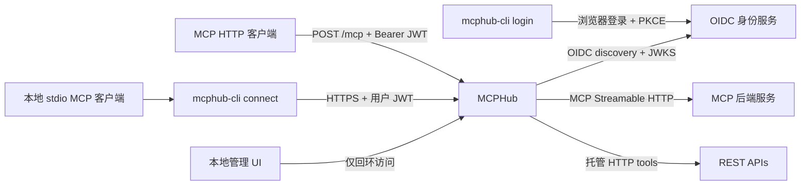

# MCPHub

[](https://github.com/SamuelSupe/mcphub/actions/workflows/ci.yml)
[](https://github.com/SamuelSupe/mcphub/releases/tag/v1.3.1)
[](https://github.com/SamuelSupe/mcphub/blob/main/LICENSE)
[](https://github.com/SamuelSupe/mcphub/blob/main/go.mod)

[English](README.md) | [中文](README.zh-CN.md)

MCPHub 是一个面向远端 MCP Server 的聚合网关。它用一个 Streamable HTTP 入口连接多个后端，按 JWT 权限为每个请求生成可见的后端视图，并把工具、提示、资源和资源模板路由回正确的后端。

MCPHub v1.3.1 为浏览器登录 CLI 和 stdio 到 HTTP 连接器增加 Windows x64、ARM64 支持，与 macOS、Linux 一同提供下载，并保留 v1.3.0 重新布局的本地管理 UI。可选管理平台用于管理加密 SQLite 配置、HTTP tools 和 OpenAPI 导入。网关仍采用单进程架构，不提供指标端点、持久化远程 MCP 目录或集群协调。

## 架构



## 项目链接

- [GitHub 仓库](https://github.com/SamuelSupe/mcphub)
- [本地管理 UI 指南](#本地管理-ui)
- [贡献指南](CONTRIBUTING.md)
- [安全策略](SECURITY.md)
- [Apache License 2.0](LICENSE)（Copyright 2026 SamuelSupe）
- [v1.3.1 发行说明](RELEASE_NOTES_v1.3.1.md)、[v1.3.0 历史发行说明](RELEASE_NOTES_v1.3.0.md)、[v1.3.1 GitHub release](https://github.com/SamuelSupe/mcphub/releases/tag/v1.3.1)和 [全部 GitHub Releases](https://github.com/SamuelSupe/mcphub/releases)

MCPHub v1.3.1 是当前最新版本；v1.3.0 及更早版本仍作为历史版本保留。

## 能力与边界

- 通过 MCP Streamable HTTP 连接多个后端；后端目录按分页读取，tools、prompts、resources 和资源模板列表会并行发现，并按后端通知或刷新周期更新。
- 聚合 `tools`、`prompts`、`resources`、资源模板和 completion；转发 tool/prompt/resource 调用、资源订阅/取消订阅、进度通知和资源更新通知。
- 后端 SSE 响应保持 streaming passthrough；检查 progress notification 时每个 event 最多缓存 1 MiB，超大 event 原样转发但跳过 progress 检查。
- 针对官方 Go MCP SDK v1.7.0 客户端的 `notifications/cancelled` 消息缺少 2026-07-28 metadata，Hub 入站和后端出站都会做兼容规范化，使取消或取消订阅后的同一逻辑 MCP session 仍可复用；这是互操作性 shim，不是自定义扩展。
- 以 `backend.id` 为命名空间，改写资源 URI，避免不同后端的同名能力和 URI 冲突。
- 使用 OIDC discovery 和 JWKS 验证 Bearer JWT；按后端 `required_scopes` 过滤目录和调用。
- 提供独立的 `mcphub-cli` 程序，提供外部 OIDC 浏览器登录及本地 stdio 到 HTTP 的连接器，并自动刷新凭证。
- 对原始后端 tool name 应用后端本地 `tool_rules` 和 Go `path.Match`；匹配规则的 scope 会合并去重，按 all-of 授权，并从 `tools/list` 隐藏未授权 tool。
- 支持后端静态请求头，或 OAuth 2.0 `client_credentials`；两者不能同时提供 `Authorization`。
- 本地管理 UI 分为概览、MCP 后端、HTTP 工具组和变更记录，默认使用中文并可持久切换到 English。工具组可以把手工 HTTP tool 和多个 OpenAPI 3.0/3.1 import 通过 `/mcp` 发布；组内共享 Base URL、Header、OAuth、scope 和 timeout，且不会暴露 raw HTTP proxy。
- 提供健康、就绪和 RFC 9728 Protected Resource Metadata 端点；配置支持 SIGHUP 热重载。

后端连接失败时，MCPHub 会重试并保留已知的后端目录；目录可能仍可列出，但具体调用会在连接恢复前失败。启动时不会因为 required 后端暂时不可用而退出，`/readyz` 会保持 503；SIGHUP 创建新运行时则要求 candidate 中的 required 后端首次连接成功。后端产生的 JSON-RPC error 原样返回。网络或 transport 失败对外只返回 `backend <id> unavailable`，不会泄露内部 backend URL、query 或 credential。后端重连时，所有 tracked resource subscription 必须全部恢复成功后才会标记 ready；任一恢复失败都会保持 unavailable 并触发后续重连。

## 快速开始

要求 Go 1.26（`go.mod` 声明 `go 1.26.0`）。使用 Go 安装 v1.3.1 服务端和可选 CLI：

```bash
go install github.com/SamuelSupe/mcphub/cmd/mcphub@v1.3.1
go install github.com/SamuelSupe/mcphub/cmd/mcphub-cli@v1.3.1
```

如果从源码构建，请先复制示例并设置其中的环境变量：

```bash
cp config.example.yaml config.yaml

# 示例；请替换为真实的 HTTPS 地址和 secret。不要把 secret 写进 Git。
export MCPHUB_PUBLIC_URL='https://hub.example.com/mcp'
export MCPHUB_CONSOLE_ORIGIN='https://console.example.com'
export MCPHUB_AUTH_ISSUER='https://idp.example.com'
export MCPHUB_PRIMARY_BACKEND_URL='https://mcp-a.example.com/mcp'
export MCPHUB_PRIMARY_API_KEY='replace-me'
export MCPHUB_CRM_BACKEND_URL='https://mcp-crm.example.com/mcp'
export MCPHUB_CRM_OAUTH_ISSUER='https://idp.example.com'
export MCPHUB_CRM_CLIENT_ID='replace-me'
export MCPHUB_CRM_CLIENT_SECRET='replace-me'

go build -trimpath -o ./mcphub ./cmd/mcphub
./mcphub validate --config ./config.yaml
./mcphub serve --config ./config.yaml
```

`validate` 只读校验配置，成功时在 stdout 输出 `configuration valid`。管理模式下，数据库存在时会只读检查 SQLite；数据库尚不存在时校验 YAML bootstrap backends，不创建文件。`serve` 把结构化 JSON 日志写到 stderr。两个子命令都要求 `--config PATH`。

也可以直接运行而不生成二进制：

```bash
go run ./cmd/mcphub validate --config ./config.yaml
go run ./cmd/mcphub serve --config ./config.yaml
```

### 浏览器登录与本地连接器

`mcphub-cli` 在用户的 Windows、macOS 或 Linux 电脑上运行，提供 `login`、`connect`、`status`、`logout`。服务端程序 `mcphub` 提供 `serve`、`validate`。可下载下方对应平台的 CLI 包、使用上文 Go 命令安装，或从当前源码构建后将它放入 PATH：

```bash
go build -trimpath -o ./mcphub-cli ./cmd/mcphub-cli
```

发布工作流分别生成服务端的 `mcphub_<version>_<os>_<arch>.tar.gz` 和客户端的 `mcphub-cli_<version>_<os>_<arch>.tar.gz`，用户电脑只需安装 CLI 包。服务端继续使用现有 `auth.issuer` 和 JWT scope 策略完成认证与授权。

先在该身份服务注册一个 **公开原生 OAuth 客户端**，启用授权码、refresh token、PKCE S256，以及 token endpoint 的 `none` 认证方式。允许回调 `http://127.0.0.1:<port>/oauth/callback`；支持原生客户端的服务可允许随机回环端口，否则注册固定端口并传入 `--callback-port 8765`。Discovery 必须声明支持 S256。身份服务签发的 JWT **access token** 必须包含完整 MCPHub 公开 URL（含 `/mcp`）作为 audience，并携带 `sub`、`exp` 和所需 scope。本机无需保存 client secret。

```bash
mcphub-cli login --server https://hub.example.com/mcp --client-id mcphub-cli --profile work
mcphub-cli status --profile work
```

`login` 打开系统浏览器，最多等待 5 分钟接收本机回调。打开失败时，会打印可在同一台电脑浏览器中访问的授权链接。它校验 state/issuer，并完成一次已认证的 MCP 握手，成功后才替换原有凭证；失败或取消会保留原有登录。重复传入 `--scope` 可指定申请的权限，未指定时使用认证 challenge 或资源 metadata 的默认值；身份服务声明支持时会追加 `offline_access`。若未签发 refresh token，仍可登录，但会明确提示到期后需要重新登录。

在支持 stdio 的 MCP 客户端中配置以下启动命令，将路径替换为已安装二进制的绝对路径：

```json
{
  "mcpServers": {
    "mcphub": {
      "command": "/absolute/path/to/mcphub-cli",
      "args": ["connect", "--profile", "work"]
    }
  }
}
```

`connect` 读取 profile，仅向保存的 MCPHub 地址附加 Bearer token，在到期前自动刷新凭证。工具、提示词、资源、分页、进度与订阅均通过连接器转发，公开名称和 URI 保持一致；取消 stdio 调用会关闭对应 HTTP 响应流。stdout 只输出 MCP 消息，诊断写入 stderr。连接器不会弹出浏览器；401 最多刷新重试一次，403 提示缺失的 scope，网络失败不会自动重放操作。

```bash
# 复用已保存的服务地址和 client ID；覆盖 scope 时列出所有需要的权限。
mcphub-cli login --profile work --scope mcp:primary.read
mcphub-cli logout --profile work
```

默认 profile 为 `default`。macOS/Linux 数据保存在 `~/.mcphub/`，目录权限 `0700`、文件权限 `0600`；Windows 保存在 `%USERPROFILE%\.mcphub\`，通过仅授权当前用户的 DACL 保护。Windows 凭证目录需位于支持 Windows 访问控制的本地文件系统（如 NTFS）。已有 profile 可直接由 `mcphub-cli` 使用，无需迁移。Token 以本地 JSON 保存，**不做加密**；不要放入共享目录或其他用户可读取的备份。临时文件替换与按 profile 的进程间锁保证多个连接器能够安全轮换 refresh token。`status` 仅显示本地缓存状态、到期时间和能否续期，不输出 Token。`logout` 清除本地 Token、保留非敏感连接设置，使连接器后续请求停止并要求登录；已经接受的请求可能继续完成。它不会吊销身份服务中的 Token 或退出浏览器会话。重新登录后，需要重启该 profile 的已有连接器。

stdio 仅用于**本地连接器**，MCPHub 服务端和后端连接仍使用 HTTP。首版不包含 SSH/device-code 登录、动态客户端注册、Token 导出、内置用户账号、管理平台登录或第三方后端交互授权。

### v1.3.1 预构建下载

[v1.3.1 GitHub release](https://github.com/SamuelSupe/mcphub/releases/tag/v1.3.1) 分别提供服务端和客户端归档。运行网关的机器安装 `mcphub`，用户电脑安装 `mcphub-cli`。

| 平台 | 服务端 | 登录 CLI 与本地连接器 |
| --- | --- | --- |
| macOS Intel | [mcphub](https://github.com/SamuelSupe/mcphub/releases/download/v1.3.1/mcphub_v1.3.1_darwin_amd64.tar.gz) | [mcphub-cli](https://github.com/SamuelSupe/mcphub/releases/download/v1.3.1/mcphub-cli_v1.3.1_darwin_amd64.tar.gz) |
| macOS Apple Silicon | [mcphub](https://github.com/SamuelSupe/mcphub/releases/download/v1.3.1/mcphub_v1.3.1_darwin_arm64.tar.gz) | [mcphub-cli](https://github.com/SamuelSupe/mcphub/releases/download/v1.3.1/mcphub-cli_v1.3.1_darwin_arm64.tar.gz) |
| Linux amd64 | [mcphub](https://github.com/SamuelSupe/mcphub/releases/download/v1.3.1/mcphub_v1.3.1_linux_amd64.tar.gz) | [mcphub-cli](https://github.com/SamuelSupe/mcphub/releases/download/v1.3.1/mcphub-cli_v1.3.1_linux_amd64.tar.gz) |
| Linux arm64 | [mcphub](https://github.com/SamuelSupe/mcphub/releases/download/v1.3.1/mcphub_v1.3.1_linux_arm64.tar.gz) | [mcphub-cli](https://github.com/SamuelSupe/mcphub/releases/download/v1.3.1/mcphub-cli_v1.3.1_linux_arm64.tar.gz) |
| Windows x64 | — | [mcphub-cli.exe（ZIP）](https://github.com/SamuelSupe/mcphub/releases/download/v1.3.1/mcphub-cli_v1.3.1_windows_amd64.zip) |
| Windows ARM64 | — | [mcphub-cli.exe（ZIP）](https://github.com/SamuelSupe/mcphub/releases/download/v1.3.1/mcphub-cli_v1.3.1_windows_arm64.zip) |

下载后先与 [SHA256SUMS](https://github.com/SamuelSupe/mcphub/releases/download/v1.3.1/SHA256SUMS) 中对应条目核对 SHA-256，再解压并将可执行文件放入 PATH。每个包包含许可证和中英文 README；服务端包另附 `config.example.yaml`。

### Windows CLI 快速开始

Intel/AMD 电脑选择 x64 ZIP，Windows on Arm 电脑选择 ARM64 ZIP。CLI 遵循 [Go 的 Windows 运行要求](https://go.dev/wiki/MinimumRequirements#windows)（Windows 10 及以上）；服务端下载仍提供 macOS/Linux。与 `SHA256SUMS` 核对归档哈希后，在 PowerShell 中解压并运行：

```powershell
Get-FileHash .\mcphub-cli_v1.3.1_windows_amd64.zip -Algorithm SHA256
Expand-Archive .\mcphub-cli_v1.3.1_windows_amd64.zip -DestinationPath .\mcphub-cli
.\mcphub-cli\mcphub-cli.exe login --server https://hub.example.com/mcp --client-id mcphub-cli --profile work
.\mcphub-cli\mcphub-cli.exe status --profile work
```

身份服务注册方式见上文。登录会打开 Windows 默认浏览器；若无法自动打开，请在同一台电脑打开终端输出的 URL。MCP 客户端配置应填写安装后的 Windows 绝对路径，JSON 中需转义反斜杠，例如：

```json
{
  "mcpServers": {
    "mcphub": {
      "command": "C:\\Tools\\mcphub-cli\\mcphub-cli.exe",
      "args": ["connect", "--profile", "work"]
    }
  }
}
```

Windows CLI 可以连接已有的 v1.3.0 网关，无需为了新增客户端平台升级服务端。

## 本地管理 UI

启用内嵌管理 UI 后，可直接配置连接，无需修改 backend YAML。新部署可将以下内容保存为 `config.yaml`，把 `MCPHUB_PUBLIC_URL`、`MCPHUB_AUTH_ISSUER` 设置为真实的 HTTPS 网关与身份服务地址，并通过 secret store 提供 Base64 编码的 32 字节 `MCPHUB_CONFIG_KEY`。密钥只生成一次（例如使用 `openssl rand -base64 32`），重启和升级时保留并安全保存。数据库目录需要可写。

```yaml
server:
  listen: "127.0.0.1:8080"
  public_url: ${MCPHUB_PUBLIC_URL}
auth:
  issuer: ${MCPHUB_AUTH_ISSUER}
admin:
  enabled: true
  listen: "127.0.0.1:8081"
  database_path: ./data/mcphub.db
  encryption_key_env: MCPHUB_CONFIG_KEY
backends: []
```

先运行 `mcphub validate --config config.yaml`，再运行 `mcphub serve --config config.yaml`，在网关所在机器打开[本地控制台](http://127.0.0.1:8081/)。管理端没有登录机制，必须保持仅回环访问。网关仍需可用的 OIDC 身份服务才能就绪并认证 MCP 客户端。

| 页面 | 主要用途 |
| --- | --- |
| 概览 | 查看后端就绪状态、工具组与工具数量、最近变更，并选择服务接入方式。 |
| MCP 后端 | 连接已有的 Streamable HTTP MCP 服务；按标识或地址搜索、按状态筛选、测试连接和管理配置。 |
| HTTP 工具组 | 将 REST API 转成 MCP 工具；创建组后添加 HTTP 接口，或解析 OpenAPI 文档并选择要发布的接口。 |
| 变更记录 | 查看最近 50 条配置变更，敏感值经过脱敏。 |

两类编辑器都按 **连接信息 → 上游认证 → 客户端访问权限** 配置。上游 Header/OAuth 是 MCPHub 调用服务的凭证；所需 Scope 决定客户端能否使用后端或工具组：留空允许所有已认证客户端，填写多个时必须**全部满足**。工具级规则可为选定操作追加 Scope；高级连接配置按需展开。编辑已有凭证时，值留空会保留原值；删除 Header 行会移除对应凭证。

多个 MCP endpoint 如需共享访问策略，可配置相同的所需 Scope，再由身份服务将该 Scope 授予对应用户。HTTP 工具组用于同一 REST API 内共享连接与权限，不用于组合多个 MCP 后端。MCPHub 不提供独立的 endpoint 分组、角色或用户目录，也不解析 JWT 的 `roles`/`groups` claim。

语言控件可切换中文与 English。刷新会重新读取当前配置并显示最近成功更新时间；失败时保留错误提示与重试入口。

## 配置

配置是单个 YAML 文档，解码使用严格字段检查；未知字段、多文档 YAML、缺失环境变量都会被拒绝。字符串配置项中的 `${NAME}` 占位符会从当前进程环境展开，`NAME` 必须匹配 `[A-Za-z_][A-Za-z0-9_]*`；没有默认值语法。duration、整数和布尔字段不支持占位符。配置加载和 SIGHUP 重载都会重新展开环境变量。管理数据库完成初始化后，YAML backends 及其环境变量占位符会被忽略。

### `server`

| 字段 | 默认值 | 说明 |
| --- | --- | --- |
| `listen` | `:8080` | HTTP 监听地址。SIGHUP 不可修改，修改后需重启。 |
| `public_url` | 无 | 必填的绝对 HTTPS URL，必须包含 MCP 路径（例如 `https://hub.example.com/mcp`），不能有 query 或 fragment。路径不能含 percent-encoded 字符，也不能是 `/healthz`、`/readyz` 或 `/.well-known/oauth-protected-resource`。它既是 MCP 地址，也是 JWT 的 audience。SIGHUP 不可修改。 |
| `page_size` | `1000` | 聚合 MCP 目录分页大小，必须大于 0。 |
| `request_timeout` | `60s` | 普通 MCP 请求和后端调用的默认超时；必须大于 0。所有 HTTP 路由在 request body 被消费或关闭前都使用该值作为读取 deadline，未认证或被拒绝请求的慢 body 也会有界结束。MCP 处理继续后，普通 MCP POST 还会用它设置 response 写入 deadline 和 request context；新版 `subscriptions/listen` POST 在 body 读完后保持长连接，不使用普通的 response 写入和 request context timeout。但 runtime 或 client context 取消仍会让底层 write deadline 立即到期，因此代际 drain 或 client 断开时，慢 subscription write 会被打断。 |
| `drain_timeout` | `15s` | SIGTERM/SIGINT 关停，以及 SIGHUP 替换旧运行时等待活动请求的最长时间；必须大于 0。 |
| `refresh_interval` | `5m` | 后端目录刷新的最大间隔；后端返回更短 TTL 时会提前刷新，最终间隔不会低于 5 秒。必须大于 0。 |
| `catalog_ttl` | `30s` | 对 MCP 目录/发现结果声明的 private TTL；允许为 0，但不能为负数。 |
| `max_request_body_bytes` | `4194304`（4 MiB） | MCP POST body 上限，超出返回 413；必须大于 0。 |
| `allowed_origins` | `[]` | 额外允许的浏览器 HTTPS Origin。每项只能是 `https://authority`，不允许路径、query、fragment、通配符；MCPHub 自身 `public_url` 的 origin 自动允许。 |

duration 使用 Go `time.ParseDuration` 语法，例如 `500ms`、`60s`、`5m`。`public_url` 的路径就是 MCP 入口路径；上例入口为 `/mcp`。路径中的 percent-encoded 字符会被拒绝，`/healthz`、`/readyz` 和 `/.well-known/oauth-protected-resource` 是保留路径。

### `auth`

| 字段 | 说明 |
| --- | --- |
| `issuer` | 必填的绝对 HTTPS OIDC issuer。MCPHub 从该地址 discovery（通常是 `/.well-known/openid-configuration`）并读取 JWKS；SIGHUP 不可修改。 |

JWT 必须满足以下条件：签名和 `iss` 由该 issuer 验证；`aud` 必须包含完整的 `server.public_url`（包含路径）——`aud` 为字符串时必须等于 `public_url`，为数组时必须包含 `public_url`；必须有非空 `sub` 和 `exp`；`nbf`（如有）也会校验。过期、未生效和 OIDC 时间比较允许 30 秒时钟偏差。只有在 OIDC discovery 成功、`jwks_uri` 是绝对 HTTPS URL，且可达的 JWKS 响应至少包含一个可解析、有效且非对称的公开验证密钥后，verifier 才会 ready；对称 `oct` 密钥以及无效或空 key 均不满足此条件。首次成功刷新前 MCP 入口返回 503；ready 后 discovery 或 JWKS 刷新暂时失败会保留 last-known-good verifier。OIDC discovery 和 JWKS 响应分别限制为 1 MiB。

JWKS ready 还要求至少一个可用 key：`use` 为空或为 `sig`；存在 `key_ops` 时必须包含 `verify`；显式 `alg` 必须匹配 OIDC discovery 宣告的支持 RSA、EC 或 Ed25519 JWS 算法。若 discovery 未宣告 `id_token_signing_alg_values_supported`，则按 `RS256`。同一 JWKS 中的坏 key 或不支持 key 不会遮蔽其他可用 key。

scope 取自 JWT 的 `scope` 和 `scp` 两个 claim：`scope` 只接受空格分隔字符串（包括空字符串或 JSON `null`）；`scp` 接受空格分隔字符串或字符串数组。两个 claim 的值会合并、去重；数组项不能包含空白。后端访问采用 **all-of** 语义：`required_scopes: [a, b]` 要求 token 同时拥有 `a` 和 `b`；缺任一项，该后端不会出现在该 token 的目录视图中，对已识别的直接调用返回 403 `insufficient_scope`。未配置 `required_scopes` 的后端不受 scope 限制。Protected Resource Metadata 的 `scopes_supported` 是所有后端 required scope 的去重并集。

### `admin`

本地管理平台默认关闭。启用后，它通过独立、无认证的回环监听器提供嵌入式 UI 和 JSON API，管理 backend 和工具组配置；`server`、`auth` 和 `admin` 仍由 YAML 管理并需要重启才能修改。

| 字段 | 默认值 | 说明 |
| --- | --- | --- |
| `enabled` | `false` | 启用本地管理平台，并让 SQLite 成为 backend 配置事实来源。 |
| `listen` | `127.0.0.1:8081` | 必须是数字形式的 IPv4/IPv6 回环地址，SIGHUP 不可修改。 |
| `database_path` | 无 | 启用时必填；相对路径以 YAML 文件所在目录解析。 |
| `encryption_key_env` | `MCPHUB_CONFIG_KEY` | 保存 Base64 编码 32 字节 AES 密钥的环境变量名；丢失或改变密钥会导致已存 Secret 无法解密。 |

空数据库首次启动时，MCPHub 会在一个事务中导入展开后的 YAML backends。bootstrap 标记写入后，SQLite 成为唯一 backend 来源，之后修改 YAML backend 不再生效。Header 值和 OAuth client secret 使用 AES-256-GCM 加密，管理 API 永不返回明文。

默认 UI 地址为 `http://127.0.0.1:8081/`，可以在不中断进程的情况下注册、测试、编辑、启停和删除后端。Required 后端连接失败时变更会被拒绝，当前 runtime 不受影响；optional 后端不可用时可以保存，并在后台持续重连。

JSON API 位于 `/api/v1`。单项 backend 响应携带 `ETag`；更新和删除必须通过 `If-Match` 提交该 revision，过期写入返回 `409 revision_conflict`。Secret 字段只返回是否已配置；编辑时省略 Secret 值表示保留，省略对应 Header 或 OAuth 配置表示删除。审计事件的 actor 固定为 `local`，只记录脱敏结果。

#### 工具组与托管 HTTP API tool

工具组是管理 API 中的对象，不是 YAML 配置。每个组统一持有其 tool 使用的 HTTPS Base URL、静态 Header 或 OAuth 2.0 `client_credentials`、JWT required scope 和请求 timeout；不要在每个 tool 中重复配置凭证。Header 值和 OAuth client secret 加密存储在 SQLite，API 只返回“已配置/未配置”标记。工具组 scope 仍采用 backend 相同的 all-of 语义；可选的组内 tool 规则可以为选定 tool 追加 scope。

一个工具组可以包含手工定义的 HTTP tool，以及多个 OpenAPI 3.0 或 3.1 import。OpenAPI import 可以先 inspect 再保存。两类对象都只作为 MCP capability，经配置的 `/mcp` Streamable HTTP 入口列出和调用；MCPHub 不提供 raw HTTP proxy 或任意 method/path 透传路由。

稳定的管理路径如下：

| 操作 | 路径 |
| --- | --- |
| 列出/创建工具组 | `GET/POST /api/v1/tool-groups` |
| 读取/更新/删除工具组；探测工具组 | `GET/PUT/DELETE /api/v1/tool-groups/{groupID}`、`POST .../{groupID}/probe` |
| 列出/创建或读取/更新/删除手工 tool | `GET/POST .../{groupID}/tools`、`GET/PUT/DELETE .../{groupID}/tools/{toolName}` |
| inspect、列出/创建或读取/更新/删除 OpenAPI import | `POST .../{groupID}/imports/inspect`、`GET/POST .../{groupID}/imports`、`GET/PUT/DELETE .../{groupID}/imports/{importID}` |
| 刷新 OpenAPI import | `POST .../{groupID}/imports/{importID}/refresh` |

工具组、手工 tool 和 import 资源各自返回 `ETag`；更新和删除必须提交匹配的 `If-Match`，revision 过期时返回 `409 revision_conflict`。这些资源只能通过 admin API 管理并持久化到 SQLite；有意不提供 `tool_groups`（或同类）YAML schema，SIGHUP 也不会导入它们。

工具组 Base URL 和 OpenAPI source URL 必须使用 HTTPS；工具组 HTTP 请求和 source 抓取都不跟随重定向。若 source 与工具组是不同 origin，抓取时绝不会发送该组的静态 Header 或 OAuth secret。OpenAPI 文档上限为 5 MiB，携带文档的请求 body 上限为 6 MiB，HTTP tool 响应默认上限为 1 MiB；响应上限可配置为 64 KiB 至 16 MiB。URL-backed import 默认每 15 分钟自动刷新（可设为 1 分钟至 24 小时）；刷新失败时保留 last-known-good 文档和 tools，并采用退避重试。

#### v1.3.1 升级说明

从 v1.3.0 或 v1.2.0 升级不需要迁移配置或数据库 schema。保留现有 SQLite 数据库和相同的 `MCPHUB_CONFIG_KEY`，替换二进制前备份数据库并单独安全保管密钥；若替换服务端二进制，需重启服务并刷新浏览器。客户端机器需单独安装 `mcphub-cli`，并在身份服务中注册公开 OAuth 客户端。

`admin.enabled` 为 `false` 时，现有 YAML-only 部署不变。首次启用本地管理时，请配置回环 `admin` listener，提供 Base64 编码的 32 字节 `MCPHUB_CONFIG_KEY`，并为 SQLite 路径准备可写卷。首次启动会在一个事务中导入已有 YAML backends；bootstrap 标记写入后 SQLite 成为唯一 backend 来源，之后修改 YAML backend 不再生效。工具组、手工 HTTP tool 和 OpenAPI import 请通过 `/api/v1/tool-groups` 创建；由于这些对象没有 YAML 表示，不提供 YAML migration。

### `backends`

YAML-only 模式至少配置一个后端；管理模式允许从空数据库启动并在网页注册第一个后端。每个 `id` 必须匹配 `[A-Za-z0-9_-]{1,32}`，并按大小写不敏感规则保持唯一；允许大写字母。

| 字段 | 默认值 | 说明 |
| --- | --- | --- |
| `id` | 无 | tool/prompt 名称使用的对外命名空间和配置 ID；不能包含点号。名称保留大写，而 resource/template URI authority 使用小写 ID。 |
| `url` | 无 | 必填绝对 URL。默认只接受 HTTPS；仅当 `allow_insecure_http: true` 且主机是 `localhost`、IPv4/IPv6 loopback 时才允许 HTTP。 |
| `required` | `false` | required 后端影响 `/readyz`。运行中断线会使就绪变为 503；连接循环会继续重试。 |
| `required_scopes` | `[]` | 该后端所需的 JWT scope，按 all-of 判断；scope 不能含空白，也不能重复。 |
| `tool_rules` | `[]` | 可选的后端本地 tool 策略。每条规则包含 `match` glob 和 `required_scopes`；匹配基于原始后端 tool name，使用 Go `path.Match`，整串且区分大小写。 |
| `request_timeout` | 继承 `server.request_timeout` | 该后端连接、目录发现、刷新和调用的超时；必须大于 0。 |
| `allow_insecure_http` | `false` | 仅为 loopback 本地 HTTP 开关；不会放宽 `server.public_url` 或任何 issuer 的 HTTPS 要求。 |
| `headers` | `{}` | 每次后端 MCP HTTP 请求附加的静态头。值支持环境变量展开，不能含 CR/LF；名称大小写不敏感且不能重复。`Accept`、`Content-Type`、任意 `Mcp-*` 头，以及 `Host`、`Content-Length`、`Connection`、`Proxy-Authorization`、`Proxy-Authenticate` 等均由 HTTP/MCP transport 管理并被拒绝。 |
| `oauth` | 无 | 后端 OAuth 配置；目前唯一允许的 `type` 是 `client_credentials`。与静态 `Authorization` 头互斥。 |

`oauth` 字段如下：

| 字段 | 说明 |
| --- | --- |
| `type` | 必须为 `client_credentials`。 |
| `issuer` | 必填绝对 HTTPS OAuth issuer；metadata 的 issuer 必须与它精确一致。 |
| `client_id` / `client_secret` | 必填，建议只通过 `${...}` 环境变量提供。 |
| `scopes` | 发给后端 OAuth token endpoint 的 scope 列表；它与 `required_scopes`（验证进入 MCPHub 的 JWT）是两套独立的 scope。 |

后端 OAuth discovery 和 token 请求不会带上该后端的静态 headers；数据面请求才会附加 headers 并自动复用/刷新 client-credentials token。Discovery 只从 RFC 8414/OIDC metadata 读取并精确校验 `issuer` 和 `token_endpoint`，不要求交互式 authorization 或 PKCE metadata。OAuth metadata 响应上限为 1 MiB。后端和 OIDC HTTP 客户端都不跟随重定向。

#### 后端本地 tool 规则

`tool_rules` 按 backend 分别评估，发生在配置的 ID 加到公开 tool name 之前。规则的 `match` 使用 Go `path.Match` 匹配原始后端 tool name：整串匹配且区分大小写，因此 `admin.*` 不会匹配 `Admin.Read` 或字符串中的子串。每条匹配规则贡献自己的 `required_scopes`；MCPHub 会合并去重这些 scope，并要求它们与 backend 级 `required_scopes` 一起全部满足。

配置校验会对 `match` 和规则 scope 字符串执行现有 `${ENV}` 展开；每个 `match` 必须非空且是有效的 Go `path.Match` 模式，每条规则必须声明非空的 `required_scopes`，其项不能含空白或重复，同一 backend 内重复的 `match` 会被拒绝。

不满足策略的 tool 不会出现在 `tools/list`。客户端直接调用已知但缺少所需 scope 的 tool 时，MCPHub 返回 403，并给出精确的 `WWW-Authenticate` challenge，其中包含 `error="insufficient_scope"`、路径感知的 `resource_metadata` URL，以及列出缺失 scope 的空格分隔 `scope` 值。当前目录 generation 没有匹配 tool 的规则会发出一次 warning，但配置仍有效，后续目录刷新出现匹配 tool 后即可生效。`tool_rules` 支持通过 SIGHUP 热重载，并随重载后的 backend policy 生效。

Backend ID 的唯一性按大小写不敏感检查。tool/prompt 名称保留配置中的 ID；所有公开 resource 或 resource-template URI 使用小写 authority，并解析回配置中的 ID。

## HTTP 端点与 RFC 9728

假设 `server.public_url: https://hub.example.com/mcp`：

| 地址 | 认证 | 语义 |
| --- | --- | --- |
| `GET /healthz` | 无 | 进程仍有运行时就返回 `200 {"status":"ok"}`；用于存活探针。 |
| `GET /readyz` | 无 | 所有 required 后端和 OIDC verifier 都 ready 时返回 200，否则 503。JSON 包含 `backends_ready`、`backends_total`、`required_ready`、`required_total`、`auth_verifier_ready`。 |
| `GET /.well-known/oauth-protected-resource/mcp` | 无 | RFC 9728 Protected Resource Metadata 的路径感知地址；推荐将此地址暴露给客户端。 |
| `GET /.well-known/oauth-protected-resource` | 无 | 同一 metadata 的根路径兼容别名。反向代理应把两个地址都路由到 MCPHub。 |
| `/mcp` | Bearer JWT | Stateless MCP Streamable HTTP 入口；只接受 POST，兼容客户端也使用同一 `/mcp` POST 语义。现代客户端可以在 POST 响应中使用 request-scoped SSE；MCPHub 不提供 standalone GET SSE 或 DELETE session 会话端点。目录和调用按 token scope 过滤。 |

Metadata 的 `resource` 是完整 `public_url`，`authorization_servers` 是 `auth.issuer`，`scopes_supported` 是所有后端 required scope 的并集，`bearer_methods_supported` 只有 `header`。未带 token 的 MCP 请求会收到 401 challenge，其中 `resource_metadata` 指向 `https://hub.example.com/.well-known/oauth-protected-resource/mcp`；缺 scope 时为 403 `insufficient_scope`。

跨域请求只接受 `public_url` 的 origin 或 `allowed_origins` 中的精确 origin。预检响应只允许 `POST`（由 `OPTIONS` 返回预检响应）和实现列出的 MCP/追踪头；不支持 `*`。其他路径返回 404。

## 命名与 URI 映射

- 工具和 prompt 对外名称为 `<backend-id>.<原名>`。原名必须匹配 `[A-Za-z0-9_.-]{1,128}`；拼接命名空间后超过 128 个字符时，会在保留 backend 前缀的前提下截断并追加原名 SHA-256 的短后缀。非法元数据和映射后的冲突项会被省略，并记录日志。
- 静态资源和结果中的 `ResourceLink`/embedded resource 统一编码为 `mcphub://<backend-id>/r/<base64url-no-padding(original-uri)>`。MCPHub 收到该 URI 后解码并向对应后端读取；结果中的资源 URI 会递归改写。
- 资源模板编码为 `mcphub://<backend-id>/t/<sha256(original-template)>`，并保留 URI 模板变量的 query 表达式（例如 `{?id}`）。读取和 completion 会把公开模板还原为后端原始模板。
- 后端 tool、prompt 或 resource 结果中的 `ResourceLink`、`EmbeddedResource`、`ResourceContents` URI 会被改写，并按 backend 记录为已签发资源。只要 URI 摘要仍被保留，就可以继续 read 和 subscribe，但不会逐项加入公开的 `resources` 目录。每个 backend 最多保留 16,384 个不同的已签发 URI SHA-256 摘要；最旧摘要被淘汰后，该 URI 可能无法再被新 read 或 subscription 使用，但已有订阅的取消和 session 清理仍按 session 映射处理。`resource updated` 通知不会创建目录项。
- 资源订阅按 upstream MCP session 跟踪并去重；后端按原始 URI 共享并做引用计数；未配对的取消订阅会忽略，session 关闭会清理，后端重连会恢复全部已跟踪订阅；backend protocol 支持该确认时，还要等待 `notifications/subscriptions/acknowledged`，全部完成后才标记 ready。确认中的 subscription ID 会映射回原订阅 URI；即使 2026 resource update 的 event URI 不同，也会向这些 URI 扇出。timeout、取消订阅以及 session/重连清理会删除映射。现代 `subscriptions/listen` stream 取消或断连时，清理会脱离已取消的 upstream context，但仍受 backend `request_timeout` 和 session lifecycle 约束，因此旧协议 backend 仍会收到 `resources/unsubscribe`。任一恢复失败时 backend 保持 unavailable，连接循环会再次重试。

每个 token 的 scope 集合决定一个独立的后端 view；因此同一个 MCP 连接只会看到该 token 有权访问的能力。

## SIGHUP 热重载与关停

`serve` 运行在 Unix 时可发送：

```bash
kill -HUP <mcphub-pid>   # 重读同一个 --config 文件
kill -TERM <mcphub-pid>  # 优雅关停
```

SIGHUP 会先完整加载、环境展开和校验配置，再构建 candidate runtime；失败时保留旧 runtime。新 runtime 的 required 后端必须首次连接成功；旧 runtime 会在 `drain_timeout` 内等待活动请求后关闭；runtime 代际最终关闭时，会先取消绑定到该代际的 request context，再关闭其 Hub/backend 状态，避免 session 晚到登记竞态。该取消会立即让底层 write deadline 到期，打断 drain 后仍在慢速或未读取的 subscription write；普通请求仍保留 `request_timeout` deadline。可热重载的包括 allowed origins、目录/请求/关停参数、后端列表及后端认证、scope 和后端本地 `tool_rules`。以下字段变化会被拒绝，必须重启：

- `server.listen`
- `server.public_url`
- `auth.issuer`
- 全部 `admin` 字段

这些值决定监听器、存储/加密身份、RFC 9728/JWT audience 和 OIDC verifier，不能只替换内存中的 runtime。管理模式下 SIGHUP 只重载 YAML 静态字段，backend 始终从 SQLite 组合；首次导入后 YAML backend 变化会被忽略。

SIGHUP candidate 启动使用可取消的 context；关停开始时仍在连接的 candidate 会被取消。candidate 的 required backend 必须先连接成功才能替换当前代际；每个 candidate 或已退役 runtime 都会关闭自己持有的 backend session 和连接。

SIGINT 和 SIGTERM 会先停止接收新请求，再保留当前 runtime 与 backend context，让 HTTP 请求在 `drain_timeout` 内完成 drain。HTTP drain 超时后，MCPHub 会强制关闭剩余 HTTP 连接；随后代际关闭会先取消绑定到该代际的 request context，再关闭 backend 状态。

SIGHUP 创建 unavailable optional backend 时，只有目录来源身份未变才会继承上一代内存目录：backend ID 和 URL、`allow_insecure_http`、全部固定 header，以及 OAuth 配置是否存在和 `type`、`issuer`、`client_id`、`client_secret`、`scopes` 必须完全一致。任意凭证、OAuth 或 tenant-selection header 变化都会阻止复用；`required`、`required_scopes`、`tool_rules`、timeout 等不标识目录来源的字段不阻止复用；继承的目录不会把新 backend 标记为 ready。

## Docker

Dockerfile 使用 `golang:1.26-bookworm` 构建静态二进制，再放入 `gcr.io/distroless/static-debian12:nonroot`；最终容器没有 shell，进程以 nonroot 用户运行。

```bash
docker build -t mcphub:local .
docker run --rm \
  --name mcphub \
  -p 8080:8080 \
  --env-file .env \
  -v "$PWD/config.yaml:/etc/mcphub/config.yaml:ro" \
  mcphub:local serve --config /etc/mcphub/config.yaml
```

容器内监听地址应与端口映射匹配（示例为 `:8080`）。`--env-file` 只为进程注入环境变量，配置以只读方式挂载；请限制宿主机 `config.yaml` 和 `.env` 的权限。镜像入口点已经是 `/usr/local/bin/mcphub`，因此 `serve`/`validate` 直接作为参数传入。

管理模式还需要为 `database_path` 挂载可写卷，并在容器环境中提供 `MCPHUB_CONFIG_KEY`。由于未认证管理服务刻意绑定容器回环地址，普通 `-p 8081:8081` 无法访问它；请使用宿主机安装或 Linux host networking 做本机管理，不要扩大监听地址把它暴露到远端。

## 安全说明

- 生产环境对外的 `public_url`、`auth.issuer` 和远端 backend URL 使用 HTTPS。`allow_insecure_http` 只允许 loopback 后端，不能把远端明文连接变成合法配置。
- `public_url` 必须出现在 token 的 `aud` 中：`aud` 为字符串时等于 `public_url`，为数组时包含 `public_url`；TLS 终止或反向代理后仍要保留公开的 host 和路径，并正确转发 RFC 9728 的两个 metadata 地址。
- 使用精确的 `allowed_origins`，不要把不受信任的控制台加入列表；Origin 和预检头均有严格 allowlist，预检只允许 `POST`（由 `OPTIONS` 返回响应）。
- 把 client secret、API key、静态 Authorization 等放在环境变量或外部 secret store，不要提交 YAML。静态 header 会发送到后端数据面，请避免把敏感值写入日志或能力名。
- 配置校验会拒绝换行头、重复头和 transport 管理头（包括 `Proxy-Authorization`、`Proxy-Authenticate`）；OAuth 模式会拒绝静态 `Authorization`，避免认证来源互相覆盖。
- 超长或无效的 request ID 会重新生成；日志中的 request/trace 值会限长或哈希，能力名和资源 URI 字段会校验并脱敏；请求失败只记录外部错误类型，不记录外部错误原文。
- `/healthz`、`/readyz` 和 metadata 不要求 Bearer；应在网络层限制管理面可见范围。MCP 入口只接受 Authorization header 的 Bearer JWT。
- 所有 HTTP 路由在 request body 被消费或关闭前都保持 `request_timeout` 读取 deadline，因此未认证或被拒绝请求的慢 body 也有界。`subscriptions/listen` POST 只有在 body 读完后才不受普通 response 写入和 request context timeout 限制。
- 后端 SSE 响应保持 streaming passthrough。progress 检查每个 event 最多缓存 1 MiB；超大 event 原样转发但跳过 progress 检查。
- 已确认的 2026 resource subscription ID 会把更新映射回原订阅 URI，包括 update event URI 不同的情况；timeout、取消订阅和 session/重连清理会删除映射。
- 管理 API 没有登录机制。配置校验强制它使用数字回环地址，并拒绝跨域和意外 Host 请求，同时设置严格 CSP；不要通过公网反向代理暴露。
- `MCPHUB_CONFIG_KEY` 应放在 YAML 和数据库备份之外安全保存。SQLite 文件权限为 `0600`，但恢复其中 Secret 必须保留完全相同的 32 字节密钥。

## 已知限制与排障提示

- 本地管理平台只持久化 backend 和工具组配置；当前仍没有指标、持久化 MCP 目录、跨实例共享订阅或高可用协调，每个进程维护自己的后端连接、目录和 token view。
- 当前版本不提供管理用户/远程管理认证、stdio 后端接入、独立旧式 GET SSE 端点、原生 TLS、动态租户/按用户后端凭证、opaque token introspection、Tasks、MCP Apps 或自定义 MCP 扩展。本地 `connect` 命令提供到 HTTP 网关的 stdio 连接；TLS 和外部限流由反向代理负责。
- 聚合器只声明并实现 tools、prompts、resources（含订阅）和 completions 能力；后端声明的其他能力不会自动变成网关能力。非法名称、非法 URI 模板和 SDK 拒绝的元数据会被省略。
- 后端断线时保留 last-known-good 目录，但调用需要实时连接；required 后端会使 `/readyz` 变为 503，optional 后端不会阻塞整体就绪。
- `server.refresh_interval` 是最大刷新周期，后端返回更短 TTL 时会更快刷新；不会提供强制即时刷新 API。
- SIGHUP 不会重新读取 Docker 编排层的 `--env-file`；占位符使用的是当前进程环境，secret 或不可热改字段变化应重启进程。

常见现象对应关系：

1. `validate` 报 `environment variable ... is not set`：先导出示例中的所有 `${...}` 变量。
2. `/readyz` 返回 503：查看 JSON 中 `auth_verifier_ready` 和 `required_ready`，再检查 OIDC discovery/JWKS 与 required 后端 URL。
3. MCP 返回 401 且 challenge 带 `resource_metadata`：检查 Bearer 是否存在、签名/issuer/audience 是否正确。
4. MCP 返回 403 `insufficient_scope`：按 challenge 中的 `scope` 补齐该后端的全部 `required_scopes`。
5. 访问 `/mcp` 404：检查请求路径是否与 `public_url` 的路径完全一致；`public_url` 不能只写域名根路径。
