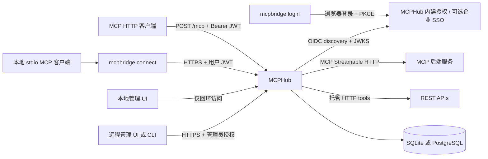

# MCPHub

> 本指南用于 v2.3.0 全新部署。内建账号与 Agent 设备授权需要 v2.3.0，v2.2.2 不包含这些功能。

[](https://github.com/SamuelSupe/mcphub/actions/workflows/ci.yml)
[](https://github.com/SamuelSupe/mcphub/releases/tag/v2.2.2)
[](https://github.com/SamuelSupe/mcphub/blob/main/LICENSE)
[](https://github.com/SamuelSupe/mcphub/blob/main/go.mod)

[English](README.md) | [中文](README.zh-CN.md)

MCPHub 将已有的远端 MCP Server 和普通 HTTP API 统一提供为 MCP 工具。它提供一个 Streamable HTTP 入口，集中管理服务接入、工具发布、用户权限、客户端授权与写操作审批。

用户在自己的电脑安装 `mcpbridge`，通过浏览器登录并为 Agent 确认访问范围；管理员部署 `mcphub`，维护服务、凭证和访问策略。网关保持单实例运行，支持 SQLite 或 PostgreSQL。

| 程序 | 安装位置 | 主要命令 |
| --- | --- | --- |
| **mcphub — 服务端** | 网关服务器 | `serve`、`validate`、`init-admin` |
| **mcpbridge — 客户端** | Agent / 用户电脑 | `setup`、`login`、`connect`、`doctor` |

从 v2.2.2 起，客户端程序由 `mcphub-cli` 改名为 `mcpbridge`，下载包以 `mcpbridge_v2.3.0_*` 开头；部署服务端选择 `mcphub_v2.3.0_*`。运行程序的 `--version` 可确认名称、版本与服务端/客户端身份。

## Agent 链接授权

内建签发者部署可将用户登录与客户端同意合并在一个网页中。本机、SSH 或容器上的 Agent 都可以使用，不需要浏览器回调到 Agent 机器。使用同一系统用户和同一 `MCPHUB_HOME` 私有目录执行：

```bash
mcpbridge pair start --server https://hub.example.com/mcp --profile work --name "项目助手" --json
mcpbridge pair finish --request pr_example --wait --json
mcpbridge connect --profile work --client ci_example
```

替换实际返回的请求与客户端 ID。向用户展示 `verification_uri_complete` 和 `user_code`；用户核对配对码后，以本地账号、LDAP 或 OIDC 登录，选择服务、工具、资源限制和期限，再确认。工具默认不勾选，写能力默认关闭。无 `--wait` 时只检查一次；`pending_user` 仍需用户确认，`ready` 表示私有凭证保存与 MCP 连接检查完成。默认申请最长 1 小时，受网关上限约束；申请 5 分钟到期，轮询初始间隔 5 秒。`--ttl` 接受秒数（至少 60），`--endpoint`、重复 `--tool` / `--scope` 可收窄请求。

Agent 没有命令执行能力时，将 stdio 连接参数设为：

```json
["connect", "--server", "https://hub.example.com/mcp", "--profile", "work", "--name", "项目助手", "--interactive-auth"]
```

会话立即初始化，仅开放 `mcpbridge_auth_start` 与 `mcpbridge_auth_status`。前者复用同一个未过期申请；后者可能领取、保存凭证并检查连接，按结果的 `interval` 调用。ready 后刷新工具列表；不支持 `notifications/tools/list_changed` 时改用返回的 `connect --profile … --client …` 重新连接。失败的业务调用不会排队或自动重试，撤销或到期后需明确重新授权。

每次配对只授权一个服务及工具能力；提示词、资源 URI 或订阅使用原有向导。权限受当前组和已确认范围共同约束，新工具不会自动扩权。所有私有凭证留在 MCPBridge，禁止复制 Token 给 Agent。失败不会覆盖原有可用 profile；换用户或服务器需另建 profile。纯外部签发者继续使用 PKCE 登录与 setup。

## 从这里开始

**[在线帮助中心](https://samuelsupe.github.io/mcphub/)**：面向最终用户的 19 篇中英文指南，提供分组导航、全文搜索和客户端配置示例。

**[在线管理员手册](https://samuelsupe.github.io/mcphub/admin/)**。按部署、服务接入、身份权限、治理审计和运行维护浏览 22 个中英文章节，可在当前章节切换语言。

| 你的任务 | 阅读入口 | 包含内容 |
| --- | --- | --- |
| 在 Agent 中使用公司工具 | **[用户手册](docs/user-guide.zh-CN.md)** | 安装 CLI、接入客户端、连接个人账号、审批与排障 |
| 配置 LDAP 与 OIDC | [身份服务指南](docs/enterprise-login.zh-CN.md) | UI 配置、连接测试、企业账号与组授权 |
| 部署和管理 MCPHub | **[管理员手册](docs/admin-guide.zh-CN.md)** | 部署、服务接入、工具发布、用户权限、治理与运维 |
| 查字段、API 或协议行为 | [配置与协议参考](docs/configuration.zh-CN.md) | YAML、工具策略、限流、HTTP 端点与热重载 |
| 查找其他专题 | [文档导航](docs/README.zh-CN.md) | SSO、Vault、部署示例、架构设计与版本资料 |

首次使用：从管理员获取 MCP 地址和 CLI client ID，按[用户手册的接入步骤](docs/user-guide.zh-CN.md#接入-mcp-客户端)运行向导，再把生成的配置加入 MCP 客户端。

首次部署：按[管理员手册](docs/admin-guide.zh-CN.md#部署准备与安装)准备 HTTPS、数据库与加密密钥，再在本机初始化管理员，从一个只读服务开始验证。

## 版本与新部署

当前文档面向 **v2.3.0 全新部署**，默认启用管理台与 SQLite，启动时没有预设后端。客户端程序为 `mcpbridge`，服务端为 `mcphub`。[发行说明](RELEASE_NOTES_v2.3.0.md) · [下载 v2.3.0](https://github.com/SamuelSupe/mcphub/releases/tag/v2.3.0)。

默认配置只要求 `MCPHUB_PUBLIC_URL` 和 `MCPHUB_CONFIG_KEY`。按“启动 MCPHub → 本机初始化管理员 → 登录管理台 → 创建组并授权、添加用户与后端 → 测试连接 → 发布工具”完成新部署。账号密码与 MFA 见[内建账号指南](docs/builtin-accounts.zh-CN.md)；企业 LDAP 与 OIDC 可选，可在管理台同时配置。每个后端分别配置地址、认证凭证和权限，远程管理使用 `deploy/config.remote-*`。

## 能力与边界

- 聚合远端 MCP 工具、提示词、资源、资源模板与 completion，并按权限过滤和路由。
- 通过独立 CLI 和本地 Broker 接入 stdio MCP 客户端；浏览器登录，凭证自动续期，客户端授权可独立撤销。
- 显式发布工具，叠加用户/组、Scope、业务资源、客户端授权和逐次写审批。
- 支持 OIDC / OAuth2 企业身份桥接，以及 Vault 共享服务账号与个人上游账号。
- 通过管理控制台维护 MCP 后端、HTTP 工具组和 OpenAPI 导入，查询请求历史与配置变更。
- 使用单实例的加密 SQLite / PostgreSQL 配置存储，提供健康检查、热重载和 endpoint 限流。

完整协议行为见[能力与边界参考](docs/configuration.zh-CN.md#能力与边界)。

## 界面预览

以下为 MCPHub v2.1.0 在 OrbStack 运行、使用本机 Chrome 截取的真实界面，内容均为演示数据。控制台支持中英文切换，截图展示本地管理模式。详见[截图说明](docs/screenshots/README.md)。

**服务概览**：集中查看连接状态、可用工具、权限管理入口和最近配置变更。


<details>
<summary><strong>工具权限</strong>：Scope、业务资源范围与写审批</summary>

在 Agent 执行前，检查已发布写工具的最终 Scope、允许访问的项目以及审批人数要求。


</details>

<details>
<summary><strong>Vault 账号</strong>：按用户身份连接上游服务</summary>

选择个人账号，配置浏览器授权、上游 Scope 和回调地址。截图展示配置界面，未连接真实外部账号。


</details>

<details>
<summary><strong>HTTP 工具组</strong>：管理 REST 接口与 OpenAPI 来源</summary>

将 HTTP 接口组织为同一 MCP 命名空间内的工具，共享连接配置和访问策略。


</details>

## 架构

MCP 客户端连接网关，管理员通过独立管理入口维护策略；上游服务仍执行自己的业务权限检查。


```mermaid
flowchart LR
    C[MCP HTTP 客户端] -->|POST /mcp + Bearer JWT| H[MCPHub]
    S[本地 stdio MCP 客户端] --> CLI[mcpbridge connect]
    CLI -->|HTTPS + 用户 JWT| H
    L[mcpbridge login] -->|浏览器登录 + PKCE| I[MCPHub 内建授权 / 可选企业 SSO]
    H -->|OIDC discovery + JWKS| I
    H -->|MCP Streamable HTTP| B[MCP 后端服务]
    H -->|托管 HTTP tools| A[REST APIs]
    U[本地管理 UI] -->|仅回环访问| H
    R[远程管理 UI 或 CLI] -->|HTTPS + 管理员授权| H
    H --> D[(SQLite 或 PostgreSQL)]
```

企业集成参考：[飞书 SSO、Vault 与 Agent 架构](docs/feishu-vault-agent-architecture.zh-CN.md)。该文档保留真实租户、目录适配器和 MFA 等待验收事项，PDF 是历史评审快照。

## 已知限制

MCPHub 保持单活；PostgreSQL 或 Vault 的高可用不等于 Hub 多实例一致性。服务端不接入 stdio 后端，不提供原生 TLS 或旧式独立 GET SSE 端点。TLS 由反向代理终止。个人 Vault 账号当前覆盖远程 MCP endpoint。

完整排障见[管理员手册](docs/admin-guide.zh-CN.md#已知限制与排障提示)，用户连接问题见[用户手册](docs/user-guide.zh-CN.md#诊断与常见问题)。

## 项目资料

[贡献指南](CONTRIBUTING.md) · [安全策略](SECURITY.md) · [全部发行版本](https://github.com/SamuelSupe/mcphub/releases) · [Apache License 2.0](LICENSE)（Copyright 2026 SamuelSupe）
