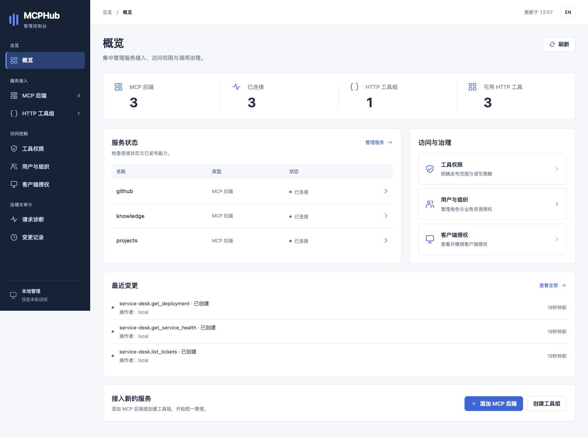
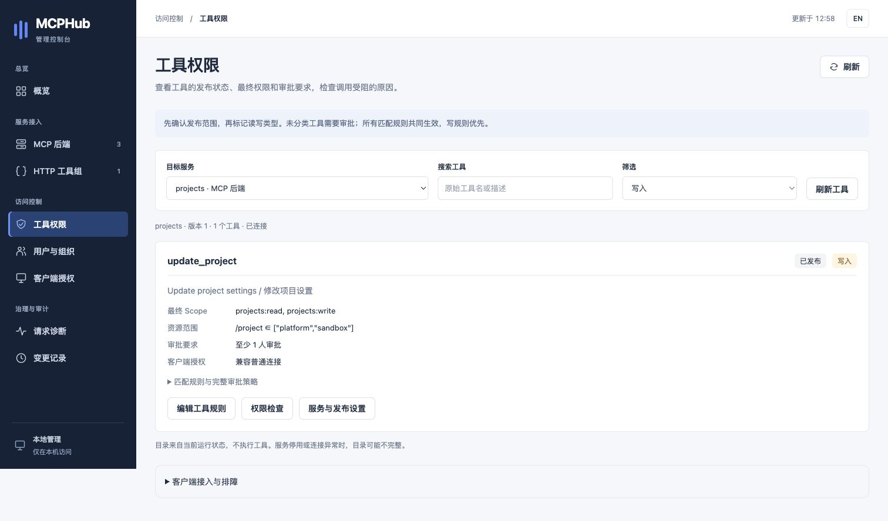
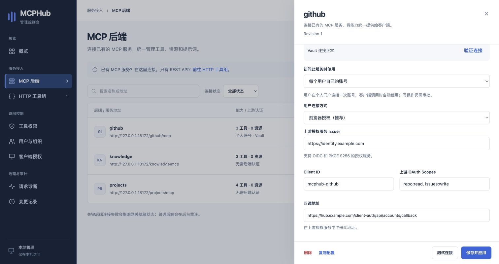
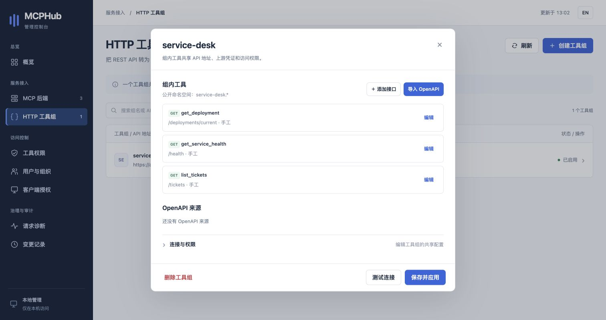
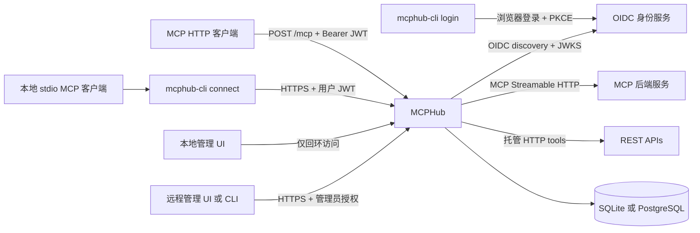

# MCPHub

[English](README.md) | [中文](README.zh-CN.md)

MCPHub 将已有的远端 MCP Server 和普通 HTTP API 统一提供为 MCP 工具。它提供一个 Streamable HTTP 入口，集中管理服务接入、工具发布、用户权限、客户端授权与写操作审批。

用户在自己的电脑安装 `mcphub-cli`，通过浏览器登录并为 Agent 确认访问范围；管理员部署 `mcphub`，维护服务、凭证和访问策略。网关保持单实例运行，支持 SQLite 或 PostgreSQL。

## 从这里开始

**[在线帮助中心](https://samuelsupe.github.io/mcphub/)**：面向最终用户的 19 篇中英文指南，提供分组导航、全文搜索和客户端配置示例。

**[在线管理员手册](https://samuelsupe.github.io/mcphub/admin/)**：按部署、服务接入、身份权限、治理审计和运行维护浏览 20 个中英文章节，可在当前章节切换语言。

| 你的任务 | 阅读入口 | 包含内容 |
| --- | --- | --- |
| 在 Agent 中使用公司工具 | **[用户手册](docs/user-guide.zh-CN.md)** | 安装 CLI、接入客户端、连接个人账号、审批与排障 |
| 部署和管理 MCPHub | **[管理员手册](docs/admin-guide.zh-CN.md)** | 部署、服务接入、工具发布、用户权限、治理与运维 |
| 查字段、API 或协议行为 | [配置与协议参考](docs/configuration.zh-CN.md) | YAML、工具策略、限流、HTTP 端点与热重载 |
| 查找其他专题 | [文档导航](docs/README.zh-CN.md) | SSO、Vault、部署示例、架构设计与版本资料 |

首次使用：从管理员获取 MCP 地址和 CLI client ID，按[用户手册的接入步骤](docs/user-guide.zh-CN.md#接入-mcp-客户端)运行向导，再把生成的配置加入 MCP 客户端。

首次部署：按[管理员手册](docs/admin-guide.zh-CN.md#部署准备与安装)准备身份服务、HTTPS、数据库与加密密钥，从一个只读服务开始验证。

## 版本与升级

当前文档对应 **v2.2.0**：增加持久化请求历史，完善管理员恢复、SSO 登录与个人账号诊断。[发行说明](RELEASE_NOTES_v2.2.0.md) · [下载 Release](https://github.com/SamuelSupe/mcphub/releases/tag/v2.2.0)

升级到 v2.2.0 会将托管数据库迁移到 **schema 9**。启动前备份数据库与匹配的加密密钥；回滚需要恢复升级前备份。从 v1.x 升级还需审核工具发布名单和读写策略，Go module 路径新增 `/v2`。详见[升级与回滚流程](RELEASE_NOTES_v2.2.0.md#upgrade-and-rollback--升级与回滚)。

## 能力与边界

- 聚合远端 MCP 工具、提示词、资源、资源模板与 completion，并按权限过滤和路由。
- 通过独立 CLI 和本地 Broker 接入 stdio MCP 客户端；浏览器登录，凭证自动续期，客户端授权可独立撤销。
- 显式发布工具，叠加用户/组、Scope、业务资源、客户端授权和逐次写审批。
- 支持 OIDC / OAuth2 企业身份桥接，以及 Vault 共享服务账号与个人上游账号。
- 通过管理控制台维护 MCP 后端、HTTP 工具组和 OpenAPI 导入，查询请求历史与配置变更。
- 使用单实例的加密 SQLite / PostgreSQL 配置存储，提供健康检查、热重载和 endpoint 限流。

完整协议行为见[能力与边界参考](docs/configuration.zh-CN.md#能力与边界)。

## 界面预览

以下为 MCPHub v2.1.0 在 OrbStack 运行、使用本机 Chrome 截取的真实界面，内容均为演示数据。控制台支持中英文切换，截图展示本地管理模式。详见[截图说明](docs/screenshots/README.md)。

**服务概览**：集中查看连接状态、可用工具、权限管理入口和最近配置变更。

<strong>工具权限</strong>：Scope、业务资源范围与写审批

在 Agent 执行前，检查已发布写工具的最终 Scope、允许访问的项目以及审批人数要求。

<strong>Vault 账号</strong>：按用户身份连接上游服务

选择个人账号，配置浏览器授权、上游 Scope 和回调地址。截图展示配置界面，未连接真实外部账号。

<strong>HTTP 工具组</strong>：管理 REST 接口与 OpenAPI 来源

将 HTTP 接口组织为同一 MCP 命名空间内的工具，共享连接配置和访问策略。

## 架构

MCP 客户端连接网关，管理员通过独立管理入口维护策略；上游服务仍执行自己的业务权限检查。

```mermaid
flowchart LR
    C[MCP HTTP 客户端] -->|POST /mcp + Bearer JWT| H[MCPHub]
    S[本地 stdio MCP 客户端] --> CLI[mcphub-cli connect]
    CLI -->|HTTPS + 用户 JWT| H
    L[mcphub-cli login] -->|浏览器登录 + PKCE| I[OIDC 身份服务]
    H -->|OIDC discovery + JWKS| I
    H -->|MCP Streamable HTTP| B[MCP 后端服务]
    H -->|托管 HTTP tools| A[REST APIs]
    U[本地管理 UI] -->|仅回环访问| H
    R[远程管理 UI 或 CLI] -->|HTTPS + 管理员授权| H
    H --> D[(SQLite 或 PostgreSQL)]
```

企业集成参考：[飞书 SSO、Vault 与 Agent 架构](docs/feishu-vault-agent-architecture.zh-CN.md)。该文档保留真实租户、目录适配器和 MFA 等待验收事项，PDF 是历史评审快照。

## 已知限制

MCPHub 保持单活；PostgreSQL 或 Vault 的高可用不等于 Hub 多实例一致性。服务端不接入 stdio 后端，不提供原生 TLS、内置账号或旧式独立 GET SSE 端点。TLS 由反向代理终止。个人 Vault 账号当前覆盖远程 MCP endpoint。

完整排障见[管理员手册](docs/admin-guide.zh-CN.md#已知限制与排障提示)，用户连接问题见[用户手册](docs/user-guide.zh-CN.md#诊断与常见问题)。

## 项目资料

[贡献指南](CONTRIBUTING.md) · [安全策略](SECURITY.md) · [全部发行版本](https://github.com/SamuelSupe/mcphub/releases) · [Apache License 2.0](LICENSE)（Copyright 2026 SamuelSupe）
