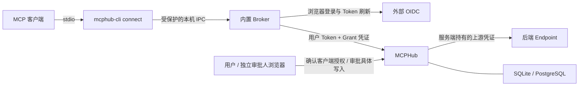

# MCPHub 登录、内置 Broker 与客户端授权统一方案

方案日期：2026-09-25；发行版本：v2.0.0（2026-09-26）。

本文记录登录、本地 Broker、客户端 scope 授权、endpoint 最终校验、写入审批及撤销同步的设计与实现。v2.0.0 包含首版 Broker；既有 v1.4.0 发布包不包含此能力。实际命令和配置见 [README](../README.zh-CN.md#客户端授权与内置-broker)。首版使用不透明 Grant、普通用户门户、SQLite/PostgreSQL 和单实例撤销控制。

**1. 目标与核心决策**

用户通过外部 OIDC 登录一次，在授权有效期内让多个 MCP 客户端通过本地 Broker 使用 MCPHub。每个客户端获得独立、可查看、可撤销的访问范围；MCPHub 对最终请求执行同一份授权约束。

核心决策如下：

- 发布程序仍为服务端 `mcphub` 和用户端 `mcphub-cli`。Broker 内置在 CLI 中，以后台进程模式运行。
- 外部 OIDC 负责用户身份与 Token；MCPHub 保存客户端授权记录并作最终授权决定。
- 授权细化到“用户 × 客户端实例 × endpoint × scope”，并叠加工具允许名单、业务资源条件及有效期。
- Broker 缓存权限用于展示和提前拒绝；缓存、通知和本地界面不具有服务端放行权。
- 启用严格模式的 endpoint 必须要求有效客户端授权，单独持有用户 Token 不能绕过。
- 用户同意某客户端访问，不等于批准该客户端的所有写操作。写入继续使用已有的逐次审批、双人审批和可选 OIDC 加强认证。
- 数据库继续支持 SQLite 和单实例 PostgreSQL。首版不增加独立授权微服务、消息队列或通用策略引擎。

首版保留上游共享服务凭证模式。代表最终用户登录第三方后端、完整 OAuth 授权服务器、跨机器 Broker、多实例 MCPHub 和应用/设备远程证明不在本次范围内。

**2. 基础能力与本次实现**

以下是对当前工作区源码的核查，不表示这些能力都已发布：

| 能力 | 当前工作区 | 本方案增量 |
| --- | --- | --- |
| 浏览器 OIDC 登录 | 已有 PKCE、state、回环回调和登录后的 MCP 验证 | 纳入 Broker 的 profile 生命周期 |
| 凭证保存与刷新 | 已有 profile、文件权限、进程间锁及刷新轮换 | 由 Broker 集中持有和使用 |
| 本地连接器 | 已有 stdio 与 Streamable HTTP 消息桥接 | 增加受保护的本机 IPC；每个连接保留独立协议上下文 |
| endpoint/tool 权限 | 已有 scope、发布状态、启停状态和工具参数资源检查 | 使用客户端授权裁剪后的权限，并强制检查 grant |
| 写入治理 | 已有单次/双人审批、加强认证、幂等、状态查询及审计相关实现 | 将申请、恢复、结果查询绑定客户端 grant |
| 管理与存储 | 已有 SQLite、单实例 PostgreSQL 和远程管理 | 增加普通用户授权门户及授权记录 |
| 本地常驻 Broker | 已实现 | 按需启动、IPC 配对与独立 MCP 连接 |
| 客户端 ClientGrant | 已实现 | 申请、浏览器确认、单次兑换、撤销及到期 |
| 授权撤销同步 | 现有 logout 主要清除本地凭证 | 增加服务端 grant/session 撤销及缓存失效 |

主要复用位置：

- [登录与凭证刷新](../internal/client/login.go)、[Token 管理](../internal/client/token.go)、[本地存储](../internal/client/store.go)。
- [MCP 消息桥接](../internal/client/connect.go)。
- [用户 Token 校验](../internal/authn/verifier.go)、[请求权限检查](../internal/hub/handlers.go)、[目录视图](../internal/hub/hub.go)。
- [写入审批](../internal/hub/approvals.go)、[只读状态查询](../internal/hub/approval_status.go)、[审批持久化](../internal/configstore/approvals.go)。

**3. 组件、身份与信任边界**



| 对象 | 定义与边界 |
| --- | --- |
| MCPHub resource | 完整公开资源 URL，例如 `https://hub.example.com/mcp`；用于 audience/resource 校验 |
| 用户主体 | 经验证的 `issuer + subject`；不采用客户端自报用户名或 email |
| Broker 会话 | 某个 profile 本次登录所建立的服务端会话；重新登录、切换身份或目标后更换 |
| 客户端实例 | 经过本机配对的逻辑安装实例；名称只用于展示 |
| endpoint | MCPHub 中的一个 MCP 后端或 HTTP 工具组；不等同于 OIDC resource URL |
| endpoint UID | 服务端持久化、不可复用的身份；与可读配置 ID 分开，删除后重建必须生成新 UID |
| ClientGrant | 某用户允许某客户端实例通过某 Broker 会话访问某 endpoint 的授权 |
| 写审批 | 对一次不可变业务请求的单次执行许可，受当前 ClientGrant 和 endpoint 权限约束 |

OAuth 的 `client_id`（例如 `mcphub-cli`）和 `client_instance_id` 是不同概念。前者标识身份服务中的 OAuth 客户端，后者标识 MCPHub 中的调用入口；不能用两者名称相同作为安全依据。

普通 stdio 客户端不能仅凭 `clientInfo.name`、进程名或 `--client editor-a` 证明应用身份。首版将授权绑定到经过配对、持有本机连接凭证的逻辑入口。可读名称和命令行 ID 只是定位凭证的索引。

本机目录权限和 IPC 权限主要隔离不同系统用户。同一系统账户下能够读取凭证文件、控制其他进程或操作已登录浏览器的恶意程序，仍可能冒用更高权限入口。首版不宣称提供此类强应用隔离。需要强隔离时，应使用独立 OS 账户/沙箱和受保护密钥，并验证对应平台边界；高风险写审批仍需独立审批人及其受保护会话。

**4. 授权模型与 scope 语义**

对一个已经绑定到 endpoint 的 grant：

```text
EffectiveScopes = VerifiedUserToken.Scopes ∩ ClientGrant.AllowedScopes

RequiredScopes = Endpoint.RequiredScopes ∪ Tool.RequiredScopes

允许进入工具执行流程，要求：
  用户 Token 有效且面向该 MCPHub resource
  AND Broker 会话与 ClientGrant 均有效
  AND 用户、客户端实例、会话、resource、endpoint 绑定匹配
  AND RequiredScopes ⊆ EffectiveScopes
  AND endpoint 已启用，工具已显式发布且包含在 Grant 的工具允许名单
  AND 当前参数同时满足 endpoint/tool 资源条件和 Grant 资源条件
  AND 对应操作类型已获准

实际执行写操作还要求：
  当前请求取得有效的单次批准，并通过恢复时的全部检查。
```

具体规则：

- scope 为精确字符串；`db:write` 不隐含 `db:read`，`db:*` 不自动成为通配授权。
- endpoint 的基础 scope 与工具 scope 均采用 all-of 语义。
- `openid`、`offline_access` 等登录/续期权限不等于工具权限。
- metadata 中列出的 scope 和客户端请求的 scope 都不是已经授予的权限；以服务端验证的 Token 为准。
- 用户 Token 的 scope 变少时，下一次请求的有效 scope 随之变少；变多时，仍不能越过已有 Grant 的上限。
- Token 刷新不扩大 Grant、不延长用户确认的授权期限。增加 Grant scope 或范围需重新确认。
- 未列入 Grant 的新增工具不自动开放，即使它使用了已有 scope。
- 工具没有额外 scope 时，仍必须通过 endpoint scope、工具允许名单、资源条件和操作类型检查。
- Grant 默认仅允许只读操作；开放申请写操作需显式设置 `allow_write_requests`，并在确认页提示“具体写入仍需审批”。

例如，用户 Token 拥有 `mcp:database`、`db:read`、`db:write`：

| 客户端入口 | Grant scope | 业务资源 | 行为 |
| --- | --- | --- | --- |
| editor-read | `mcp:database`、`db:read` | project-a | 仅能调用获准查询工具 |
| ops-write | 三个 scope | project-a | 可查询、可申请写入；写入仍需审批 |
| report-only | `mcp:database`、`db:read` | project-b | 无权查询 project-a，也不能读取其他入口的审批结果 |

资源限制复用现有工具参数 JSON Pointer 规则：精确字符串或全部元素均获准的非空字符串数组，缺失和错误类型拒绝。Grant 和服务端策略共同收紧范围。scope 与资源条件不能证明数据库对象所有权，也不能替代后端对 SQL、目录跳转、别名等业务语义的校验。

**5. ClientGrant 数据与凭证**

一条 ClientGrant 对应一个客户端实例和一个 endpoint。建议记录：

| 字段 | 含义 |
| --- | --- |
| `grant_id` | 服务端生成的随机标识 |
| `issuer`、`subject` | 用户主体 |
| `broker_session_id` | 所属本次登录会话 |
| `client_instance_id` | 已配对客户端入口 |
| `resource` | 完整 MCPHub resource URL |
| `endpoint_uid` | 不可复用的目标身份 |
| `allowed_scopes` | 用户明确同意的 scope 上限 |
| `allowed_tools` | 当前明确同意的原始工具名集合，不接受自动匹配未来工具的通配名单 |
| `resource_rules` | 额外业务资源约束 |
| `allow_write_requests` | 是否可申请写操作；不代表写入已批准 |
| `capabilities` | 是否开放 tools、prompts、resources、subscriptions 等能力类别 |
| `status` | `active`、`revoked`、`expired`、`reconfirmation_required` |
| `revision` | 授权内容版本，变更后递增 |
| `created_at`、`expires_at`、`revoked_at` | 生命周期 |
| `credential_hash` | Grant 凭证哈希；不保存其明文 |
| `consent_evidence` | 确认用户、时间、已确认范围摘要，以及策略要求的认证证据 |

拟议记录示意：

```json
{
  "grant_id": "gr_example",
  "issuer": "https://id.example.com",
  "subject": "user-subject",
  "broker_session_id": "bs_example",
  "client_instance_id": "ci_editor_read",
  "resource": "https://hub.example.com/mcp",
  "endpoint_uid": "ep_immutable_id",
  "allowed_scopes": ["mcp:database", "db:read"],
  "allowed_tools": ["query"],
  "resource_rules": [{"argument": "/project", "allowed_values": ["project-a"]}],
  "allow_write_requests": false,
  "capabilities": {"tools": true, "prompts": false, "resources": false, "subscriptions": false},
  "status": "active",
  "revision": 1,
  "expires_at": "2026-09-25T16:00:00Z"
}
```

Grant ID 不是凭证。实际凭证由服务端以密码学安全随机数生成，建议至少 256 bit，返回给 Broker 并保存在受保护存储中。MCP 客户端配置、进程参数、日志和 URL 均不包含它。

首版采用“现有 OIDC access token + 不透明 Grant 凭证 + 服务端在线查表”。这是一层 MCPHub 专有的附加授权，不是新的 OAuth Token 签发服务。不会自行修改或伪造外部 OIDC Token 的 scope，也不要求身份服务支持 Token Exchange。

Grant 凭证最晚在 Grant 或 Broker 会话到期时失效。建议首版默认 Grant 最长为一个工作会话（8 小时，可配置更短），每次请求仍检查撤销状态；不依赖到期来实现在线撤销。到期后重新确认。凭证轮换不得增加 scope 或延长授权绝对期限，首版不增加独立长期刷新凭证。

Broker 会话 ID 也不单独授予权限。Grant 的签发、换发和会话恢复不能仅凭可猜测/可见的 ID 完成。已撤销或结束的会话不能被再次登录自动复活。

**6. 登录、配对与用户确认流程**

完整流程如下：

1. 用户执行 `mcphub-cli login`。沿用浏览器、PKCE S256、state、issuer、resource、回环回调和无副作用 MCP 验证；成功后才替换原 profile。
2. 严格模式下，登录验证允许认证后的协议握手及授权能力发现，不因此暴露 endpoint 目录或执行工具。不能为了兼容登录测试而给 `/mcp` 增加业务访问旁路。
3. Broker 为该 profile 建立新的待绑定会话。客户端入口在本机显式登记，生成随机实例 ID 和独立的本机 IPC 连接凭证。
4. Broker 提交授权申请：目标 endpoint、希望使用的 scope、工具、资源范围和期限。服务端验证用户 Token，仅允许申请在用户身份及当前 endpoint 策略范围内的权限。
5. 服务端返回短期申请 ID、受认证的确认 URL，以及只返回给申请 Broker 的兑换凭证。确认 URL 不携带 Token 或兑换秘密。建议申请 5 分钟到期，并限制每用户未处理申请数量。
6. 用户在 MCPHub 普通用户授权页面登录，核对用户、Broker 会话、客户端入口、目标、scope、工具、资源和期限。确认上下文包含防混淆的配对信息。仅申请人本人可同意自己的授权；管理员不能靠填写用户 ID 冒充同意。
7. 确认必须经过浏览器会话、CSRF/Origin 校验；MCP Token、管理 API Token 或本地 IPC 消息不能替代确认动作。高权限客户端授权可按服务端策略要求加强认证或额外安全审批。
8. Broker 使用原兑换凭证和有效的同主体 Token 领取 Grant 凭证。兑换记录单次消费、具有有效期；失败或响应丢失不能开放无身份检查的领取接口。
9. MCP 客户端启动 `connect`，通过本机连接凭证关联到已确认入口，开始传输 MCP 消息。

普通用户授权门户与管理员、写操作审批人、安全管理员分开授权。可复用现有 OIDC 浏览器实现与 CSRF 防护，但普通用户只能管理自己的客户端授权，不能进入配置管理或取得写审批权限。

门户会话和 MCP Token 必须能够确认相同的 `issuer + subject`。身份服务若对不同客户端给出不同主体标识，需要先配置可信主体映射或一致的主体策略；不能使用未验证的 email 相等来拼接身份。

`connect` 不自动弹出浏览器，也不在缺权时自行扩权。缺少授权时给出清晰的下一步命令或确认链接，由用户显式启动交互流程。Broker 只处理由当前 MCPHub 返回、经过来源校验的授权地址，不把任意工具结果中的链接当作登录入口。

**7. CLI 与客户端配置体验**

保留现有 `login`、`connect`、`status`、`logout`。以下新增命令和参数已实现：

```bash
# 已有登录方式继续使用。
mcphub-cli login --server https://hub.example.com/mcp \
  --client-id mcphub-cli --profile work

# 新增：登记一个本地调用入口，并申请服务端授权。
mcphub-cli client add --profile work --name editor-read \
  --endpoint database-prod \
  --scope mcp:database --scope db:read

# 新增：查询与重新办理某个入口的授权。
mcphub-cli client list --profile work
mcphub-cli client authorize --profile work --client ci_example
mcphub-cli client revoke --profile work --client ci_example

# connect 按需启动或连接内置 Broker；不触发登录或授权窗口。
mcphub-cli connect --profile work --client ci_example

# 新增运行管理命令；run 为前台运行，便于诊断。
mcphub-cli broker run
mcphub-cli broker status
mcphub-cli broker stop

# 立即清理本地秘密，再尝试撤销远端会话；离线时保留非秘密待撤销引用。
mcphub-cli logout --profile work
```

`client add` 完成后输出不含秘密的实例 ID 和 MCP 配置片段。客户端配置示意：

```json
{
  "mcpServers": {
    "database-read": {
      "command": "mcphub-cli",
      "args": ["connect", "--profile", "work", "--client", "ci_example"]
    }
  }
}
```

为保持首版简单，一个 `connect --client` 入口绑定一个 endpoint 和一条 Grant。需要访问多个 endpoint 时，配置多个入口，由同一个 Broker 共享登录和凭证刷新。跨多个 Grant 的单个 MCP 目录聚合留待后续；现有协议中的工具前缀及资源 URI 规则保持一致。

旧的 `connect --profile work` 在兼容模式下继续使用。严格 endpoint 不接受没有明确客户端绑定的旧连接；不会默认挑选权限最大的 Grant，也不会因 Broker 故障退回旧的直接访问路径。

`status` 应分开显示本地登录缓存、服务端可达性、Broker 会话、客户端授权、scope 和到期时间。离线数据明确标注“缓存”；任何状态命令均不输出 Token 或 Grant 凭证。

**8. Broker 运行与协议隔离**

建议每个 OS 用户运行一个 Broker，内部隔离不同 profile、Hub resource、登录会话和客户端入口。使用进程间启动锁处理多个 `connect` 同时启动；只有空闲且没有活动连接时才可退出。

- macOS/Linux 使用当前用户私有目录内的 Unix domain socket，并检查目录、socket 和对端用户身份。
- Windows 使用有当前用户访问控制的 named pipe；具体对端校验需要独立平台测试。
- CLI 入口读取自己的本机连接凭证完成 IPC 握手。该凭证只用于接入 Broker，不是远程 Grant，也不是 OAuth Token。
- 当前 Token 文件的权限保护可先复用；现有存储并非加密保险箱。OS 凭证库是后续增强，不能在实现前宣称已采用。
- Broker 持有远程 Token 和 Grant 凭证，MCP 客户端只接收 MCP 消息。管理 profile 不得接入 MCP 数据通道。
- 每个连接分别维护初始化版本、请求 ID、进度、取消、续传状态和订阅。相同 JSON-RPC ID 不可跨连接互相覆盖。
- 一个长请求不能阻塞其他连接或取消消息。取消只影响所属请求/流；关闭连接时清理其订阅。
- 复用现有 SDK 传输和消息桥接，不因加入 Broker 而重建协议对象、丢弃 metadata 或把订阅改成轮询。
- stdout 仅输出 MCP 消息；诊断写 stderr。拒绝 IPC 协议版本不兼容，避免误解控制消息。
- Broker 崩溃或网络断开时，结束相关连接并报告状态；不自动重放工具调用、不离线排队执行写操作。
- 停止 Broker 只终止本地连接，不等于远程 logout；CLI 要明确区分两者。

**9. MCPHub 请求执行与缓存设计**

拟议请求头示意：

```http
POST /mcp
Authorization: Bearer <OIDC access token>
MCPHub-Grant: <opaque grant credential>
```

`MCPHub-Grant` 是本方案拟议的 MCPHub 扩展，不是 MCP 标准头。它只用于 Broker 到 MCPHub，不转发给后端、不出现在日志和业务参数中。浏览器授权接口和普通第三方 MCP 客户端不会因此获得自动批准能力。

服务端按顺序处理：

1. 验证 OIDC Token 的签名、issuer、audience、有效期及当前可验证的主体和 scope。
2. 查验 Grant 凭证和当前记录，核对主体、resource、Broker 会话、客户端实例、endpoint UID、状态及期限。
3. 将 Grant 限制与当前 endpoint 策略组合，产生由服务端构造的请求授权上下文；客户端提交的 scope/主体/客户端名称不可覆盖它。
4. 目录与调用都使用这份上下文；实际调用前再检查当前策略和 Grant 版本。
5. 执行工具发布、启停、scope、允许工具集合、资源、限流和写审批检查，再向上游发送请求。

权限上下文至少包括主体、会话/Grant/客户端/endpoint ID、授权与策略版本、有效 scope 和资源限制。保留原始已验证 Token 信息供审计，不把裁剪后的 scope 错记成身份服务签发内容。

需要覆盖的入口：

| 入口 | 授权要求 |
| --- | --- |
| 初始化及能力发现 | 不得泄露未授权 endpoint 的业务目录；允许引导登录和办理 Grant |
| tools/list、分页 | 只返回已发布且同时满足 Grant 与现行策略的工具；分页游标绑定授权版本 |
| tools/call | 检查实际参数，不能依赖目录曾经出现过该工具 |
| prompts/list/get | 需要 Grant 明确开放该能力及 endpoint scope；沿用现有路由和权限 |
| resources/list/read、templates | 需要 Grant 明确开放该能力及 endpoint scope；不得将工具参数资源规则误认为已覆盖任意 resource URI |
| subscriptions | 在建立和继续投递时受当前授权约束，撤销后停止新事件并清理上游订阅 |
| 审批创建、状态、恢复、缓存结果 | 绑定所属 Grant 和客户端；重新检查当前可访问范围 |

Grant 默认只开放 tools。prompts/resources/subscriptions 需要显式选择；若需要对其中的业务对象做更细限制，必须先定义对应 URI/参数授权规则，不能通过 tools 的 JSON Pointer 条件推断。首版未支持的细粒度资源语义应拒绝配置，不能静默降级。

当前目录缓存主要按 endpoint 集合与 scope 组织。加入 Grant 后，不能继续假设 scope 相同即可共享全部目录和结果。缓存键至少包含授权上下文或其服务端计算的摘要：主体、Grant ID/revision、endpoint 策略版本及相关 scope/范围。分页、会话和订阅同样绑定上下文，避免串用授权。

首版采用有界缓存，限制每用户 Grant、连接、待处理请求及视图数量；撤销/过期后清理相应视图，防止按授权版本不断累积缓存。

**10. 策略生效、撤销与同步**

数据库保存权威记录；单实例服务可使用内存快照加速。所有授权及相关 endpoint 修改经同一受控写入路径：持久化成功后发布新版本，在发布完成后返回成功。无法确认持久化或版本状态时，拒绝受影响请求。

请求在进入上游前完成一次最终授权和接纳登记，与授权变更的生效点排序。不能在检查后排队很久，再不经复核就执行。授权变更不应等待全部长请求结束；对已接纳的请求按取消能力处理，并保留“可能已经生效”的边界。

Broker 使用用户与 Grant 隔离的权限快照接口，携带 ETag。建议每 30 秒刷新一次，连接启动及收到明确授权失效响应时立即刷新。以后可增加事件通知以改善显示速度；漏掉事件不影响服务端每次请求的判断。

| 变化 | 服务端处理 | Broker 处理 |
| --- | --- | --- |
| 收回 scope/工具/资源范围 | 新策略生效后，后续接纳的请求按新规则判断 | 刷新目录与界面，停止不再允许的请求 |
| 取消发布或停用 endpoint | 阻止后续访问，尽力终止相关流 | 显示不可用，清理相关连接 |
| 删除重建同名 endpoint | 新 UID；旧 Grant 不得重新匹配 | 要求重新授权 |
| 更换实际目标或扩大执行语义 | 相关 Grant 进入需重新确认状态；不能把用户同意静默移到新目标 | 展示变更并引导重新确认 |
| 新增工具或扩大 Grant | 旧 Grant 不自动增加范围；另走确认流程 | 明确展示新增项 |
| 撤销单个客户端 | 撤销其 Grant，其他客户端不受影响 | 关闭对应连接 |
| 退出 profile | 撤销该 Broker 会话及其全部 Grant | 先停止接纳，再撤销远端并清除本地凭证 |
| Token 刷新 | 以新 Token 重新计算交集，Grant 上限和绝对期限不变 | 不弹出额外授权窗口；需要重新登录时明确提示 |
| 本地缓存过期或同步失败 | 服务端继续以现行记录检查 | 本地不能用旧缓存扩大权限；不能绕开 Hub 直接访问上游 |

与授权无关的显示信息变更不需要用户重新确认。实现时应将安全含义变化与普通显示变化明确区分；无法可靠判断时采用需重新确认的保守行为。服务端策略收紧始终立即生效，不等待重新确认完成。

离线 logout 先关闭本地连接并清除访问凭证，记录非敏感的待撤销会话 ID。界面必须说明“本地已退出，远端撤销尚未确认”。用户下次登录后可先撤销旧会话，也可从另一台设备的授权门户撤销；在此之前由绝对期限限制剩余有效期。

这里的即时撤销针对 MCPHub 内的 Grant 与策略。身份服务中停用账号或收回角色，并不会自动让已签发、未到期的自包含 JWT 失效。需要额外接入身份服务撤销事件、在线校验或配置短 Token 有效期；不把本地 Grant 撤销能力表述成通用 OIDC 即时撤销。

撤销不能回滚已被上游接纳的写入。订阅撤销后停止新消息交付，已进入网络缓冲区的数据无法追回；失败结果、日志和用户提示都要保留这些区别。

**11. 与现有写审批、幂等和状态查询联动**

写审批增加以下绑定：

```text
issuer + subject
+ broker_session_id + client_instance_id + grant_id + grant_revision
+ endpoint_uid + 工具/策略版本
+ 不可变参数和业务 metadata 摘要 + operation_id
```

执行流程：

1. 原调用先满足有效 scope、允许工具、资源范围及 `allow_write_requests`，才允许创建写审批。
2. 审批内容展示调用用户、客户端入口、endpoint、具体参数、业务 ID 和预览。
3. 独立审批人按现有条件、人数与加强认证要求决定；批准只针对该请求。
4. 原客户端显式调用恢复工具。服务端重新检查所有绑定、当前权限、预览/版本和限流，再原子消费批准。
5. 客户端关闭或 Broker 重启后不自动恢复写操作。新的连接仍需匹配原有效身份与 Grant，并由客户端明确请求恢复。

客户端 A 的批准不能由客户端 B 使用，即使它们登录的是同一用户。Grant 撤销、过期、重新授权或权限版本变化后，旧的未执行批准失效。正常 OIDC Token 刷新不改变 Grant revision，因此不会仅因刷新 Token 而使批准失效；完整 runtime 重载的现有失效行为继续保留。

`mcphub_approval_status` 仍为只读，不领取执行资格。客户端查询审批详情、上游状态和缓存结果时，需要匹配 Grant 归属并满足当前权限；授权门户可向用户提供自己的授权/申请概要，但不能让另一个客户端凭同主体 Token 取走结果。

业务幂等键保持“用户 + 目标工具/endpoint 身份 + operation_id”的稳定范围，不将 Grant ID、凭证轮换次数或客户端实例作为创建新业务操作的理由。来自另一个 Grant 的重复业务 ID 返回受限的冲突提示，不泄露结果、不自动转移批准。详细记录清理后仍保留防重用登记。

**12. API、错误与审计约定**

以下为授权接口契约，实际普通用户确认路径以 `/client-auth/api/` 为前缀，机器接口以 `/api/v1/` 为前缀：

| 接口 | 用途与认证 |
| --- | --- |
| `POST /api/v1/client-authorization-requests` | Broker 用有效 MCP 用户 Token 创建待确认申请；仅申请，不激活 |
| `GET /api/v1/client-authorization-requests/{id}` | 原主体及申请绑定范围内查询状态；不返回 Grant 秘密 |
| `POST /api/v1/client-authorization-requests/{id}/confirm` | 普通用户浏览器会话、相同主体、CSRF；确认被冻结的申请范围 |
| `POST /api/v1/client-authorization-requests/{id}/exchange` | 同主体 Token + 原 Broker 兑换凭证；单次领取 Grant |
| `GET /api/v1/client-grants/current` | Broker 查询当前 Grant 的有效权限快照，支持 ETag |
| `POST /api/v1/client-grants/{id}/revoke` | 本人浏览器、持有对应 Grant 的 Broker，或授权管理员；只能撤销各自有权控制的对象 |
| `POST /api/v1/broker-sessions/{id}/revoke` | 本人浏览器/授权管理员，或有效同主体 Token 与该会话的 Grant 持有证明；撤销整个会话 |

使用普通用户 Token 的这些附加接口，只接受面向本 MCPHub resource 的有效 Token，并独立执行各自权限检查；不复用管理 API 的管理员权限作为普通用户前提。浏览器 Cookie 与 API Bearer 的允许动作保持明确分离。

Broker 使用的控制接口应部署在 MCPHub resource 所属的可信服务入口，由受认证的能力发现返回路径。客户端验证返回地址的来源，不能把 MCP Token 发给任意重定向地址或管理域。用户浏览器确认页可以位于单独配置的门户域，使用该门户自己的 OIDC 会话与 CSRF 保护；它不通过 URL 接收 MCP Token。

严格模式限制的是 endpoint 业务访问。认证后的授权申请、本人撤销及最小协议握手执行各自的控制接口权限，不要求事先拥有业务 Grant；这些入口本身不能调用上游。这样既能首次办理授权，也不会形成绕过数据通道校验的旁路。

建议错误区分如下：

| 情况 | 响应语义与客户端动作 |
| --- | --- |
| 用户 Token 无效/到期 | `401 invalid_token`；按现有安全边界最多刷新后重试一次，认证拒绝必须发生在上游执行前 |
| 用户 Token 缺少必需 scope | `403 insufficient_scope`；提示向身份服务申请缺失权限，不自动扩权 |
| 未提供客户端授权 | `403 client_grant_required`；提示显式登记/授权客户端 |
| Grant 撤销/过期 | `403 client_grant_revoked` / `client_grant_expired`；停止使用，不能只刷新 OAuth Token 循环重试 |
| Grant scope/资源不足 | `403 client_grant_insufficient`；提示修改客户端授权，重复登录本身不能解决 |
| endpoint 或工具不允许 | 脱敏的不可访问错误；不向未授权客户端暴露完整目标信息 |
| 业务调用网络失败 | 不自动重放，尤其不重放写调用；使用已有状态/幂等能力核查 |

MCP 消息层的错误仍使用 SDK 支持的结构。不能把已建立的 MCP 通道变成任意文本输出，也不能用看似成功的空结果掩盖授权拒绝。

新增审计事件至少覆盖：申请、确认、拒绝、撤销、过期、范围变更、Broker 会话结束、scope 拒绝以及写请求关联。记录实际生效的主体、会话、客户端、Grant/revision、endpoint UID、scope、策略版本、审批 ID 和业务 ID；不记录 Token、Grant 秘密或完整敏感参数。

审批与客户端授权生命周期事件现在共用事务投递及 Ed25519 签名归档链。启用 `admin.approvals.audit_archive` 后才具备独立归档能力；单独的本机数据库不是防篡改边界。

**13. 存储、配置与兼容迁移**

建议沿用现有 configstore，新增 Broker 会话、客户端实例、授权申请和 ClientGrant 记录，并给托管 endpoint 增加不可复用 UID。授权内容、确认记录和必要审计使用现有加密能力；凭证只保存安全哈希。SQLite/PostgreSQL 保持一致的状态转换、版本冲突和事务语义，不引入数据库专有权限逻辑。

pending 申请短期保留；终态 Grant 和会话按配置清理，审计与幂等登记遵循各自保留契约。对申请数量、Grant 数量、请求大小及客户端连接设置上限，避免新授权入口成为无界存储或连接来源。

以下仅为拟议配置结构：

```yaml
client_authorization:
  enabled: true
  require_client_grant: false   # 兼容默认；企业可全局强制。
  max_grant_ttl: 8h            # 可配置 1m 到 8h。
  client_id: mcphub-user-portal # 回调：https://hub.example.com/client-auth/auth/callback。
  # client_secret_env: MCPHUB_PORTAL_SECRET

backends:
  - id: database-prod
    require_client_grant: true
    required_scopes: [mcp:database]
    published_tools: [query, update]
    tool_rules:
      - match: query
        effect: read
        required_scopes: [db:read]
      - match: update
        effect: write
        required_scopes: [db:write]
        approval:
          required_approvals: 2
```

全局和 endpoint 级强制条件取 OR：全局要求时，endpoint 不能单独关闭。HTTP 工具组需要对应字段。关闭严格模式、扩大 endpoint 权限及修改 Grant 上限策略属于敏感配置变更，在启用现有配置治理时应进入独立安全审批；撤销和收紧访问可及时生效。

分阶段迁移：

1. 部署数据库迁移及服务端能力，默认保留原有连接方式。
2. 用户升级 CLI，显式登记并确认客户端授权；核查各 endpoint 的授权覆盖。
3. 按 endpoint 启用严格模式，验证目录、调用、审批恢复和订阅。
4. 企业需要时启用全局强制，并清楚标识尚未迁移的客户端。

不为旧客户端静默生成全权限 Grant。用户可主动授权一个需要的范围，但默认行为不能复制账号全部权限。

启用该能力需要可用的数据库、OIDC 和受保护用户门户。SQLite 可用于单实例小型/本机部署，但不意味着可以免登录批准授权。仅 YAML、无持久化身份的模式不能提供本方案的严格授权和撤销保证。数据库迁移前备份数据与加密密钥；本次 schema 版本为 6。

**14. 上游认证与标准边界**

发给 MCPHub 的 access token，其 audience/resource 指向 MCPHub；Grant 则限定 MCPHub 内部 endpoint 和客户端访问范围。二者不应混成上游 API 的访问凭证。[MCP 授权规范](https://modelcontextprotocol.io/specification/2026-07-28/basic/authorization)

MCPHub 到上游使用当前配置的静态凭证或服务 OAuth 凭证，并保留调用用户与客户端的网关审计。上游如果只识别一个服务账号，就不会自动拥有终端用户的独立权限；不能声称两边业务 ACL 已经同步。上游凭证需要最小权限，上游和网络边界应限制绕过 MCPHub 的直接访问。[MCP Token 透传边界](https://modelcontextprotocol.io/docs/2026-07-28/tutorials/security/security_best_practices#token-passthrough)

后续若上游必须按用户授权，应接入其用户委托流程或受支持的 [OAuth Token Exchange](https://www.rfc-editor.org/rfc/rfc8693.html)，取得面向该上游的独立 Token。不能假定通用 OIDC 自动支持 Token Exchange，也不能把旧 Token 原样转发。

如需加强凭证持有者绑定，可评估 [DPoP](https://www.rfc-editor.org/rfc/rfc9449.html) 或受保护的客户端密钥。DPoP 的标准证明本身不绑定业务请求体，不能替代已有的参数冻结和单次审批；本方案首版也不把“记录 broker_id”描述成密码学设备绑定。

原生登录继续使用外部系统浏览器与 PKCE，沿用 [RFC 8252](https://www.rfc-editor.org/rfc/rfc8252.html) 的相关边界。Broker 不内置账号密码体系，也不缓存审批人的管理员 Cookie。

**15. 实施顺序与验收**

建议按三个可交付阶段推进：

| 阶段 | 交付内容 | 通过条件 |
| --- | --- | --- |
| 服务端授权闭环 | endpoint UID、ClientGrant、普通用户确认、严格模式、scope 交集及调用校验 | 不经过本地 Broker 的测试请求也无法绕过 Grant；两种数据库语义一致 |
| 本地 Broker 接入 | 常驻进程、IPC 配对、每连接协议隔离、CLI 和状态管理 | 多客户端共用登录且授权互不串用；并发、取消、订阅及 Token 刷新正常 |
| 审批与撤销闭环 | Grant 绑定审批/缓存/幂等、实时服务端撤销、门户与审计 | 换客户端、换 Grant、撤销、策略变化和重启均不能误执行或泄露结果 |

生产代码按现有模块职责扩展，不新增通用策略 DSL。授权判定集中在服务端的一个可复用检查路径；本地 Broker 可以做相同规则的提前拒绝，但它的判断始终不能取代服务端。

验收至少包括：

| 场景 | 预期 |
| --- | --- |
| 用户有写 scope，客户端只有读 scope | 写调用拒绝，不创建可执行批准 |
| 用户没有某 scope，客户端申请或伪造该 scope | 拒绝，不能通过同意界面授予用户本身没有的权限 |
| endpoint 基础 scope 缺失，只有工具 scope | 拒绝 |
| 相同 scope、不同工具/项目范围的两个客户端 | 目录、分页、调用及缓存结果隔离 |
| 更改客户端显示名称或伪造 clientInfo/Header | 不改变 Grant 归属或权限 |
| 严格 endpoint 只收到用户 Token | 拒绝，不能通过旧协议或旧 CLI 绕过 |
| 错误 audience、跨 profile、跨 Hub、跨用户复制 Grant | 拒绝 |
| A 的审批由 B 查询或恢复 | 不泄露结果、不执行 |
| 相同业务 ID 经新 Grant 重试 | 不创建新的写执行机会 |
| 一票、重复投票或申请人参与双人审批 | 保持现有拒绝/等待语义 |
| 提交、预览、批准、恢复之间收回权限 | 恢复拒绝，不使用历史缓存放行 |
| 同名 endpoint 删除重建 | 旧授权不可复活 |
| Grant 撤销与请求接纳并发 | 生效点之后的新请求拒绝；已接纳操作状态明确 |
| Token 正常刷新或 scope 改变 | 不扩张 Grant，新的有效 scope 正确生效 |
| 用户在线/离线退出 | 分别显示已撤销和撤销待确认；后续本地请求停止 |
| Broker 崩溃、断网、上游结果丢失 | 不自动重放写请求；可按既有业务 ID 核查 |
| 订阅中撤销、取消长请求 | 停止相关事件并清理上下文，不影响其他连接 |
| 自动新增工具或更换 endpoint 实际目标 | 不继承旧客户端的未确认权限 |
| SQLite/PostgreSQL 并发确认、撤销、重复兑换 | 状态转换原子、凭证不重复领取或复活 |
| Grant 生命周期审计投递失败 | 持久化重试、状态可见，独立归档按约定验证 |

后端、迁移、并发和协议验证使用 OrbStack，包含 SQLite 与真实 PostgreSQL、`go test -race ./...`、`go vet ./...` 及构建。测试聚焦实际授权边界、不可重放行为和协议兼容，避免为字段存在本身添加测试。

本机 Chrome 验证普通用户登录、授权范围确认、拒绝、scope 扩展、撤销、写审批跳转及中英文/移动布局；不安装新的浏览器自动化框架。macOS/Linux IPC 和 Windows named pipe 分别验证，缺少目标系统实测时明确标注，不能以交叉编译代替平台安全验证。

首版完成标准是：一个用户登录后，两个不同客户端可获得不同 endpoint/scope/资源范围；服务端能阻止绕过 Broker 的访问；权限撤销和变化在后续调用中强制生效；写入审批和业务幂等贯穿同一条授权链；中英文使用文档清楚区分本地入口隔离与强应用隔离。


**16. 本次落地与验证记录（2026-09-25）**

- 当前工作区新增 `mcphub-cli client add/list/authorize/revoke` 与 `broker run/status/stop`；一个入口绑定一个 endpoint。重新授权支持显式修改 scope、工具、资源和能力，必须再次确认并重建连接。严格模式默认关闭，可逐个 endpoint 迁移。
- 用户门户在 MCP 服务同源 `/client-auth/`，独立于管理员及写审批人的会话；IDP 必须为 CLI 与门户提供相同 issuer/sub 和完整 MCP audience。普通 Bearer Token 不能确认授权。全局门户设置需重启，endpoint 策略沿用托管配置治理。
- 有效权限为 JWT 与 Grant 的交集；Grant 绑定 endpoint UID、客户端、会话、工具列表及资源条件。撤销与请求接纳串行化，活跃流会取消；已接纳的上游副作用无法撤回。Token 到期也结束该请求流。
- 授权记录加密，兑换/Grant/会话凭证仅存哈希。SQLite/PostgreSQL 共用生命周期和事务语义。客户端授权事件纳入已有签名审计归档及失败重试队列。
- OrbStack 已通过全量 `go test -race ./...`（含真实 PostgreSQL）；覆盖两客户端范围隔离、共享 refresh token 轮换、分页、进度、prompt/resource/订阅、取消、撤销、重授权后旧连接失效、写审批归属、跨 Grant 业务幂等、到期、endpoint 重建及归档失败重试。`go vet ./...`、Linux 构建以及 macOS/Linux/Windows 的 amd64/arm64 双命令交叉构建通过；补充验证了离线退出及 HTTP 工具执行语义变更。
- 本机 Chrome 已通过普通用户登录、确认、资源扩展再次确认、拒绝、撤销、中英文及 390px 布局。浏览器使用一次性账号及 loopback HTTP 测试前端；内部 OIDC/Hub HTTPS 交换校验测试 CA。没有修改系统证书信任或生产 HTTPS 要求。真实企业 IDP 配置仍需部署方验收。
- macOS 与 OrbStack Linux 已实际运行 Broker IPC 集成测试；Windows named pipe 需要 Windows CI/实机完成运行验证，不能用交叉编译代替。
- 首版没有额外实现“客户端 Grant 确认本身”的 MFA/安全审批；写操作仍使用既有 OIDC 加强认证、独立审批人与多人复核。该可选增强、OS 凭证库、强应用身份绑定、DPoP、用户委托上游 Token、跨 Grant 聚合和多实例一致性不在本次交付范围。
