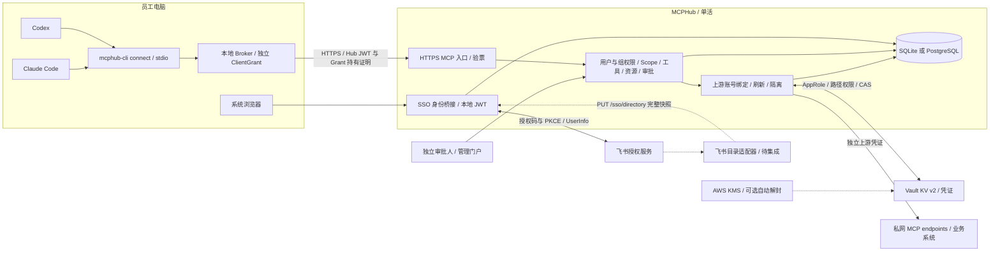
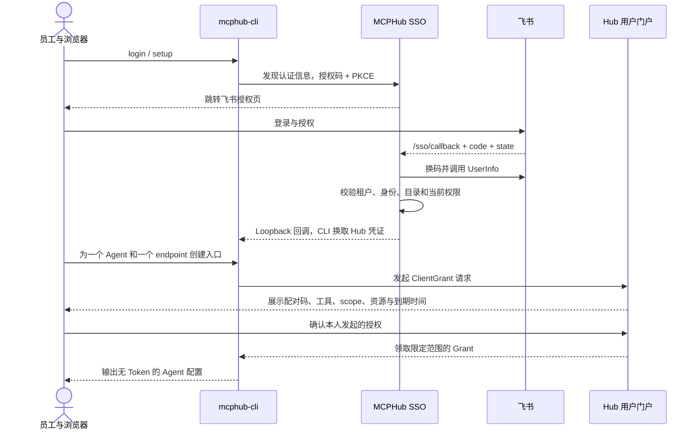
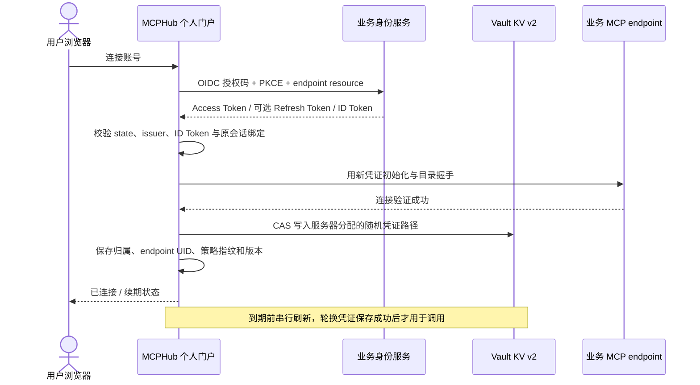
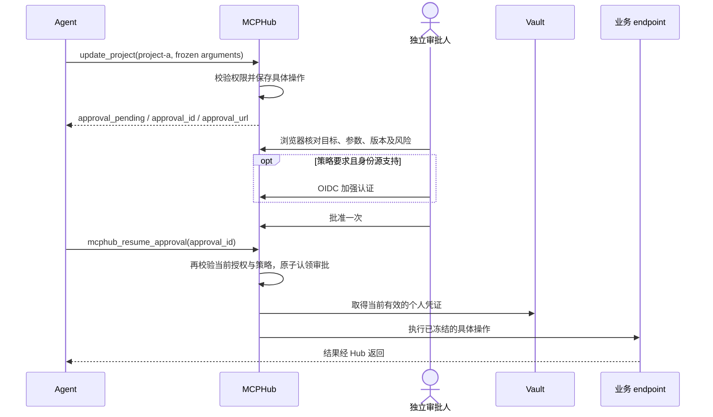

# 飞书 SSO、Vault 与企业 Agent 接入架构

核查日期：2026-09-26。对应 MCPHub v2.1.0，面向架构评审、部署人员、安全管理员和 Agent 使用者。

[下载 27 页 PDF](feishu-vault-agent-architecture.zh-CN.pdf) · [配置示例](../deploy/config.feishu-vault.example.yaml) · [文档导航](README.zh-CN.md)。PDF 保留同日发布前的架构评审快照；当前版本状态以本在线文档为准。

本方案采用 **飞书登录 + MCPHub 集中授权 + Vault 上游凭证 + 本地 Broker**。员工在浏览器完成登录、连接个人服务账号，为 Codex 和 Claude Code 分别确认访问范围，然后在 Agent 中使用工具。生产写操作由独立审批人确认。

Vault 在本方案中承担凭证保管和路径访问控制；MCPHub 承担用户、客户端、工具、业务资源及操作审批；后端继续执行自身权限检查。三个环节共同决定能否执行，任意一项不满足都拒绝。

## 1. 交付范围与当前状态

本文描述当前代码可组合的部署方案，并明确外部集成尚需完成的工作。**它不是已连接真实飞书租户、已完成 Codex/Claude Code 全链路认证的验收报告。** Vault 功能从 v2.1.0 起提供，未包含在 v2.0.0 发布包中。

| 能力 | 当前状态 | 上线要求 |
| --- | --- | --- |
| MCPHub OIDC/OAuth2 身份桥接、用户/组/部门授权 | 已有实现 | 配置真实身份源、租户约束与主体映射 |
| 飞书网页 OAuth 登录 | 通用接口可配置，真实租户未联调 | 验证授权端点与 Token 端点配对、PKCE、UserInfo 和业务错误码 |
| 飞书通讯录自动同步 | Hub 完整快照接口已有；飞书拉取适配器待提供 | 同一应用的稳定用户 ID、完整分页、离职检测、同步监控 |
| Vault KV v2 共享/个人账号、刷新与撤销联动 | v2.1.0 已有实现 | 真实 Vault 权限、TLS、备份恢复演练 |
| 本地 Broker、ClientGrant、stdio 连接器 | 已有实现 | 每个 Agent、每个 endpoint 分别授权 |
| 独立写审批、多人复核、OIDC 加强认证 | 已有实现 | 飞书普通 OAuth2 不能提供 OIDC 加强认证证明；见第 4 节 |
| SQLite / PostgreSQL | 支持；当前源码 schema 8 | MCPHub 保持单活，PostgreSQL 不代表可运行多台 Hub |
| Codex / Claude Code 接入 | 本文提供官方格式的配置 | 仍需在实际客户端版本完成验证 |
| Vault AWS KMS 自动解封 | Vault 部署能力，可选 | 配置 Vault 的 IAM Role 和 KMS Key；不代表 Hub 已直连 KMS |
| 飞书审批卡片、SCIM、Vault 动态凭证/OBO、Hub 多活 | 本方案未实现 | 单独设计和验收 |

建议先选择一个只读 endpoint 完成真实租户试点，再开放个人账号与写审批；不要一次把所有生产工具发布出来。

## 2. 总体架构


[打开可缩放 SVG](diagrams/feishu-vault-agents.svg) · [下载 PNG](diagrams/feishu-vault-agents.png)。实线表示主要调用路径；虚线表示待集成或可选部署能力。图中的组件状态以第 1 节为准。



目录适配器调用 `PUT /sso/directory`，由 Hub 校验并写库，不能直接访问数据库。TLS 入口反向代理在逻辑图中合并到 HTTPS 入口，实际网络布局见第 8 节。

| 组件 | 负责什么 | 凭证边界 |
| --- | --- | --- |
| 飞书 | 人员登录、应用可用范围、企业身份和目录来源 | 飞书 App Secret 仅在服务端使用 |
| MCPHub SSO | 校验飞书身份，映射 Hub 用户，签发受众为 Hub 的凭证 | 飞书登录 Token 不转发到 Agent 或业务 endpoint |
| MCPHub 授权层 | 用户/组织权限、ClientGrant、工具发布、scope、业务资源、写审批 | 每次调用检查当前状态 |
| 本地 Broker | 管理本机 profile、连接、登录刷新及客户端 Grant | 本机目录权限保护；不是同一 OS 用户进程之间的安全沙箱 |
| Vault | 保存个人/共享上游凭证，限制 Hub 工作负载可读写路径 | Agent 和用户浏览器没有 Vault Token 或路径选择权 |
| 业务 endpoint | 校验上游凭证并执行实际业务权限 | Hub 的放行不能扩大业务账号自身权限 |

工具结果可能进入 Agent 的模型上下文及其模型服务。数据可发送到何处、是否允许云端模型，应由企业的模型服务与数据分类政策另行约束。

## 3. 一次调用中的四种身份

以员工 Alice 使用 Codex 读取 `projects` 服务的 `project-a` 为例：

| 层次 | 标识 | 作用 |
| --- | --- | --- |
| 企业身份 | 飞书连接命名空间 + `data.open_id`，并校验 `data.tenant_key` | 确认是哪一个企业的哪一位员工 |
| Hub 身份 | MCPHub 用户 ID + Hub JWT | 读取当前用户与组织权限；JWT scope 是签发时的上限 |
| 客户端授权 | `client_instance_id` + `grant_id` + endpoint UID | 限定这一条 Codex 入口可以访问什么 |
| 上游账号 | credential ID + endpoint UID + 配置指纹 + revision | 找到 Alice 在该服务显式连接的账号与 Vault 凭证 |

飞书账号和业务系统账号可以不同；关联由本人登录门户后显式连接完成，不根据姓名或邮箱自动合并。管理员审批人名单应填写 **Hub 验证得到的 subject / Hub 用户 ID**，不要混用飞书 `open_id`、显示名或 Agent 自报用户名。

执行条件可以表达为：

```text
当前用户及目录均有效
AND Hub JWT 的 issuer / audience / 时间 / session 校验通过
AND 用户或组织有一条完整授权允许当前工具和参数
AND 当前 ClientGrant 允许 endpoint、scope、工具、资源和能力
AND endpoint 启用、工具显式发布且全部匹配规则通过
AND 写操作已有有效、未消费的具体审批
AND 上游账号绑定有效，凭证可取得
AND endpoint 自身授权通过
```

Hub scope（例如 `projects:read`）与上游 OAuth scope（例如 `project.read`）分别配置。飞书登录权限、Vault ACL、业务 OAuth scope 也各有作用，不做字符串相同即互相授权的推断。MCP access token 应限制到目标服务的 resource/audience。[MCP 授权规范][mcp-auth]

## 4. 飞书 SSO 接入

### 4.1 推荐的登录路径

采用飞书自建机密 Web 应用，固定回调为 `https://hub.example.com/sso/callback`。应用的可用范围限制到试点人员/部门；服务端还必须校验 `tenant_key`。飞书应用的 App Secret 只供 Hub 服务端换码使用。

当前适配方式是 `auth.sso.upstream.protocol: oauth2`，经过 UserInfo 验证身份，再由 MCPHub 给本地 CLI、用户门户、管理门户签发各自受众的 JWT。飞书官方文档提供授权码、PKCE 和 UserInfo 链路。[授权入口][feishu-authorize]、[用户信息][feishu-userinfo]

下列端点是 **2026-09-26 核查的候选组合，仍需租户验收**：

| 配置 | 候选值 |
| --- | --- |
| `issuer` | `https://accounts.feishu.cn`，在 OAuth2 模式下用于稳定的身份连接命名空间 |
| `authorization_url` | `https://accounts.feishu.cn/open-apis/authen/v1/authorize` |
| `token_url` | `https://accounts.feishu.cn/oauth/v3/token` |
| `userinfo_url` | `https://open.feishu.cn/open-apis/authen/v1/user_info` |
| `token_auth_method` | `client_secret_post` |
| `subject_claim` / `name_claim` | `data.open_id` / `data.name` |
| `tenant_claim` / `tenant_value` | `data.tenant_key` / 本企业实际值 |
| `success_claim` / `success_value` | `code` / `'0'` |

v3 Token 文档声明支持表单编码与 `code_verifier`，与当前 Go OAuth 库的请求形式相符；但授权页的 PKCE 说明仍提示配合 v2 使用。**不能据此宣称整个组合已经兼容。** 正式启用前，必须验证正确 verifier 可换码、缺失/错误 verifier 必须失败、重复 code 必须失败；若组合不满足要求，应向飞书确认支持的成对端点，或接入企业 OIDC 身份桥接服务。不要通过关闭 PKCE 绕过兼容问题。[v3 Token 文档][feishu-token]、[授权页 PKCE 说明][feishu-authorize]

Hub 登录只申请必要的用户身份权限。例子中的 `auth:user.id:read` 须先在应用控制台核对和开通；不为登录申请云文档、消息发送或业务写权限。`auth.sso.upstream.scopes` 是飞书授权范围；`mcphub-cli login --scope` 是 Hub 权限范围。

### 4.2 首次登录与组织授权

1. 运维指定一个精确的飞书主体作为首次引导管理员，并先完成首次登录。
2. 管理员在「用户与组织」创建最小部门/组授权，普通新用户默认待授权。
3. 完成管理员引导后移除 `bootstrap_subjects`。
4. 再启用目录快照同步，避免引导用户先由目录创建而失去首次引导条件。
5. 目录适配器使用同一应用可识别的主体 ID；切换飞书 App ID 或主体映射后按新的身份连接重新授权，不自动继承旧权限。

飞书 UserInfo 中的邮箱/手机号不能作为自动合并身份的依据；官方文档明确这些联系方式可能由管理员导入。[用户信息接口说明][feishu-userinfo]

### 4.3 部门、用户组及离职同步

部署一个独立的飞书目录适配任务：拉取允许范围内全部人员和部门分页，转换为 Hub 完整快照，再发送到 `/sso/directory`。适配器使用独立应用权限与推送密钥；不复用员工的登录 Token。该适配器当前未包含在仓库中。

```json
{
  "version": 1,
  "groups": [{"kind":"department","id":"platform","name":"平台部"}],
  "users": [{
    "subject":"ou_example",
    "name":"Alice",
    "active":true,
    "groups":[],
    "departments":["platform"]
  }]
}
```

`version` 是适配器持久化维护的单调递增版本；图例 `1` 只表示首次快照。成员关系以目录快照为准，本地权限仍由 Hub 管理员配置。目录同步不能写入管理员角色、scope 或工具权限。

每次遗漏的用户/组织会被停用，因此仅在所有分页成功且完整性校验通过后推送。权限缩小导致“能看见的目录变少”必须先告警确认，不能当作全员离职；请求失败不能发送空快照。不要直接把单个飞书事件当完整快照。部门父级继承须由适配器明确展开；Hub 当前保存平面成员关系。同步契约和容量见[目录文档](sso-and-user-management.zh-CN.md#部门--用户组自动同步)。

建议试点以每 5 分钟完整同步起步，按离职生效目标评估 API 配额与目录大小；高敏感环境再增加事件触发的重新对账。离职发现延迟取决于适配器，Hub 收到停用后在后续调用中执行撤权。目录长期失联时当前实现不会自动把所有账号停用，需告警并执行预先约定的人工暂停策略。

### 4.4 MFA 与高风险写操作

当前普通 OAuth2 桥接无法提供经验证的 OIDC `acr`、`auth_time` 和 ID Token。同一个飞书用户扫码登录，不足以让 Hub 判定已满足某个 MFA/Passkey 强度。

若生产写审批要求 `require_step_up: true`，推荐由企业已有的 OIDC 身份服务联邦飞书登录，并真正执行加强认证，再作为 MCPHub 的 `upstream.protocol: oidc`。它必须支持 S256，返回可验证的认证强度和认证时间，并保持加强认证前后 subject 一致。当前 Hub 只配置一个上游身份源，因此这会改变整套登录链路，不能仅给审批人添加第二个未实现的登录源。

在此之前，高风险写工具保持未发布；可以先验证只读流程和不要求 step-up 的低风险独立审批。禁止填入一个自创 ACR 字符串就声称完成 MFA。

## 5. 登录与客户端授权时序



每个 Codex / Claude Code 入口单独申请 Grant。一个条目绑定一个 endpoint；多个 endpoint 配多个条目。同一个 Hub 登录可以复用，但 Grant 应分别撤销和到期，不给两个 Agent 复制同一 `ci_...`。

个人账号、客户端 Grant、单次写审批是三种不同确认：连接账号让 Hub 能代表用户访问上游；Grant 限定客户端入口；写审批只允许一次具体操作。已连接账号不自动获得写批准。

## 6. Vault 与个人上游授权

### 6.1 两种凭证模式

| 模式 | 适用场景 | 实际业务身份 |
| --- | --- | --- |
| `shared` | 只读公共知识、低敏感共享服务 | 后端看到共享服务账号，Hub 保留申请人审计 |
| `personal` | 项目、数据库、工单等需保留个人权限的服务 | 后端看到用户显式连接的个人账号 |

生产写优先选择个人模式。共享凭证适用时，业务服务账号本身应限制 endpoint、操作和数据范围，避免用高权限账号承担所有 Agent 调用。

个人模式的流程如下：



仅支持 PAT 的服务由用户在门户填写 Token，也先通过无工具调用的握手验证再保存。握手证明连接可用，不证明用户拥有所有工具的业务权限；最终权限由每次调用时的 endpoint 决定。

当前个人浏览器授权要求业务身份服务提供 OIDC。**飞书 SSO 的 OAuth2 身份桥接与个人上游 OAuth 连接是两个实现入口**：不能把飞书登录的 `user_access_token` 自动保存为任意 endpoint 的业务凭证，也不能据此宣称已支持飞书云文档个人 OAuth 自动续期。若 endpoint 本身就是飞书业务服务，需要单独验证其 Token 契约，必要时新增供应商适配。

### 6.2 Vault 路径与最小权限

例如挂载点为 `secret`，部署前缀为 `mcphub-prod`：

```text
secret/data/mcphub-prod/accounts/cr_<random>  个人凭证，由 Hub 分配
secret/data/discovery/projects             仅目录发现用凭证
secret/data/services/knowledge              可选共享服务凭证
secret/data/oauth/projects                 可选上游 OAuth client_secret
```

给 Hub 独立 AppRole，策略示例：

```hcl
path "secret/data/mcphub-prod/accounts/*" {
  capabilities = ["create", "update", "read"]
}
path "secret/metadata/mcphub-prod/accounts/*" {
  capabilities = ["delete"]
}
path "secret/data/discovery/projects" {
  capabilities = ["read"]
}
path "secret/data/oauth/projects" {
  capabilities = ["read"]
}
path "auth/token/lookup-self" {
  capabilities = ["read"]
}
```

按实际需要单独增加共享凭证精确路径；不授予根路径通配、策略管理或管理其他 AppRole 的权限。上述删除权限用于断开后清除 KV v2 全版本；它与普通软删除不同。[Vault KV v2 API][vault-kv]

当前一个 Hub 使用工作负载 AppRole 访问本部署的个人凭证，再由 Hub 检查用户归属。Vault 不直接校验每次 MCP 调用的飞书用户或工具 scope；安全上必须信任 Hub 进程和配置管理者。

AppRole Token 到期前，当前实现重新使用 RoleID/SecretID 登录。部署时让 SecretID 的使用次数、有效期与轮换方式适配这一行为；不能照搬“单次 SecretID”后期待长期续期。SecretID 轮换需更新服务环境并重启。不要配置 root Token。[AppRole 文档][vault-approle]

目录发现凭证只用于初始化和列目录，不能成为个人调用失败后的备用账号。没有个人凭证或 Vault 不可用时，调用返回连接账号/稍后重试的提示。

### 6.3 数据与撤销

数据库存储加密的账号关联元数据，Vault 存储上游 Token。多个 Agent 共用该用户账号时，单实例内串行刷新，并用 KV CAS 防止覆盖轮换后的凭证。

断开或替换账号会让该用户在该 endpoint 的旧 ClientGrant 失效，并取消已接纳的请求/订阅；其他用户的授权不受影响。首次连接可以满足已经确认的 Grant；重新连接后需要再次授权客户端并重建连接。

先阻止使用，再删除 Vault 凭证；删除失败进入持久化清理队列。OAuth 刷新与 Vault 写入不是跨系统原子事务；若刷新成功后持久化失败再遇进程崩溃，可能需要重新连接。删除 KV 不会调用上游 revoke API，也无法删除外部备份中的历史内容。完整边界见 [Vault 文档](vault-accounts.zh-CN.md)。

## 7. 写审批与 Agent 体验



以下是 Agent 的操作约定，可加入团队使用说明；真正的限制由 Hub 执行：

```text
收到 connect_account 时，向用户显示个人门户链接，等待用户连接账号。
收到 approval_pending 时，展示审批链接和操作摘要，不把它当成执行成功。
查询状态使用 mcphub_approval_status；批准后使用 mcphub_resume_approval。
恢复时只提交 approval_id，不重发原写调用，不替换已审批参数。
拒绝、过期、撤销或结果未知时停止；核查业务状态后再决定后续动作。
```

Agent 自带的“允许调用此工具”提示与 Hub 独立审批可以同时出现。前者是本地客户端控制，后者是企业服务端授权；不应为减少点击而给 Agent 审批员角色。

管理员逐项发布工具，可信只读工具明确标 `effect: read`，写工具标 `write`；未分类工具也走审批。`readOnlyHint`、工具名称、HTTP 方法都不足以证明只读。可执行任意 SQL、Shell、HTTP 请求的工具应结合后端只读账号、命令范围和网络限制治理。

写工具建议配置 `require_different_reviewer: true`、精确审批人和资源范围；高风险要求双人及可验证 MFA。后端支持时启用只读预览、版本条件、业务幂等键和状态查询。取消/撤权不能回滚已经提交的写入；断网后不能把“未收到结果”当作“没有执行”。

## 8. 部署与网络边界

生产推荐：一个 MCPHub 活跃实例 + PostgreSQL + 独立 Vault 集群 + HTTPS 反向代理。SQLite 适合本地/小规模单机部署，授权语义一致。Vault 和数据库可以各自具有高可用能力，但 Hub 当前仍是单活；切换需确保旧进程已停止接纳/执行请求，避免双活消费刷新凭证或审批。

| 来源 | 目标/路由 | 用途与限制 |
| --- | --- | --- |
| CLI/Broker | `hub.example.com/mcp` | HTTPS Streamable HTTP，携带 Hub 凭证与 Grant |
| 用户浏览器 | `hub.example.com/client-auth/*` | 本人账号连接与客户端授权 |
| 用户浏览器/CLI | `hub.example.com/sso/*` 和 discovery 路由 | 登录、换码及刷新，TLS 与边缘速率保护 |
| 管理/审批浏览器 | `admin.example.com` | 单独监听器、client ID、audience；推荐企业网络限制 |
| Hub | 飞书授权、Token、UserInfo 服务 | 仅允许配置的 HTTPS 目标，不跟随不受控重定向 |
| 目录适配器 | `/sso/directory` | 独立 Bearer 推送密钥；反向代理可额外限定来源 |
| Hub | Vault HTTPS | AppRole、个人路径及精确服务路径 |
| Hub | 私网 MCP endpoint | 独立上游凭证，禁止员工网络直接绕过 Hub |
| Hub | PostgreSQL / 本机 SQLite | 应用最小数据库权限，不对用户电脑开放 |
| Vault | AWS KMS（可选） | 自动解封专用 IAM Role/Key |

反向代理要支持长响应流、及时刷新事件、取消连接传播，并保留认证和 MCP 协议头。公开 Hub 域名需转发 `/mcp`、`/client-auth/*`、`/sso/*` 以及 `/.well-known/*` 元数据；管理域名只转发独立管理监听器。不要将 API 响应缓存到共享缓存。

为登录、目录同步和未认证流量设置代理层防护。Hub 的 endpoint 限流是单实例内的 endpoint 总配额，默认不限流，不等于每个员工的独立配额；订阅流会占用并发额度，应按实际长连接规模设定。

Vault、后端与数据库都应有明确的出站白名单。工具结果和日志按数据分类处理，避免把生产秘密、任意文件或敏感查询结果发送到未经批准的模型服务。

## 9. 可核对的配置起点

完整示例见 [config.feishu-vault.example.yaml](../deploy/config.feishu-vault.example.yaml)。它使用当前代码字段，**含候选飞书端点与占位值，只用于配置准备和联调**。需要替换域名、飞书 App ID、租户 ID、引导管理员、上游 OIDC issuer/client ID；两套应用的 client ID 不可混用。

示例默认仅发布 `get_project`。`update_project` 保持未发布，待用户权限、审批人及 MFA 路线验收后开放。业务名称与 scope 必须替换为 endpoint 实际提供的契约。

服务端需要注入下列秘密：

| 环境变量 | 内容 |
| --- | --- |
| `MCPHUB_CONFIG_KEY` | Base64 编码的 32 字节配置加密密钥，需与数据库备份配套 |
| `MCPHUB_FEISHU_APP_SECRET` | 飞书 SSO 应用的 App Secret |
| `MCPHUB_VAULT_ROLE_ID` / `MCPHUB_VAULT_SECRET_ID` | Hub 专用 AppRole 登录信息 |
| `MCPHUB_DIRECTORY_TOKEN`（启用目录后） | 独立的高熵推送密钥，至少 32 字符 |
| `MCPHUB_DATABASE_URL`（选择 PG 后） | PostgreSQL DSN |

可以由企业已有部署密钥注入系统供给这些变量。当前 SSO secret、数据库加密密钥仍从环境变量读取；不能在它们的位置填写 Vault 路径并期待 Hub 自动解析。Vault Agent 的引导、认证和注入若采用，属于单独部署配置。

```bash
mcphub validate --config ./config.yaml
mcphub serve --config ./config.yaml
```

`validate` 检查本地配置与已有托管库，不验证飞书应用、Vault 权限或实际业务账号。启用托管配置后，YAML 后端列表只用于空库首次导入；日常后端修改通过管理 UI/API，不能把编辑 YAML 当成已更新数据库策略。

切换到 PostgreSQL 时替换示例中的数据库字段，删除 `database_path`：

```yaml
admin:
  # 保留示例中其他 admin 字段。
  database_driver: postgres
  database_dsn_env: MCPHUB_DATABASE_URL
```

数据库备份、Vault 数据和配置加密密钥必须协调恢复。schema 8 数据库不能交给旧二进制写入。恢复历史数据库可能恢复旧授权，应核对撤销记录与账号绑定后再开放流量。

### 可选：AWS KMS 保护 Vault

以下配置放在 **Vault 服务的配置文件**：

```hcl
seal "awskms" {
  region     = "ap-southeast-1"
  kms_key_id = "arn:aws:kms:ap-southeast-1:123456789012:key/REPLACE_ME"
}
```

由 Vault 工作负载 IAM Role 获得指定 Key 的 `kms:Encrypt`、`kms:Decrypt`、`kms:DescribeKey`；不在文件中写 AWS Access Key。自动解封与 Enterprise seal wrapping 的运行时依赖不同，应按所用版本确认。保留旧密钥直到迁移和恢复验证完成。[Vault AWS KMS seal][vault-kms]

这不会替代 `MCPHUB_CONFIG_KEY`，也不会为用户授予工具权限。MCPHub 直接用 KMS 托管数据库数据密钥属于后续能力。

## 10. Codex 与 Claude Code 接入

### 10.1 用户的推荐流程

1. 管理员启用本人账号并授予最小 endpoint/工具权限。
2. 本机安装支持本方案的 `mcphub-cli`，运行向导并在浏览器用飞书登录。
3. 在个人门户连接该 endpoint 的上游账号。
4. 分别为 Codex、Claude Code 确认配对码与访问范围，使用生成的真实 client ID 配置 Agent。
5. 在 Agent 中刷新 MCP 连接，先验证一个只读操作；写操作按审批流程进行。

```bash
mcphub-cli setup --profile work \
  --server https://hub.example.com/mcp --client-id mcphub-cli
```

向导输出通用 `mcpServers` JSON 或 VS Code JSON，不直接输出 Codex TOML，也不会覆盖现有客户端文件。给不同 Agent 运行各自的授权流程并使用不同入口名称。个人账号未连接时，根据提示打开 `https://hub.example.com/client-auth/` 完成连接，然后运行 `doctor`；不要把连接未完成误当成要给客户端填写 Token。

需要精确脚本化时，以下命令分别创建只读入口（先完成 login 和用户授权）：

```bash
mcphub-cli login --profile work \
  --server https://hub.example.com/mcp --client-id mcphub-cli \
  --scope projects:access --scope projects:read

mcphub-cli client add --profile work --name codex-projects --endpoint projects \
  --scope projects:access --scope projects:read \
  --tool get_project --resource /project=project-a --ttl 4h

mcphub-cli client add --profile work --name claude-projects --endpoint projects \
  --scope projects:access --scope projects:read \
  --tool get_project --resource /project=project-a --ttl 4h
```

下例的 `ci_CODEX_FROM_OUTPUT`、`ci_CLAUDE_FROM_OUTPUT` 必须分别替换成上两条命令返回的真实 ID。`/absolute/path/to/mcphub-cli` 与 `/absolute/path/to/.mcphub` 替换成本机实际路径；不要照抄示例字面值。

### 10.2 Codex

Codex 支持 stdio MCP，默认在 `~/.codex/config.toml` 配置。使用一个独立条目启动连接器：[OpenAI 官方 MCP 配置][codex-mcp]

```toml
[mcp_servers.mcphub_projects]
command = "/absolute/path/to/mcphub-cli"
args = ["connect", "--profile", "work", "--client", "ci_CODEX_FROM_OUTPUT"]
startup_timeout_sec = 30
tool_timeout_sec = 120

[mcp_servers.mcphub_projects.env]
MCPHUB_HOME = "/absolute/path/to/.mcphub"
```

也可用官方 CLI 注册命令，再在同一配置中按需设置超时：[Codex CLI 配置方式][codex-mcp]

```bash
codex mcp add mcphub_projects \
  --env MCPHUB_HOME=/absolute/path/to/.mcphub -- \
  /absolute/path/to/mcphub-cli connect --profile work --client ci_CODEX_FROM_OUTPUT
codex mcp list
```

这里由 `mcphub-cli` 处理 Hub 登录与 Grant，无需再运行 `codex mcp login` 登录同一条 stdio 入口。120 秒是示例工具超时，需要与实际后端超时配套；审批返回待处理状态，不应让工具调用一直阻塞等待人批准。

### 10.3 Claude Code

推荐使用用户级配置，避免把个人 client ID 和本机绝对路径提交到项目仓库。`--` 后是连接器命令，参数由连接器接收。[Claude Code 官方 MCP 配置][claude-mcp]

```bash
claude mcp add --transport stdio --scope user mcphub-projects \
  --env MCPHUB_HOME=/absolute/path/to/.mcphub -- \
  /absolute/path/to/mcphub-cli connect --profile work --client ci_CLAUDE_FROM_OUTPUT

claude mcp list
claude mcp get mcphub-projects
```

在实际 Claude Code 会话中使用 `/mcp` 检查连接；配置写入成功不等于已经连通。不要将 Claude Desktop 配置文件路径当作 Claude Code 的配置路径。[Claude Code 连接状态说明][claude-mcp]

### 10.4 故障处理与重新授权

```bash
mcphub-cli status --profile work
mcphub-cli client list --profile work
mcphub-cli doctor --profile work --client ci_CODEX_FROM_OUTPUT
mcphub-cli client authorize --profile work --client ci_CODEX_FROM_OUTPUT
mcphub-cli client revoke --profile work --client ci_CODEX_FROM_OUTPUT
```

Grant 到期不能靠刷新登录 Token 自动延期；需要重新确认。切换上游账号或扩大工具/scope/资源范围后也应重新授权并重建 Agent 连接。

本机 CLI、Broker、Agent 必须运行在相同主机和 OS 用户下，并指向同一个 `MCPHUB_HOME`。SSH、容器、远程开发主机和云端 Agent 不能直接复用本机 socket 或绝对路径；需要单独的受管运行环境和适配登录方案。本文不承诺支持云端 Agent 直接使用这套本机登录流程。

## 11. 面向用户的简洁交互

用户只面对「已连接账号」「我的客户端」「待审批操作」三个概念。Vault 路径、AppRole、飞书 App Secret、JWT audience 和 CAS 版本保留在管理员配置与诊断中。

| 场景 | 用户应看到的动作 |
| --- | --- |
| 首次接入 | 打开向导，飞书登录，核对范围，复制配置 |
| 未获得服务权限 | 提示联系管理员，不引导重复登录或粘贴 Token |
| 未连接上游账号 | 一个个人门户链接，完成连接后回到 Agent |
| 上游授权到期且无法续期 | 对应服务显示“重新连接” |
| 写操作待审批 | 显示操作摘要与独立审批链接；批准后恢复同一审批单 |
| Vault 暂时故障 | 提示稍后重试，保持原账号记录 |
| 换账号或断开 | 说明旧客户端授权失效，再提示重新确认 |
| 网络失败或结果未知 | 显示查询状态的步骤，不自动重放写操作 |

当前已具备账号连接、错误状态、授权门户和审批链接。Agent 是否自动展示链接、等待或调用恢复工具，仍取决于客户端版本和模型行为，需要真实客户端验收；Hub 的服务端限制不依赖模型自觉遵守。

## 12. 运维与最佳实践

| 领域 | 推荐做法 | 当前边界 |
| --- | --- | --- |
| 最小权限 | 部门分配基础读取，敏感工具按人追加；所有新工具先审核发布 | 多条组织授权取并集，宽泛授权会扩大范围 |
| 职责分离 | 配置管理员、业务审批人、安全复核人分工；生产写禁止自审 | 给同一人多个角色应经过明确审批 |
| Vault | 独立部署前缀/AppRole，精确服务路径，TLS，启用审计 | Hub 进程可访问其策略允许的凭证，不能防御已被完全控制的 Hub |
| 本机 | 私有目录，受信任二进制，限制 Agent 对凭证目录的访问 | 同一 OS 用户下的恶意程序可冒用本机入口；client 名称不证明程序身份 |
| 上游 | 个人账号或最小服务账号，业务系统再次鉴权 | Hub 参数规则不解析 SQL、符号链接或任意业务语义 |
| 续期 | 监控 refresh 失败、轮换冲突和凭证清理积压 | 不提供 OAuth 服务与 Vault 的跨系统事务 |
| 撤权 | 离职目录停用、Hub 禁用、Grant 撤销、上游撤销分层处理 | Hub logout 不等于飞书全局退出或上游 revoke |
| 故障 | 凭证/授权校验失败拒绝新调用，保留可恢复信息 | 已提交的副作用不能回滚，网络失败不自动重放 |
| 审计 | 关联用户、client、Grant、endpoint、审批 ID、credential ID | 请求诊断是短期内存窗口，不能替代长期审计归档 |
| 变更 | 发布清单/写规则/凭证模式变更经安全复核，保存版本记录 | 可修改配置的管理员属于信任边界 |
| 容灾 | 联合备份 DB、加密密钥、Vault；演练撤权状态恢复 | 恢复旧备份可能恢复旧授权，必须复核 |
| 可用性 | Hub 单活，Vault/PG 可单独 HA，先设可观测的 RTO/RPO | 当前没有 Hub 多实例刷新/撤销/限流一致性保证 |

Vault 审计中敏感字段通常经过 HMAC，但审计设备配置、权限和可用性仍需独立管理；不要开启原始秘密记录。[Vault 审计文档][vault-audit]

Hub 诊断不记录 Token、参数和结果正文；审批单为冻结执行需要保存参数，因此审批数据库、浏览器页面和审计投递目标同样要限制访问与保留期。代理访问日志应过滤 OAuth code、查询参数和认证头。Vault 审计看到的是 Hub 工作负载身份；若需要跨系统逐次审计关联，应另行设计关联字段，不能假定已自动记录终端用户。

不允许 Agent 通过工具读取 Vault、导出 Token、修改自己的 Grant 或批准自己的写申请。针对工具返回内容的提示注入，仍需限制后端能力、结果数据范围及 Agent 的网络/文件权限。MCP 协议也要求处理令牌透传、授权混淆等风险。[MCP 安全最佳实践][mcp-security]

## 13. 撤销与故障行为表

| 操作/故障 | 影响 | 用户下一步 |
| --- | --- | --- |
| `client revoke` | 撤销单个客户端入口，停止后续接纳并取消相关活动流 | 其他独立入口可继续使用 |
| 用户/部门权限收窄 | 后续验票与调用检查使用当前策略 | 扩权后可能需重新登录取得新 scope，再重新授权 |
| 个人账号断开/替换 | 同用户、同 endpoint 旧 Grant 失效，取消调用与订阅 | 连接账号并重新授权客户端 |
| `logout` | 清除本地登录秘密，断开 profile，尝试远端会话撤销 | 离线撤销未确认时在个人门户撤销旧会话 |
| `broker stop` | 停止本地连接，保留远端授权 | 重新启动连接器即可；不作为安全撤权手段 |
| 飞书目录同步失败 | 现有目录保留，离职信息可能尚未到达 Hub | 告警、恢复同步或人工暂停敏感用户 |
| Vault 不可用 | 需要凭证的新请求失败；清理任务等待重试 | 修复 Vault，避免重新提交未知结果的写请求 |
| Hub 重启 | 在途请求/内存登录尝试中断；持久化授权保留 | 重建连接，未完成登录重新开始 |
| 后端写超时/断网 | 结果可能未知，不能推断未执行 | 按业务幂等键或状态工具核查 |

## 14. 上线验收清单

以下项目是部署验收要求，未勾选表示本文没有宣称其已在真实环境完成：

- [ ] 飞书：应用可用范围、正确/错误 tenant、正确/错误/缺失 PKCE verifier、state、拒绝授权、code 重放全部验证。
- [ ] 身份映射：应用切换不继承旧权限；同名员工不串号；首次用户默认待授权。
- [ ] 目录：全分页、离职、部门调动、重复版本、部分失败、空快照和异常数量下降经过验证。
- [ ] Vault：Hub AppRole 允许必要路径、拒绝其他部署路径；没有 root Token；TLS 与审计已启用。
- [ ] 个人账号：Alice/Bob 的工具、提示词、资源和订阅隔离；无法用另一个账号的 credential ID 取凭证。
- [ ] 刷新：临近到期、refresh token 轮换、并发 Agent、持久化失败、进程重启的恢复行为经过验证。
- [ ] Codex 与 Claude Code：真实版本各自完成初始化、目录、只读调用、Grant 过期、撤销、取消和重连。
- [ ] 写审批：待批不执行、自审被拒、参数被冻结、审批过期/复用被拒、上游凭证正确、未知结果不自动重放。
- [ ] MFA：如需生产写 step-up，已用真实 OIDC 认证强度验证；普通 OAuth 登录不能代替此项。
- [ ] 出站与数据：员工不能绕过 Hub 直连受控 endpoint；模型服务的数据去向和敏感结果处理已获组织确认。
- [ ] 容灾：DB/加密密钥/Vault 联合恢复、单活切换、旧授权复核、审计归档均已演练。

建议按四阶段交付：**只读真实登录 → 组织同步与个人账号 → 独立写审批 → MFA、审计与恢复演练**。每个阶段只开放已经验收的工具和人员范围。

## 15. 源码对应与本次核查

| 主题 | 入口 |
| --- | --- |
| SSO 协议与 UserInfo | [login.go](../internal/sso/login.go)、[identity.go](../internal/config/identity.go) |
| 目录快照与本地用户权限 | [server.go](../internal/sso/server.go)、[SSO 使用说明](sso-and-user-management.zh-CN.md) |
| Broker 和无凭证配置输出 | [broker.go](../internal/client/broker.go)、[setup.go](../internal/client/setup.go) |
| Vault 连接与账号生命周期 | [vault.go](../internal/upstream/vault.go)、[manager.go](../internal/upstream/manager.go) |
| 账号门户与回调 | [accounts.go](../internal/app/accounts.go) |
| 个人会话与上游客户端隔离 | [credentials.go](../internal/hub/credentials.go) |
| 单次审批恢复 | [approvals.go](../internal/hub/approvals.go) |

本次文档根据当前源码、CLI 定义、官方文档以及飞书官方页面的本机 Chrome 内容核查。在 OrbStack 中运行 `go run ./cmd/mcphub validate --config deploy/config.feishu-vault.example.yaml`，使用仅供验证的占位环境变量，返回 `configuration valid`；架构 SVG 已渲染为 PNG 并检查可读性，文档本地链接及 `git diff --check` 均通过。

上述静态验证不等于真实 SSO/业务联调。未安装或修改真实飞书应用、Vault 策略及 Agent 配置；未向外部服务发送业务凭证。

当前本机 Codex 命令包装器缺少其目标可执行文件，Claude Code 命令未发现，因此本文客户端命令依据官方格式和 `mcphub-cli` 源码核对，尚未在这两款客户端完成本轮运行验证。

## 16. 官方参考

来源按 2026-09-26 实际读取的页面记录；上线前应复核飞书端点与客户端版本。

- [飞书：获取授权码][feishu-authorize]
- [飞书：获取 user_access_token（v3）][feishu-token]
- [飞书：获取登录用户信息][feishu-userinfo]
- [OpenAI：Codex MCP 配置][codex-mcp]
- [Anthropic：Claude Code MCP 配置][claude-mcp]
- [HashiCorp：KV v2 API][vault-kv]、[AppRole][vault-approle]、[Audit Devices][vault-audit]、[AWS KMS seal][vault-kms]
- [MCP：Authorization][mcp-auth]、[Security Best Practices][mcp-security]

[feishu-authorize]: https://open.feishu.cn/document/common-capabilities/sso/api/obtain-oauth-code
[feishu-token]: https://open.feishu.cn/document/uAjLw4CM/ukTMukTMukTM/authentication-management/access-token/get-user-access-token-v3
[feishu-userinfo]: https://open.feishu.cn/document/uAjLw4CM/ukTMukTMukTM/reference/authen-v1/user_info/get
[codex-mcp]: https://learn.chatgpt.com/docs/extend/mcp?surface=cli
[claude-mcp]: https://code.claude.com/docs/en/mcp
[vault-kv]: https://developer.hashicorp.com/vault/api-docs/secret/kv/kv-v2
[vault-approle]: https://developer.hashicorp.com/vault/docs/auth/approle
[vault-audit]: https://developer.hashicorp.com/vault/docs/audit
[vault-kms]: https://developer.hashicorp.com/vault/docs/configuration/seal/awskms
[mcp-auth]: https://modelcontextprotocol.io/specification/2026-07-28/basic/authorization
[mcp-security]: https://modelcontextprotocol.io/docs/2026-07-28/tutorials/security/security_best_practices
