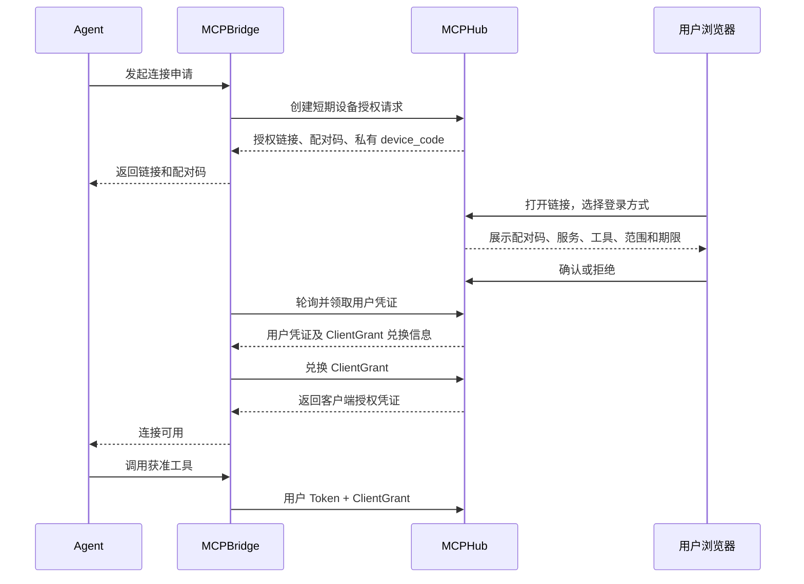

# MCPBridge 链接登录与 Agent 连接授权设计

- 方案日期：2026-10-02
- 状态：已完成实现与验收，随 v2.3.0 交付
- 适用范围：MCPHub 新部署、MCPBridge、普通用户授权门户
- 源码依据：2026-10-02 当前工作区；不代表 GitHub 已发布版本的能力

## 1. 目标

让用户通过一次网页操作完成 Agent 的登录与连接授权：

**Agent 发起连接申请 → MCPBridge 返回授权链接和配对码 → 用户在 MCPHub 登录并确认权限 → MCPBridge 保存凭证 → Agent 调用获准工具。**

这一流程同时适用于本机 Agent，以及运行在远程服务器、容器或没有浏览器的环境中的 Agent。用户无需复制 Token、向 Agent 提供密码，也不需要让浏览器回调到运行 Agent 的机器。

权限继续分配在组上。用户确认客户端授权，只能收窄组赋予的权限，不能为自己或 Agent 增加组外权限。

本文记录 v2.3.0 的设计及实现契约。新增命令、工具和路由与双语指南一致。

## 2. 当前实现

| 能力 | 当前行为 | 源码 |
| --- | --- | --- |
| 用户登录 | `mcpbridge login` 使用浏览器授权码、PKCE S256、本机回环回调，获取并保存用户凭证 | [login.go](../internal/client/login.go) |
| 接入向导 | `setup` 先登录，再选择服务、工具、资源限制和期限，最后发起客户端确认 | [setup.go](../internal/client/setup.go) |
| 客户端授权 | `client add` 依赖已登录的 profile，创建申请、打开确认链接，再兑换独立 ClientGrant 凭证 | [client_authorization.go](../internal/client/client_authorization.go) |
| Agent 连接 | `connect --profile … --client …` 使用本地 Broker 和已保存凭证，不自动发起登录 | [broker.go](../internal/client/broker.go) |
| 服务端授权 | 用户 Token 与 ClientGrant 共同接受身份、目标、工具、资源范围和生命周期检查 | [client_authorization.go](../internal/app/client_authorization.go)、[client_grants.go](../internal/hub/client_grants.go) |
| 内建认证 | 默认内建签发者；本地账号及配置的 LDAP、OIDC 身份接入复用内部用户与组体系 | [authentication.go](../internal/config/authentication.go)、[sso](../internal/sso/) |
| OAuth 授权类型 | 支持授权码、刷新凭证和内建设备授权接口 | [server.go](../internal/sso/server.go)、[token.go](../internal/sso/token.go) |

当前[默认模板](../config.example.yaml)同时启用 `client_authorization` 与全局 `require_client_grant`。启用授权功能和强制每个业务请求携带客户端授权，是两个不同的配置要求。

## 3. 核心决策与范围

1. 增加 OAuth Device Authorization Grant，用于需要跨设备完成网页登录的连接申请。
2. 网页合并用户登录与客户端确认，但服务端继续分别校验用户身份和 ClientGrant。
3. 复用现有用户、组、会话、Token、刷新、ClientGrant、Broker、写审批和撤销机制。
4. 新部署默认强制 ClientGrant，防止仅持用户 Token 的调用绕过客户端授权。
5. 保留本机授权码及 PKCE 登录；设备授权作为新增接入能力。
6. 第一期一条客户端授权绑定一个服务。多个服务分别建立入口，复用同一用户登录体系。
7. 普通 `connect` 保持现有行为；交互授权通过明确的命令或参数启用，不在连接失败后无限自动创建申请。

第一期以 MCPHub 内建签发者为前提。LDAP、OIDC 是 MCPHub 的可选身份来源，最终由 MCPHub 签发访问自身的凭证。纯外部签发者模式不能假定身份服务支持设备授权，应保留原有登录流程。

本方案不包含旧配置或旧数据库迁移、应用远程证明、机器服务账号，以及多服务授权聚合。

## 4. 完整授权流程



### 4.1 创建申请

Bridge 生成随机客户端实例 ID，提交客户端展示名称以及可选的服务和工具范围。首次申请不要求已有用户 Token，不接受客户端自报的用户名、邮箱或组作为授权身份。

MCPHub 返回标准设备授权字段，并保存短期申请。Bridge 将 `device_code` 保存在私有存储中，只将授权链接、配对码、请求 ID 和期限展示给用户或 Agent。

登录前不能通过此接口枚举私有服务、工具或用户组。客户端传入的服务 ID 只是请求目标；只有用户登录后才能检查并展示其可访问目录。

### 4.2 登录与确认

用户打开 MCPHub 提供的链接，选择本地账号、LDAP 或 OIDC。已有有效普通用户会话时可以进入确认页；已有管理员会话不能替代普通用户的客户端同意。

确认页展示：

- 当前登录用户及身份来源，可在确认前切换账号。
- 配对码，要求与 Agent 展示的配对码核对。
- 客户端展示名称、实例标识、申请时间；明确名称是申请方提供的信息。
- 目标服务和具体工具；未指定目标时，由用户从有权访问的服务中选择。
- 业务资源限制和授权期限。
- 是否允许申请写操作，以及具体写入仍需审批的提示。

工具默认不全选，写操作申请能力默认关闭。页面允许收窄申请范围，不允许选择组权限之外的能力。无可用服务、账号待启用或无组权限时显示明确原因，不能完成空授权。

最终确认时绑定经过验证的内部用户 ID 和身份来源，并冻结授权内容。确认后不能通过更换浏览器账号、修改 URL 或修改轮询参数转移申请。

### 4.3 领取与保存

Bridge 按服务端间隔轮询 Token 接口。只有用户完成登录及明确确认后，才允许领取凭证；登录成功本身不代表已同意连接。

Token 响应中的 MCPHub 扩展关联到已确认的 ClientGrant。Bridge 持用户 Token 和私有兑换凭证，调用现有兑换接口领取 ClientGrant，并保存本地 IPC 入口凭证。

在确认、Token 领取和 Grant 兑换三个阶段，都重新校验用户状态、身份服务配置、凭证版本、当前组权限及服务策略。确认后权限发生变化时，应拒绝领取或要求重新确认。

凭证保存完成并通过连接检查后，才输出可使用的客户端实例 ID。失败或取消不得覆盖既有可用 profile 和入口；切换用户或 MCPHub 目标时，需要独立 profile 或显式重新登录。

## 5. CLI 接入方式

以下命令从 v2.3.0 起可用。

```bash
# 非阻塞生成链接，适合 Agent 通过命令执行能力发起申请。
mcpbridge pair start \
  --server https://hub.example.com/mcp \
  --profile work \
  --name "项目助手" \
  --endpoint projects \
  --json

# 用户在网页确认后，轮询、领取并保存凭证。
mcpbridge pair finish --request pr_example --wait --json

# 使用 pair finish 返回的客户端实例 ID 连接。
mcpbridge connect --profile work --client ci_example
```

`pair start` 的公开输出示例：

```json
{
  "request_id": "pr_example",
  "status": "pending_user",
  "verification_uri": "https://hub.example.com/client-auth/device",
  "verification_uri_complete": "https://hub.example.com/client-auth/device?user_code=ABCD-EFGH",
  "user_code": "ABCD-EFGH",
  "expires_at": "2026-10-02T00:05:00Z",
  "interval": 5
}
```

结果不包含 `device_code`、用户 Token、刷新凭证或 Grant 凭证。`--json` 的标准输出只包含约定的机器可读结果，进度与诊断信息写入标准错误。

`pair finish` 无 `--wait` 时执行一次领取尝试；尚未确认则返回等待状态。有 `--wait` 时按设备授权协议轮询，拒绝、到期或取消后停止。它只能完成当前 OS 用户私有存储中的申请，公开请求 ID 不能用于领取。

用户需要的是单一网页流程，不必要求命令也同步等待完整流程。非阻塞创建申请可以避免 Agent 的命令执行超时。

## 6. MCP 会话内的交互授权

仅向标准错误打印链接不足以覆盖 Agent：部分客户端不会展示进程日志，也可能在等待登录时发生 MCP 初始化超时。

为没有命令执行能力的 Agent，提供显式交互模式：

```bash
mcpbridge connect \
  --server https://hub.example.com/mcp \
  --profile work \
  --name "项目助手" \
  --interactive-auth
```

该模式需要本地 MCP 接入处理层，能够在尚未连接远端时完成协议初始化。新增两个固定工具：

| 工具 | 行为 |
| --- | --- |
| `mcpbridge_auth_start` | 创建或返回同一未过期申请，返回公开授权链接和配对码 |
| `mcpbridge_auth_status` | 检查进度；确认后尝试领取和保存凭证，返回连接状态，不返回秘密 |

工具契约需要明确 `auth_status` 可能完成凭证领取这一副作用。连接已就绪时重复调用返回当前状态，不重复创建会话、签发凭证或扩权。

授权前只提供接入工具，不暴露私有业务目录。授权完成后开放 ClientGrant 允许的工具，并通过 `notifications/tools/list_changed` 提示刷新；不支持刷新通知的客户端需要重新连接。

此模式必须处理本地与远端协议版本、能力声明、请求 ID、通知和取消，不能在已经初始化的 stdio 会话中直接再次透传远端初始化。为接入工具保留名称，防止与业务工具冲突。未完成授权时拒绝业务调用，不缓存等待执行的写请求。

授权到期、撤销或组权限收回后，后续调用明确返回不可用状态。重新授权仍需用户明确发起，不自动重放失败的业务请求。

## 7. 组权限、客户端范围与写审批

```text
实际可用权限
= 当前用户所属组的权限
∩ 用户为该客户端确认的范围
∩ 当前服务及工具策略
```

具体不变量：

- 用户只持有组成员关系与账号状态；客户端同意不形成用户级权限分配。
- 组权限变化按现有服务端权限检查生效，Bridge 缓存不能作为放行依据。
- 组新增权限不自动扩大旧 ClientGrant；新工具也不自动加入旧工具名单。
- 本地、LDAP、OIDC 身份来源独立，不以相同用户名或邮箱合并身份。
- Grant 绑定内部用户、客户端实例、Broker 会话、MCPHub resource 和不可复用的服务 UID。
- 授权允许申请写操作，不代表批准任何具体写入；逐次审批、双人审批及策略要求的加强认证继续生效。
- 普通本地密码或 LDAP 密码登录不能直接视为 MFA；需加强认证的操作继续验证相应认证证据。
- Agent 不获取用户密码、上游 OIDC Token、LDAP 服务绑定密码或后端认证密钥。

新部署建议在启用 `client_authorization` 的同时设置全局 `require_client_grant: true`。认证后的协议握手和必要授权发现可以保留，但不能借此暴露业务目录或执行工具。

## 8. 协议与接口

| 接口 | 变更 | 契约 |
| --- | --- | --- |
| OAuth 发现元数据 | 扩展 | 宣告 `device_authorization_endpoint` 和设备授权 grant type |
| `POST /sso/device_authorization` | 新增 | 公共客户端提交短期申请，返回标准设备授权字段 |
| `/client-auth/device` | 新增网页 | 登录、核对配对码、选择或收窄范围、确认或拒绝 |
| `POST /sso/token` | 扩展 | 接受 `urn:ietf:params:oauth:grant-type:device_code`，领取用户凭证 |
| `POST /api/v1/client-authorization-requests/{id}/exchange` | 复用 | 同主体用户 Token 与私有兑换凭证共同领取 ClientGrant |
| 现有 Grant 与 Broker 撤销接口 | 复用 | 独立撤销客户端或整个 Broker 会话 |

设备授权请求使用标准表单参数 `client_id`、`scope`，以及绑定到目标 MCPHub 的 `resource`。客户端实例、服务、工具和期限使用明确版本化的 MCPHub 扩展字段，不能伪装成 RFC 8628 标准字段。

申请中未指定业务范围时，网页选择的范围仍必须在公共客户端允许的 resource 和服务端策略内，并作为明确同意结果保存。签发的 scope 仅包含完成最终授权所需的范围。

Token 响应保留标准 Token 字段，通过 MCPHub 扩展返回关联 Grant 的 ID、一次性兑换凭证和必要的 Broker 会话绑定信息。这些秘密只返回给持有 `device_code` 的 Bridge，不能显示在网页或 Agent 工具结果中。

通用 HTTP MCP 客户端继续采用现有标准授权流程。设备授权与 ClientGrant 组合属于 MCPBridge 接入能力，不要求第三方 MCP 客户端实现这一扩展。

## 9. 状态、持久化与失败处理

设备授权申请状态：

```text
pending_login → pending_confirmation → approved → redeemed
       └──────────────┴───────────────┴→ denied / expired / canceled
```

`redeemed` 表示设备凭证已经消费；连接只有在后续 Grant 兑换、本地保存及检查成功后才可用。设备请求状态与 ClientGrant 状态需要分开，不能把“用户已确认”显示为“连接已成功”。

短期记录至少包含随机请求 ID、设备凭证哈希、配对码索引、客户端及 resource 绑定、请求内容、最终确认范围、确认用户、身份来源、凭证版本、策略版本、期限、状态和关联会话／Grant ID。

持久化复用现有 SQLite／PostgreSQL 存储。秘密尽量只保存哈希；必须跨阶段返回的兑换秘密使用现有配置加密能力短期保存，兑换或清理后删除。服务重启不能使请求扩权、重置期限或再次消费。

确认和领取使用数据库事务及状态条件更新，保证并发确认、并发领取只有一次成功。浏览器确认使用受认证会话和 CSRF／Origin 校验；GET 打开链接不会执行确认。

默认建议：

| 项目 | 建议值或行为 |
| --- | --- |
| 登录申请有效期 | 5 分钟 |
| 初始轮询间隔 | 5 秒 |
| 客户端授权期限 | 默认 1 小时，不能超过现有服务端上限 |
| Device Code | 至少 256 bit 随机熵，不进入 URL、日志、Agent 输出或进程参数 |
| 配对码 | 便于人工核对；限次、限速并处理碰撞，不作为领取凭证 |
| 请求创建 | 按来源地址、公共客户端及全局容量限流 |
| 轮询 | 遵守 `authorization_pending`、`slow_down`，网络超时降低频率 |
| 拒绝、到期或取消 | 停止领取，不自动重新申请 |

领取成功但响应丢失时，不凭公开 ID 重复签发，也不盲目重试兑换。提示重新配对，并按过期清理策略结束未完成连接的关联凭证；不得影响此前已经可用的入口。清理必须通过关联 ID 定位该申请创建的会话和 Grant，不能撤销用户其他连接。

链接只能来自经过发现与信任校验的 MCPHub 授权地址。确认页需明确配对码和请求上下文，降低用户替陌生设备授权的风险。客户端名称、进程名称和 `client_id` 都不构成真实应用身份或设备证明。

## 10. 实施顺序与验收

先实现服务端设备授权、网页确认和 CLI 配对命令，验证闭环；再实现 MCP 会话内的交互授权层。两者复用同一服务端申请和领取逻辑。

受影响模块包括 `internal/sso`、`internal/configstore`、普通用户门户、ClientGrant API、`internal/client` 及 `cmd/mcpbridge`。应按现有模块职责组织，不引入独立授权微服务或通用策略引擎。

实施时同步中英文用户指南、管理员指南、示例模板、CLI 帮助和 GitHub Pages 内容，确保拟议接口在真正可用后才进入正式操作文档。

验收覆盖：

1. 本地账号、LDAP、OIDC 各完成一次链接登录和客户端确认。
2. Agent／Bridge 在 OrbStack Linux 环境运行，用户在本机 Chrome 完成授权，不依赖本机回调。
3. 两个客户端分别授权不同服务和工具，验证允许调用与越权拒绝；撤销其中一个不影响另一个。
4. 覆盖账号待启用、无组权限、切换身份、用户拒绝、申请到期、配对码错误和限流。
5. 覆盖并发领取、重复消费、响应丢失、凭证保存失败和服务／Bridge 重启。
6. 确认或领取期间收回组权限、停用账号、更改身份配置或服务策略，验证不得沿用旧授权结果放行。
7. 组新增权限或服务新增工具时，旧 Grant 不自动扩权；写操作仍通过现有审批边界。
8. 单独验证交互模式的初始化、工具列表刷新、授权失效和重新连接；不支持刷新通知的客户端有可执行的恢复提示。
9. 检查配置、日志、URL、Agent 工具结果和错误输出，不泄露秘密。

验收结果需区分源码检查、运行验证和未验证环境；实际结果与覆盖范围见文末链接的验收记录，不以本文的验收清单代替执行证据。

## 11. 参考

- [RFC 8628：OAuth 2.0 Device Authorization Grant](https://www.rfc-editor.org/rfc/rfc8628.html)
- [MCP 授权规范，2025-11-25](https://modelcontextprotocol.io/specification/2025-11-25/basic/authorization)
- [现有 Broker 设计历史快照](broker-authorization-design.zh-CN.md)
- [当前用户指南](user-guide.zh-CN.md)
- [当前管理员指南](admin-guide.zh-CN.md)

## 本地实现说明

- 接口和数据：`internal/app/device_authorization.go`、`internal/configstore/device_authorization.go`；标准设备字段加版本为 1 的 `mcphub` 扩展。创建扩展提供客户端实例、展示名称和可选范围。Token 扩展带 Grant 兑换及 Broker 绑定，仅供 Bridge 私有消费。
- 普通用户确认页：`/client-auth/device`，登录后的 API 使用独立用户会话、Origin 与 CSRF；不接受管理员会话或 Bearer 代替浏览器确认。
- `pair start` / `pair finish` 及交互认证仅授予工具能力，提示词、资源 URI、订阅保留 setup / client add。资源参数限制仍可在网页填写。`pair --ttl` 单位为秒。
- 私有取消扩展：Token 请求携带 `mcphub_cancel=1` 与原始 device_code、client_id，取消未交付申请，并清理对应未交付 SSO 家族；已经生效的 Grant 不接受此取消操作。
- 状态领取为一次性；成功兑换标记 completed，清理丢失响应仅针对尚未完成兑换的关联 SSO 家族。权限或身份源变化需要重新确认，不重复签发。
- 本地 MCP 会话和远端会话分别使用 Go MCP SDK 协商协议，stdout 专用于协议；工具列表变化由 SDK 通知，取消通过请求上下文传播。
- 本地验收的范围和环境见 [验收记录](mcpbridge-device-authorization-validation.zh-CN.md)。

服务端用 pending 合并等待登录与等待确认，公开状态为 pending_user；确认前不绑定自报身份。已证明属于当前用户的 Broker 到期或撤销后，可在明确的新配对中创建新会话；Token 扩展以 replaces_broker_session_id 指明替换关系，旧 Grant 不会转移。
